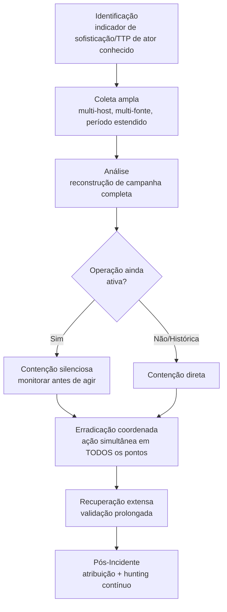

# APT-Investigation

> 🟢 Full Playbook

## 1. Descrição Técnica

### Definição
APT (Advanced Persistent Threat) Investigation é a metodologia aplicada quando há suspeita ou confirmação de comprometimento por um ator sofisticado e persistente — tipicamente associado a operações de espionagem patrocinadas por estado-nação, mas também aplicável a grupos criminosos altamente organizados. Diferente das demais categorias (que tipicamente investigam uma técnica ou incidente isolado), esta categoria trata o incidente como uma **campanha completa multi-tática**, exigindo investigação muito mais ampla, demorada e cuidadosa.

### Objetivo do Atacante
Acesso de longo prazo e furtivo para espionagem (roubo de propriedade intelectual, inteligência), pré-posicionamento estratégico (acesso mantido para uso futuro, possivelmente disruptivo), ou — em alguns casos híbridos — monetização através de operações criminosas paralelas.

### Impacto Esperado
- **Confidencialidade:** o impacto mais característico — roubo prolongado de dados sensíveis/estratégicos, frequentemente não detectado por meses ou anos (dwell time médio de APT historicamente medido em meses)
- Risco estratégico/geopolítico em setores de infraestrutura crítica
- Pré-posicionamento (Volt Typhoon-style) cria risco latente de disrupção futura sem exfiltração imediata

### Vetores de Entrada
- Spear-Phishing altamente direcionado (ver `Spear-Phishing/`)
- Exploração de vulnerabilidade zero-day ou n-day em serviço exposto
- Supply Chain compromise (ver `Supply-Chain/`)
- Comprometimento de credencial de parceiro/fornecedor de confiança
- Watering hole attacks (comprometimento de site frequentado pelo alvo)

### Indicadores de Comprometimento (IOCs)
| Tipo | Exemplo | Onde encontrar |
|---|---|---|
| Uso extensivo de LOLBins (living off the land) | PowerShell, WMI, certutil para atividades não administrativas | Sysmon, PowerShell logs |
| Infraestrutura de C2 customizada/não-commodity | domínios com padrão de registro específico do ator | TI feeds, DNS logs |
| Persistência não-óbvia e redundante | múltiplos mecanismos sutis (ver `Persistence/`) | Varredura completa de persistência |
| Atividade fora de horário comercial do fuso do atacante | padrão de horário de atividade consistente | Correlação de timestamp em escala |
| TTPs consistentes com perfil de ator conhecido | técnicas específicas catalogadas em TI | `Threat-Intel/` |

### TTPs Relacionados (MITRE ATT&CK)
> APT é multi-tática por definição — praticamente todas as táticas do Enterprise Matrix podem estar envolvidas ao longo da campanha. Ver `MITRE-Mappings/Master-Mapping-Table.md` e o perfil específico do ator em `Threat-Intel/` quando atribuição for possível.

| Tática | Exemplos típicos |
|---|---|
| Initial Access | T1566.001/002/003, T1190, T1195 |
| Persistence | T1547, T1546.003, T1098 |
| Privilege Escalation | T1068, T1078 |
| Defense Evasion | T1027, T1070, T1218 (LOLBins) |
| Credential Access | T1003, T1558 |
| Discovery | T1082, T1087, T1018 |
| Lateral Movement | T1021, T1550 |
| Collection | T1114, T1005 |
| Exfiltration | T1041, T1567 |

---

## 2. Fluxo de Investigação

> ⚠️ Esta é a única categoria onde **agir rápido pode ser pior que agir devagar e com cautela**. Um ator de APT que perceba que foi detectado pode acelerar destruição de evidência, ativar mecanismos de persistência de backup, ou simplesmente desaparecer e retornar por outro caminho meses depois. A decisão de quando conter exige aprovação explícita do Incident Commander e, frequentemente, de liderança executiva.

### 2.1 Identificação
**Como detectar:**
- TI feed associando IOC/TTP observado a ator conhecido
- Threat hunting proativo identificando padrão de comportamento sofisticado sem alerta automatizado prévio
- Indícios de sofisticação incomum (evasão ativa de EDR, uso extensivo de LOLBins, persistência redundante)
- Notificação externa (parceiro, governo, pesquisador de segurança) sobre comprometimento

**Logs relevantes:** todo o espectro de logs disponíveis — host, rede, identidade, cloud — geralmente por um período **muito mais longo** que incidentes comuns (meses, não dias)

**Ferramentas utilizadas:** toda a suíte de DFIR/Threat Hunting do repositório; engajamento de Threat Intel é praticamente obrigatório

**Alertas comuns:** raramente um único alerta — geralmente um padrão construído a partir de múltiplos indicadores fracos correlacionados

### 2.2 Coleta
**Artefatos necessários:**
- Coleta em escala muito maior que incidentes típicos — todos os hosts potencialmente tocados, não apenas os com alerta direto
- Logs históricos pelo período máximo de retenção disponível
- Coordenação cuidadosa para evitar alertar o atacante durante a coleta (operações secretas/forense silenciosa)

**Evidências:** todas as categorias de evidência (host, rede, cloud, identidade) — esta investigação tipicamente consome e referencia **todos os outros playbooks** do repositório conforme a campanha se revela

### 2.3 Análise
**O que procurar:**
- Reconstrução da campanha **completa**, do acesso inicial (possivelmente meses atrás) até o estado atual
- Todos os pontos de persistência e todos os hosts/contas tocados — escopo de APT é tipicamente muito maior do que o ponto de detecção inicial sugere
- Atribuição: TTPs, infraestrutura e ferramentas consistentes com ator catalogado em Threat Intel
- Objetivo aparente da campanha (quais dados/sistemas foram o alvo real)

**Técnicas de investigação:** esta é a categoria onde a colaboração com `Threat-Intel/` é mais crítica — cruzar achados técnicos com perfis de ator conhecidos pode acelerar dramaticamente a investigação (saber que TTPs batem com um ator específico permite prever próximos passos prováveis e mecanismos de persistência adicionais a procurar).

**Correlação de eventos:** dado o escopo amplo, recomenda-se fortemente o uso de uma timeline centralizada (Timesketch ou equivalente) agregando todas as fontes — análise manual de logs isolados não escala para uma investigação de meses de atividade.

**Hipóteses a validar:**
- [ ] Qual foi o vetor de acesso inicial e há quanto tempo?
- [ ] Qual o escopo completo (todos os hosts/contas/sistemas tocados)?
- [ ] A operação está ativa no momento da investigação?
- [ ] É possível atribuição a um ator conhecido?
- [ ] Qual foi o objetivo real da campanha (que dados/sistemas eram o alvo)?
- [ ] Existem mecanismos de persistência de "fallback" não óbvios preparados para o caso do acesso primário ser descoberto?

### 2.4 Contenção
- [ ] **Decisão de contenção requer aprovação explícita do Incident Commander e liderança** — avaliar cuidadosamente o trade-off entre conter rapidamente vs. observar mais para mapear o escopo completo antes de agir
- [ ] Se contenção silenciosa for escolhida: monitoramento passivo extensivo, sem qualquer ação que possa alertar o atacante (sem bloqueio de IOC, sem comunicação não essencial)
- [ ] Quando a decisão de conter for tomada: ação deve ser **simultânea e coordenada** em todos os pontos identificados, executada em uma única janela

### 2.5 Erradicação
- [ ] Remover **todos** os mecanismos de persistência identificados em **todos** os hosts/contas simultaneamente
- [ ] Resetar **todas** as credenciais potencialmente expostas durante toda a duração da campanha (não apenas as usadas nos eventos mais recentes)
- [ ] Considerar reconstrução completa (rebuild) de sistemas-chave, dado o tempo prolongado de acesso do atacante

### 2.6 Recuperação
- [ ] Validação extensa e prolongada (semanas a meses) — APT é conhecido por retornar via mecanismos de acesso secundários não descobertos na primeira rodada de erradicação
- [ ] Threat hunting contínuo pós-incidente, não apenas monitoramento passivo

### 2.7 Pós-Incidente
- [ ] Relatório detalhado de atribuição (mesmo que com confiança moderada) para informar postura de defesa futura
- [ ] Compartilhamento de IOCs/TTPs com comunidade (ISAC, parceiros, autoridades) conforme apropriado e aprovado
- [ ] Revisão arquitetural ampla — comprometimentos de APT frequentemente revelam fraquezas estruturais (segmentação, Tiering, visibilidade) que vão além de qualquer patch único
- [ ] Hunting proativo contínuo por TTPs do ator identificado, mesmo após o incidente formal ser encerrado

---

## 3. Checklist Operacional

- [ ] Engajamento de Threat Intel realizado desde o início
- [ ] Escopo de coleta expandido além do ponto de detecção inicial
- [ ] Timeline completa da campanha reconstruída (acesso inicial → estado atual)
- [ ] Decisão de contenção (rápida vs. silenciosa) aprovada pela liderança apropriada
- [ ] Todos os mecanismos de persistência mapeados antes de qualquer remediação
- [ ] Ação de erradicação executada de forma simultânea e coordenada
- [ ] Atribuição avaliada e documentada
- [ ] Hunting contínuo pós-incidente estabelecido
- [ ] Comunicação/compartilhamento de IOC aprovado e executado conforme política

---

## 4. Evidências Relevantes

> Esta categoria utiliza **todas** as fontes de evidência cobertas nos demais playbooks. Ver tabelas detalhadas em `Credential-Access/`, `Persistence/`, `Lateral-Movement/`, `C2/`, `Data-Exfiltration/`, `Active-Directory/` e `Cloud-Intrusion/` conforme a investigação revela cada componente da campanha.

| Categoria de evidência | Referência |
|---|---|
| Host (Windows/Linux) | [`DFIR/README.md`](../../DFIR/README.md) |
| Rede | [`Network-Forensics/README.md`](../../Network-Forensics/README.md) |
| Cloud | [`Cloud-Investigations/README.md`](../../Cloud-Investigations/README.md) |
| Identidade/AD | [`Active-Directory/README.md`](../Active-Directory/README.md) |

---

## 5. Ferramentas Recomendadas

| Categoria | Ferramentas |
|---|---|
| Timeline centralizada | Timesketch, Plaso/log2timeline |
| DFIR em escala | Velociraptor (coleta distribuída em milhares de hosts) |
| Threat Intel | MISP, plataformas comerciais de TI, OSINT |
| Análise de malware avançada | Ghidra, IDA Pro (payloads de APT são frequentemente customizados) |

---

## 6. Casos Reais

### Volt Typhoon — Pré-posicionamento em Infraestrutura Crítica
Conforme reportado pela CISA e parceiros internacionais, este ator prioriza técnicas "living off the land" (uso exclusivo de ferramentas administrativas nativas, sem malware customizado) para manter acesso furtivo e prolongado em redes de infraestrutura crítica, com objetivo aparente de pré-posicionamento estratégico em vez de roubo de dados imediato. **Aplicação da metodologia:** a investigação não pode depender de detecção por assinatura (não há malware para detectar) — exige análise comportamental extensa de logs de autenticação e execução de ferramentas nativas (WMI, PowerShell, `netsh`) ao longo de período muito estendido, com hunting hipótese-driven baseado nos TTPs publicamente documentados pela CISA.

### APT29 (Cozy Bear) — Operações de Espionagem de Longo Prazo
Ator associado a operações de inteligência, historicamente caracterizado por extremo cuidado operacional (uso de infraestrutura legítima, persistência redundante e não-óbvia, abuso de serviços cloud confiáveis para C2). **Aplicação:** investigações associadas a este perfil de ator tipicamente revelam dwell time de muitos meses, exigindo coleta de logs muito além da retenção padrão — reforçando a importância de políticas de retenção de log estendida como medida de preparação (`Incident-Response/README.md`, fase de Preparação).

---

## Referências
- MITRE ATT&CK Enterprise Matrix (cobertura completa)
- CISA Advisories sobre Volt Typhoon e outros atores de infraestrutura crítica
- Relatórios públicos de atribuição (Mandiant, Microsoft MSTIC, CrowdStrike)
- [`Threat-Intel/README.md`](../../Threat-Intel/README.md) — metodologia de perfilamento de ator
