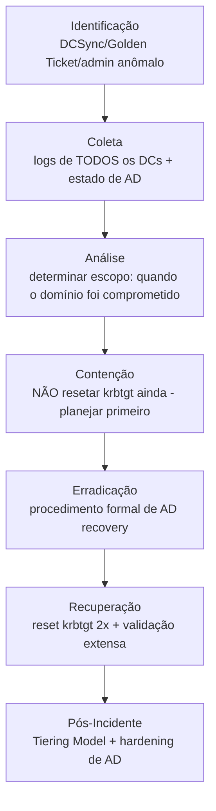

# Active-Directory

> 🟢 Full Playbook

## 1. Descrição Técnica

### Definição
Esta categoria cobre a investigação de comprometimento de Active Directory como objetivo/alcance final do atacante — diferente de `Credential-Access`, `Kerberoasting` e `Pass-the-Hash` (técnicas específicas), aqui o foco é o **comprometimento do domínio como um todo**: controle de Domain Controller, abuso de ACLs/delegação, Golden/Silver Ticket, e o procedimento de recuperação completa de um domínio comprometido.

### Objetivo do Atacante
Controle total sobre a floresta/domínio AD — de onde deriva acesso irrestrito a praticamente todos os recursos do ambiente.

### Impacto Esperado
- **Máximo** — comprometimento de AD é tipicamente classificado como SEV1 automaticamente, pois compromete a base de confiança de todo o ambiente Windows
- Recuperação completa de um domínio comprometido é um dos processos de IR mais complexos e demorados que existem

### Vetores de Entrada
- Escalonamento a partir de host comprometido até Domain Admin (via PtH, Kerberoasting, abuso de ACL)
- Exploração direta de vulnerabilidade em Domain Controller (ex.: ZeroLogon, PrintNightmare, NTLM relay)
- Abuso de delegação Kerberos insegura (unconstrained/constrained delegation)
- Comprometimento de conta de Tier 0 via phishing direcionado

### Indicadores de Comprometimento (IOCs)
| Tipo | Exemplo | Onde encontrar |
|---|---|---|
| Golden Ticket (TGT forjado) | TGT com tempo de vida anômalo (ex.: 10 anos) | Event ID 4768/4769 com anomalias |
| DCSync não autorizado | replicação solicitada por conta não-DC | Event ID 4662 (com GUID de replicação) |
| Mudança de política de domínio/GPO | — | Event ID 5136, 4739 |
| Criação de novo Domain Admin | — | Event ID 4728/4732 no grupo Domain Admins |
| Uso de exploit conhecido (ZeroLogon, etc.) | — | EDR, logs de aplicação do DC |

### TTPs Relacionados (MITRE ATT&CK)
| Tática | Técnica | ID |
|---|---|---|
| Credential Access | Steal or Forge Kerberos Tickets: Golden Ticket | T1558.001 |
| Credential Access | Steal or Forge Kerberos Tickets: Silver Ticket | T1558.002 |
| Credential Access | OS Credential Dumping: DCSync | T1003.006 |
| Persistence | Domain Policy Modification | T1484 |
| Lateral Movement | Use Alternate Authentication Material | T1550 |

---

## 2. Fluxo de Investigação

> ⚠️ Comprometimento confirmado de Active Directory exige **planejamento cuidadoso** antes de qualquer ação de remediação. Reset de krbtgt sem preparação adequada pode causar outage massivo (todos os tickets Kerberos do domínio são invalidados simultaneamente).

### 2.1 Identificação
**Como detectar:**
- Alerta de DCSync de conta não-DC (Event ID 4662 com GUID de replicação `1131f6aa-9c07-11d1-f79f-00c04fc2dcd2` ou similar, solicitado por conta que não é Domain Controller)
- Detecção de Golden Ticket via anomalia de tempo de vida ou RID inconsistente
- Mudança não autorizada em GPO ou grupo Domain Admins

**Logs relevantes:** Security.evtx de **todos** os Domain Controllers (não apenas um — replicação pode mascarar origem), Event ID 4662, 4768/4769, 4728/4732, 5136

**Ferramentas utilizadas:** SIEM com correlação multi-DC, BloodHound (para mapear caminhos de ataque possíveis), Hayabusa/Chainsaw

**Alertas comuns:** "DCSync detected", "Golden Ticket usage suspected", "Unauthorized Domain Admin group modification"

### 2.2 Coleta
**Artefatos necessários:**
- Logs de Security de **todos** os Domain Controllers do domínio/floresta
- Estado atual de GPOs, grupos privilegiados, delegações configuradas
- Histórico de replicação do AD (metadados de objeto — `repadmin /showobjmeta`)

**Evidências:**
- Logs: cadeia completa de eventos relacionados a credential theft, replicação, mudança de privilégio
- Estado de AD: snapshot de configuração atual para comparação com baseline conhecido

### 2.3 Análise
**O que procurar:**
- **Quando** o domínio foi efetivamente comprometido (não apenas quando foi detectado) — essencial para determinar escopo de credenciais potencialmente expostas
- Quais contas/objetos foram modificados, criados ou tiveram privilégio alterado
- Se houve uso de Golden/Silver Ticket (indica que o hash do krbtgt — ou de uma conta de serviço, no caso de Silver Ticket — já foi extraído)
- Caminhos de ataque possíveis no estado atual do AD (BloodHound, defensivamente, para entender o que mais está exposto)

**Técnicas de investigação:** análise de metadados de replicação do AD (`repadmin /showobjmeta`) pode revelar quando objetos específicos (ex.: associação a grupo privilegiado) foram modificados, mesmo se os logs de evento já expiraram.

**Correlação de eventos:** esta investigação tipicamente integra achados de `Credential-Access/`, `Kerberoasting/`, `Pass-the-Hash/` e `Privilege-Escalation/` — o comprometimento de AD raramente é uma técnica isolada, é o resultado acumulado de uma cadeia de ataque completa.

**Hipóteses a validar:**
- [ ] O hash do krbtgt foi comprometido (Golden Ticket em uso)?
- [ ] DCSync foi executado com sucesso (todo o NTDS.dit deve ser considerado exposto)?
- [ ] Quais contas privilegiadas (Domain Admin, Enterprise Admin, conta de serviço Tier 0) foram criadas/modificadas pelo atacante?
- [ ] O atacante ainda tem acesso ativo no momento da investigação?

### 2.4 Contenção
- [ ] **Não resetar krbtgt imediatamente sem planejamento** — coordenar janela de manutenção, pois invalida todos os tickets Kerberos ativos no domínio
- [ ] Isolar contas comprometidas identificadas sem alertar o atacante prematuramente, se possível (monitoramento silencioso até plano de erradicação completo estar pronto)
- [ ] Avaliar isolamento de rede dos Domain Controllers de redes não essenciais durante a janela de remediação

### 2.5 Erradicação
- [ ] Executar reset de senha do **krbtgt duas vezes**, com intervalo (mínimo 10 horas, idealmente 24h+ entre os dois resets, conforme prática Microsoft) — invalida todos os Golden Tickets existentes
- [ ] Resetar senha de **todas** as contas privilegiadas (Domain Admin, Enterprise Admin, contas de serviço Tier 0)
- [ ] Remover contas/GPOs/delegações criadas pelo atacante
- [ ] Avaliar reconstrução completa do domínio (rebuild from scratch) em casos de comprometimento muito profundo/prolongado — às vezes mais seguro que tentar "limpar" um domínio extensamente comprometido

### 2.6 Recuperação
- [ ] Validar funcionamento de autenticação em toda a organização após reset de krbtgt (planejar comunicação/suporte para usuários durante a transição)
- [ ] Monitoramento intensivo de toda atividade privilegiada por período estendido (semanas a meses)
- [ ] Revalidar configuração de delegação Kerberos em toda a floresta

### 2.7 Pós-Incidente
- [ ] Implementar **Tiering Model** (Tier 0/1/2) para segregar credenciais privilegiadas de uso em estações de trabalho comuns
- [ ] Auditoria completa de delegação Kerberos (eliminar unconstrained delegation onde não for estritamente necessário)
- [ ] Implementar Privileged Access Workstations (PAWs) para administração de Tier 0
- [ ] Considerar arquitetura de **Red Forest** / Enhanced Security Admin Environment (ESAE) para ambientes de alto risco

---

## 3. Checklist Operacional

- [ ] Logs de todos os DCs coletados (não apenas um)
- [ ] Timeline completa de comprometimento reconstruída
- [ ] Uso de Golden/Silver Ticket avaliado
- [ ] DCSync avaliado (NTDS.dit deve ser considerado exposto se confirmado)
- [ ] Todas as contas/objetos modificados pelo atacante identificados
- [ ] Plano de reset de krbtgt aprovado e janela de manutenção agendada
- [ ] Reset de krbtgt executado (2x, com intervalo)
- [ ] Todas as contas privilegiadas resetadas
- [ ] Tiering Model avaliado para implementação
- [ ] Monitoramento pós-recuperação ativo por período estendido

---

## 4. Evidências Relevantes

### Windows
| Fonte | Localização | O que procurar |
|---|---|---|
| Security.evtx (todos os DCs) | Domain Controllers | Event ID 4662 (DCSync), 4768/4769 (tickets anômalos), 4728/4732 (grupo privilegiado), 5136 (mudança de objeto AD) |
| Metadados de replicação | `repadmin /showobjmeta` | Histórico de modificação de objetos, mesmo sem log de evento |
| NTDS.dit | Domain Controller | Análise offline se exfiltração for confirmada |

### Linux
*Não aplicável diretamente — Active Directory é tecnologia Windows. Hosts Linux integrados via SSSD/Winbind podem ser ponto de pivô.*

### Cloud
| Fonte | Serviço | O que procurar |
|---|---|---|
| Azure AD Connect logs | Hybrid AD | Sincronização anômala entre AD on-prem e Azure AD |

---

## 5. Ferramentas Recomendadas

| Categoria | Ferramentas |
|---|---|
| DFIR | Velociraptor, KAPE |
| Análise de AD | BloodHound, PingCastle, repadmin |
| Threat Hunting | Hayabusa, Chainsaw, Sigma |

---

## 6. Casos Reais

### Comprometimento de AD via ZeroLogon em campanhas diversas
A vulnerabilidade ZeroLogon (CVE-2020-1472) permitiu, quando não corrigida, que um atacante com acesso de rede ao Domain Controller resetasse a senha da conta de máquina do DC para uma string vazia, obtendo controle administrativo completo do domínio sem credencial prévia. Amplamente explorada por múltiplos atores (incluindo operadores de ransomware) como caminho direto para comprometimento total de AD. **Aplicação:** a investigação de qualquer indício de exploração de ZeroLogon (ou vulnerabilidades similares de DC) deve assumir comprometimento total do domínio desde o primeiro indício, acionando o procedimento completo de AD recovery acima — não há "comprometimento parcial" quando a vulnerabilidade explorada concede controle direto do DC.

---

## Referências
- MITRE ATT&CK: [T1558.001](https://attack.mitre.org/techniques/T1558/001/), [T1003.006](https://attack.mitre.org/techniques/T1003/006/), [T1484](https://attack.mitre.org/techniques/T1484/)
- Microsoft: "AD Forest Recovery" official guidance
- CISA: orientações sobre ZeroLogon (CVE-2020-1472)
