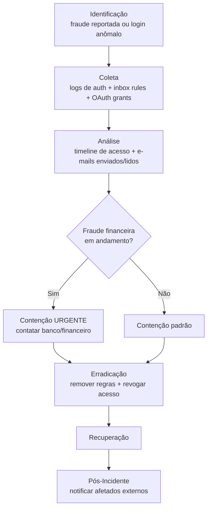

# BEC (Business Email Compromise)

> 🟢 Full Playbook

## 1. Descrição Técnica

### Definição
BEC é uma fraude na qual o atacante compromete ou falsifica uma conta de e-mail corporativa (geralmente de executivo ou fornecedor) para induzir vítimas a realizar transferências financeiras fraudulentas, alterar dados bancários de pagamento, ou expor dados sensíveis. Diferente de outras categorias, o foco do atacante é frequentemente **engenharia social pura** após o comprometimento — sem malware envolvido na maior parte da operação.

### Objetivo do Atacante
Fraude financeira direta (transferência bancária fraudulenta, alteração de dados de pagamento de fornecedor) ou coleta de informação para fraude futura.

### Impacto Esperado
- **Financeiro:** perda direta via transferência fraudulenta (tipicamente o maior impacto financeiro per-incidente entre todas as categorias)
- **Confidencialidade:** exposição de dados de e-mail/contratos
- **Reputacional:** impacto em relação com clientes/fornecedores enganados

### Vetores de Entrada
- Phishing/Spear-Phishing tradicional levando a roubo de credencial
- AiTM (Adversary-in-the-Middle) phishing para bypass de MFA e roubo de session cookie
- Credential stuffing com senha vazada/reutilizada
- Comprometimento de fornecedor/parceiro (vendor email compromise) usado para atacar a organização

### Indicadores de Comprometimento (IOCs)
| Tipo | Exemplo | Onde encontrar |
|---|---|---|
| Regra de encaminhamento maliciosa | Forward para `attacker@external[.]com` | Inbox Rules (M365/Google) |
| Login de geolocalização anômala | IP de país incomum | Azure AD Sign-in Logs |
| Domínio lookalike usado para resposta | `empresa-financeiro[.]com` vs `empresa.com` | Headers de e-mail de resposta |
| OAuth app não autorizado consentido | App de terceiro com escopo de e-mail | Azure AD / Google Workspace app consents |

### TTPs Relacionados (MITRE ATT&CK)
| Tática | Técnica | ID |
|---|---|---|
| Initial Access | Phishing | T1566 |
| Persistence | Email Forwarding Rule | T1114.003 |
| Collection | Email Collection | T1114 |
| Impact | Data Manipulation | T1565 |
| Credential Access | Steal Web Session Cookie | T1539 |

---

## 2. Fluxo de Investigação

### 2.1 Identificação
**Como detectar:**
- Destinatário externo reporta solicitação de pagamento suspeita
- Alerta de regra de encaminhamento criada (Defender/Google Workspace)
- Login de geolocalização/dispositivo impossível (impossible travel)
- Banco/financeiro reporta solicitação de transferência suspeita

**Logs relevantes:** Azure AD Sign-in Logs, Unified Audit Log (M365), Inbox Rules, OAuth app consents

**Ferramentas utilizadas:** Microsoft 365 Defender, Google Workspace Security Center, KQL/Audit Log Search

**Alertas comuns:** "Impossible travel", "Suspicious inbox forwarding rule", "Unusual mailbox access"

### 2.2 Coleta
**Artefatos necessários:**
- Histórico completo de login da conta (período de pelo menos 90 dias antes da detecção)
- Todas as regras de caixa de entrada criadas/modificadas
- Lista de e-mails enviados durante o período suspeito
- OAuth app consents associados à conta

**Evidências:**
- Identidade: Sign-in logs (IP, dispositivo, MFA challenge, conditional access)
- E-mail: Message Trace de tudo enviado/recebido no período
- Financeiro: detalhes da transação fraudulenta, se houver (para investigação com o banco)

### 2.3 Análise
**O que procurar:**
- Quando o acesso inicial não autorizado começou (nem sempre coincide com a fraude detectada — atacante pode ter acesso há semanas, "lurking" para entender padrões de comunicação antes de agir)
- Todas as regras de encaminhamento, incluindo as ocultas da UI padrão (auditar via `Get-InboxRule` / API)
- E-mails enviados a partir da conta comprometida (fraude pode já ter sido perpetrada contra terceiros)
- Acesso a OneDrive/SharePoint/Drive vinculado (exfiltração de dados além da fraude financeira)

**Técnicas de investigação:** reconstrução de timeline completa de login (Azure AD Sign-in Logs) cruzada com criação/modificação de regras de caixa e horário de envio dos e-mails fraudulentos.

**Correlação de eventos:** verificar se a mesma infraestrutura (IP/ASN do atacante) aparece em outras contas da organização — BEC frequentemente envolve múltiplas contas testadas/comprometidas simultaneamente.

**Hipóteses a validar:**
- [ ] Houve transferência financeira concluída (não apenas tentada)?
- [ ] O atacante teve acesso de "lurking" prolongado antes de agir?
- [ ] Outras contas foram comprometidas na mesma campanha?
- [ ] Dados de terceiros (clientes/fornecedores) foram expostos?

### 2.4 Contenção
- [ ] Resetar senha e **revogar todas as sessões/tokens ativos** (essencial — reset de senha sozinho não invalida tokens já emitidos)
- [ ] Remover regras de encaminhamento maliciosas
- [ ] Revogar OAuth app consents não autorizados
- [ ] Se fraude financeira em andamento: contatar banco/instituição financeira imediatamente para tentar reversão (janela de minutos a poucas horas)

### 2.5 Erradicação
- [ ] Confirmar remoção de toda persistência (regras, apps OAuth, delegação de caixa)
- [ ] Verificar se houve criação de regras similares em outras contas
- [ ] Forçar re-registro de MFA

### 2.6 Recuperação
- [ ] Confirmar uso normal da conta restaurada
- [ ] Monitoramento elevado da conta por período estendido

### 2.7 Pós-Incidente
- [ ] Notificar clientes/fornecedores que possam ter recebido e-mail fraudulento
- [ ] Avaliar enforcement de Conditional Access (bloqueio geográfico, exigência de dispositivo gerenciado)
- [ ] Revisar processo de validação de mudança de dados bancários (controle de processo, não só técnico — callback verification obrigatório)

---

## 3. Checklist Operacional

- [ ] Sessões/tokens revogados (não só senha resetada)
- [ ] Todas as regras de encaminhamento auditadas e removidas
- [ ] OAuth app consents revisados
- [ ] Histórico de login completo (90+ dias) analisado
- [ ] Financeiro/banco contatado se fraude em andamento
- [ ] Jurídico acionado
- [ ] Terceiros afetados notificados
- [ ] Processo de validação de pagamento revisado

---

## 4. Evidências Relevantes

### Windows
| Fonte | Localização | O que procurar |
|---|---|---|
| Sysmon (se acesso via host comprometido) | Operational | Processo de roubo de credencial (browser, keylogger) |

### Linux
*Geralmente não aplicável diretamente — BEC é majoritariamente um ataque ao nível de identidade cloud (e-mail SaaS).*

### Cloud
| Fonte | Serviço | O que procurar |
|---|---|---|
| Azure AD Sign-in Logs | Identity | IP, dispositivo, geolocalização, MFA challenge de cada login |
| Unified Audit Log | M365 | `New-InboxRule`, `Set-Mailbox`, `New-TransportRule` |
| Google Workspace Audit | Gmail | Filtros criados, delegação de caixa, OAuth grants |

---

## 5. Ferramentas Recomendadas

| Categoria | Ferramentas |
|---|---|
| Investigação de e-mail/identidade | Microsoft 365 Defender, KQL, Google Workspace Security Investigation Tool |
| Threat Hunting | Sigma (para regras de encaminhamento), Hawk (M365 incident response) |

---

## 6. Casos Reais

### Fraude de "CEO Fraud" / Vendor Email Compromise
Padrão recorrente reportado globalmente (FBI IC3 cita BEC como uma das categorias de maior perda financeira agregada entre crimes cibernéticos): atacante compromete e-mail de fornecedor real, monitora a comunicação ("lurking") até identificar uma fatura legítima pendente, então envia e-mail da conta comprometida (ou domínio lookalike) solicitando alteração da conta bancária de destino momentos antes do pagamento ser processado. **Aplicação da metodologia:** a investigação deve sempre verificar o histórico completo de login da conta (não apenas o dia da fraude) para identificar a janela de "lurking", e o processo de pós-incidente deve necessariamente incluir revisão do controle de **callback verification** (confirmação por canal independente, ex.: telefone, para qualquer mudança de dados bancários) — o controle técnico sozinho (MFA, etc.) não previne a fraude se o processo de negócio não exige verificação fora de banda.

---

## Referências
- MITRE ATT&CK: [T1114](https://attack.mitre.org/techniques/T1114/), [T1114.003](https://attack.mitre.org/techniques/T1114/003/), [T1539](https://attack.mitre.org/techniques/T1539/)
- FBI IC3 Annual Report (dados públicos sobre impacto financeiro de BEC)
