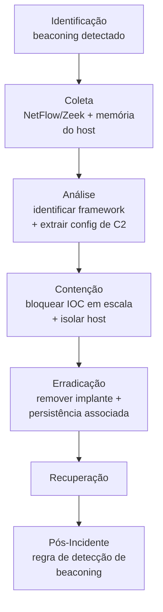

# C2 (Command and Control)

> 🟢 Full Playbook

## 1. Descrição Técnica

### Definição
Command and Control (C2) refere-se à infraestrutura e aos canais de comunicação que um atacante usa para manter controle remoto sobre sistemas comprometidos — enviar comandos, receber dados, e baixar payloads adicionais. Frameworks modernos (Cobalt Strike, Sliver, Mythic, Brute Ratel) oferecem C2 altamente configurável com técnicas de evasão (malleable profiles, domain fronting, jitter de beacon).

### Objetivo do Atacante
Manter controle remoto persistente e furtivo sobre o(s) host(s) comprometido(s), permitindo execução de comandos sob demanda, movimento lateral coordenado, e exfiltração.

### Impacto Esperado
- Habilita praticamente qualquer impacto subsequente (movimento lateral, exfiltração, ransomware) — C2 ativo é geralmente o indicador de que o atacante mantém controle em tempo real, não apenas presença passiva

### Vetores de Entrada
*(C2 é estabelecido após acesso inicial, via execução do agente/implante)*
- HTTP/HTTPS (mais comum — mistura-se com tráfego legítimo)
- DNS (DNS tunneling — para ambientes com proxy HTTP restritivo)
- Protocolos legítimos abusados (Slack, Discord, Telegram, Google Sheets como C2 channel)
- Domain Fronting / uso de CDN para mascarar destino real

### Indicadores de Comprometimento (IOCs)
| Tipo | Exemplo | Onde encontrar |
|---|---|---|
| Beaconing periódico | conexões regulares com jitter para mesmo destino | NetFlow, Zeek conn.log |
| JA3/JA3S fingerprint conhecido | hash de handshake TLS associado a framework de C2 | Zeek ssl.log |
| User-Agent incomum/desatualizado | — | Proxy logs |
| Domínio de C2 com certificado recém-emitido | — | Certificate Transparency logs, Zeek |
| Processo legítimo com conexão de rede anômala | `rundll32.exe` conectando externamente | Sysmon Event ID 3 |

### TTPs Relacionados (MITRE ATT&CK)
| Tática | Técnica | ID |
|---|---|---|
| Command and Control | Application Layer Protocol | T1071 |
| Command and Control | Application Layer Protocol: DNS | T1071.004 |
| Command and Control | Encrypted Channel | T1573 |
| Command and Control | Proxy | T1090 |
| Command and Control | Dynamic Resolution | T1568 |
| Command and Control | Ingress Tool Transfer | T1105 |

---

## 2. Fluxo de Investigação

### 2.1 Identificação
**Como detectar:**
- Regra de detecção de beaconing (intervalo regular com jitter — ferramentas como RITA automatizam essa análise sobre logs Zeek)
- EDR sinalizando processo com comportamento de injeção + conexão de rede
- TI feed com IOC de infraestrutura de C2 conhecida

**Logs relevantes:** Zeek `conn.log`/`ssl.log`, NetFlow, Sysmon Event ID 1/3, logs de proxy

**Ferramentas utilizadas:** RITA (detecção de beaconing), Zeek, Wireshark, EDR

**Alertas comuns:** "Possible C2 beaconing", "Known C2 infrastructure contacted", "Cobalt Strike beacon signature detected"

### 2.2 Coleta
**Artefatos necessários:**
- PCAP/Zeek logs do período de comunicação
- Memória do host (implantes C2 modernos são frequentemente fileless/refletidos em memória)
- Processo e linha de comando associados à conexão

**Evidências:**
- Rede: padrão completo de beaconing (frequência, jitter, volume de dados por beacon)
- Memória: extração do implante para identificação de framework e configuração

### 2.3 Análise
**O que procurar:**
- Identificação do framework de C2 (Cobalt Strike, Sliver, Mythic, custom) via assinatura de tráfego, JA3, ou extração de configuração da memória
- Configuração extraída (domínio/IP de C2, malleable profile, chave de criptografia) — alto valor para bloqueio em escala e atribuição
- Comandos executados via o canal de C2 (se reconstruível a partir de PCAP ou logs do host)

**Técnicas de investigação:** extração de configuração de Cobalt Strike Beacon (e frameworks similares) a partir de memória usando ferramentas especializadas (ex.: `1768.py` para Cobalt Strike) é frequentemente o passo de maior valor — revela todos os C2 servers configurados (incluindo failover) e o malleable profile usado.

**Correlação de eventos:** cruzar a janela de comunicação de C2 com toda a atividade subsequente no host (movimento lateral, exfiltração) — o tráfego de C2 é a "espinha dorsal" temporal de boa parte da investigação.

**Hipóteses a validar:**
- [ ] Qual framework de C2 está em uso?
- [ ] Existem múltiplos servidores de C2 configurados (failover)?
- [ ] Outros hosts no ambiente se comunicam com a mesma infraestrutura?
- [ ] O canal de C2 foi usado para exfiltração de dados além de comando/controle?

### 2.4 Contenção
- [ ] Bloquear toda a infraestrutura de C2 identificada (incluindo servidores de failover) em firewall/proxy/EDR, em escala (toda a organização, não só o host afetado)
- [ ] Isolar host(s) comprometido(s) preservando estado para captura de memória

### 2.5 Erradicação
- [ ] Remover o implante e qualquer persistência associada (ver `Persistence/`)
- [ ] Verificar se o implante tem mecanismo de auto-reinstalação/watchdog

### 2.6 Recuperação
- [ ] Confirmar ausência de novas tentativas de beaconing após remediação
- [ ] Monitoramento de rede elevado por período estendido para a mesma infraestrutura/padrão

### 2.7 Pós-Incidente
- [ ] Criar/atualizar regra de detecção de beaconing (Sigma/Suricata) com IOCs e padrão de tráfego extraídos
- [ ] Avaliar TLS inspection em pontos críticos de saída, se ainda não implementado
- [ ] Compartilhar IOCs com comunidade (ISAC/MISP), respeitando TLP

---

## 3. Checklist Operacional

- [ ] Padrão de beaconing confirmado (frequência, jitter, volume)
- [ ] Framework de C2 identificado
- [ ] Configuração de C2 extraída (todos os servidores, incluindo failover)
- [ ] Memória do host capturada antes de remediação
- [ ] Toda a infraestrutura bloqueada em escala
- [ ] Outros hosts com mesmo IOC identificados (hunting retroativo)
- [ ] Implante e persistência removidos
- [ ] Regra de detecção de beaconing criada/atualizada

---

## 4. Evidências Relevantes

### Windows
| Fonte | Localização | O que procurar |
|---|---|---|
| Sysmon | Operational | Event ID 1 (processo do implante), 3 (conexão de rede), 7 (DLL load suspeita) |
| Memória | — | Extração de configuração do implante (Cobalt Strike, Sliver, etc.) |

### Linux
| Fonte | Caminho | O que procurar |
|---|---|---|
| auditd | `/var/log/audit/audit.log` | Execução de implante, conexão de rede de processo suspeito |

### Cloud
| Fonte | Serviço | O que procurar |
|---|---|---|
| VPC Flow Logs / NSG Flow Logs | AWS/Azure | Comunicação de instância/VM para infraestrutura de C2 externa |

---

## 5. Ferramentas Recomendadas

| Categoria | Ferramentas |
|---|---|
| Network Analysis | Wireshark, Zeek, RITA, Arkime |
| Memory Forensics | Volatility 3, ferramentas de extração de config (1768.py para Cobalt Strike) |
| Threat Hunting | Suricata, Sigma |

---

## 6. Casos Reais

### Cobalt Strike como C2 padrão de mercado em intrusões de Ransomware-as-a-Service
Cobalt Strike (ferramenta legítima de red team, amplamente "cracked" e reutilizada por atores maliciosos) é historicamente a infraestrutura de C2 mais observada em incidentes envolvendo afiliados de ransomware (LockBit, Conti, e diversos outros), devido à sua robustez e malleable profiles que dificultam detecção por assinatura simples. **Aplicação:** a investigação deve priorizar extração do malleable C2 profile e dos JA3/JA3S fingerprints específicos da instância observada — bloqueio apenas por IP/domínio é insuficiente, pois a infraestrutura de C2 é tipicamente descartável e rotacionada rapidamente pelo afiliado.

---

## Referências
- MITRE ATT&CK: [T1071](https://attack.mitre.org/techniques/T1071/), [T1573](https://attack.mitre.org/techniques/T1573/), [T1090](https://attack.mitre.org/techniques/T1090/)
- MITRE D3FEND: Network Traffic Analysis
