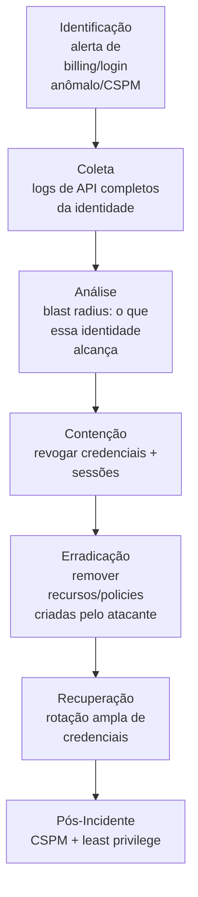

# Cloud-Intrusion

> 🟢 Full Playbook

## 1. Descrição Técnica

### Definição
Cloud Intrusion cobre a metodologia **geral** de investigação de comprometimento em ambientes de nuvem (AWS/Azure/GCP), complementando a metodologia transversal em [`Cloud-Investigations/README.md`](../../Cloud-Investigations/README.md). Esta categoria foca no ciclo completo de resposta a um comprometimento confirmado de identidade ou recurso cloud, independente do provedor específico (ver `AWS/`, `Azure/`, `GCP/` para detalhes específicos de cada plataforma).

### Objetivo do Atacante
Acesso não autorizado a recursos cloud (compute, storage, dados), com objetivos que vão desde cryptojacking (uso de recursos para mineração) até exfiltração de dados em massa ou pivô para o ambiente on-premises via identidade híbrida.

### Impacto Esperado
- **Financeiro:** custo de recursos cloud abusados (cryptojacking pode gerar contas de dezenas de milhares de dólares em dias)
- **Confidencialidade:** exposição de dados armazenados em cloud storage
- **Disponibilidade:** exclusão/criptografia de recursos cloud (ransomware cloud-native)

### Vetores de Entrada
- Credenciais/chaves de API vazadas (commit acidental em repositório público, log exposto)
- Instance Metadata Service (IMDS) abuse via SSRF em aplicação web (T1552.005)
- Configuração excessivamente permissiva de IAM (over-privileged role)
- Comprometimento de identidade federada (SSO comprometido)
- Bucket/storage configurado com acesso público não intencional

### Indicadores de Comprometimento (IOCs)
| Tipo | Exemplo | Onde encontrar |
|---|---|---|
| Login de geolocalização/IP anômalo | — | CloudTrail/Azure AD Sign-in/GCP Audit |
| Criação de recursos de alto custo (instâncias GPU, etc.) | — | CloudTrail (`RunInstances`), billing alert |
| Chamada de API a partir de user-agent de SDK incomum | — | CloudTrail `userAgent` |
| Acesso ao Instance Metadata Service de origem inesperada | requisição a `169.254.169.254` via app comprometida | Logs de aplicação, WAF |
| Mudança de política IAM por identidade não administrativa | — | CloudTrail/Azure AD Audit |

### TTPs Relacionados (MITRE ATT&CK)
| Tática | Técnica | ID |
|---|---|---|
| Initial Access | Valid Accounts: Cloud Accounts | T1078.004 |
| Persistence | Additional Cloud Credentials | T1098.001 |
| Credential Access | Unsecured Credentials: Cloud Instance Metadata API | T1552.005 |
| Impact | Resource Hijacking | T1496 |
| Exfiltration | Transfer Data to Cloud Account | T1537 |

---

## 2. Fluxo de Investigação

### 2.1 Identificação
**Como detectar:**
- Alerta de billing anômalo (custo súbito de recursos)
- CSPM (Cloud Security Posture Management) sinalizando configuração explorada
- Detecção nativa do provedor (GuardDuty, Microsoft Defender for Cloud, Security Command Center)
- Login de geolocalização impossível

**Logs relevantes:** CloudTrail (AWS), Azure AD Sign-in + Activity Logs (Azure), Admin/Data Access Audit Logs (GCP)

**Ferramentas utilizadas:** GuardDuty/Defender for Cloud/SCC, Prowler/ScoutSuite para avaliação de postura

**Alertas comuns:** "Anomalous API activity", "Resource created in unusual region", "Credential used from new location"

### 2.2 Coleta
**Artefatos necessários:**
- Histórico completo de chamadas de API da identidade comprometida (período amplo — mínimo 30-90 dias)
- Configuração atual de IAM/permissões da identidade
- Snapshot de qualquer recurso modificado/criado pelo atacante (antes de remediar, se possível)

**Evidências:**
- Logs de API: toda chamada feita pela identidade, com origem (IP, user-agent)
- Configuração: políticas/roles anexadas, trust relationships

### 2.3 Análise
**O que procurar:**
- **Blast radius:** o que a identidade comprometida tem permissão de fazer (não apenas o que já fez) — essencial para avaliar o pior cenário possível
- Origem do comprometimento: como a credencial foi obtida (vazamento, phishing, SSRF/IMDS)
- Persistência estabelecida: novas chaves de acesso, novos usuários/service accounts, mudanças de trust policy

**Técnicas de investigação:** reconstruir a timeline completa de chamadas de API em ordem cronológica é geralmente mais revelador que buscar por "ação maliciosa óbvia" — muitas chamadas de reconhecimento (`ListBuckets`, `DescribeInstances`, `GetCallerIdentity`) precedem a ação de impacto e ajudam a confirmar intenção.

**Correlação de eventos:** se a organização tem ambiente híbrido (AD + cloud), verificar se a identidade comprometida tem qualquer ligação com credenciais on-premises (federação SSO) que possa permitir pivô em qualquer direção.

**Hipóteses a validar:**
- [ ] Como a credencial/identidade foi comprometida originalmente?
- [ ] Qual o blast radius completo da identidade (todas as permissões, não só as usadas)?
- [ ] Houve criação de persistência (chaves, usuários, trust policies)?
- [ ] Há exposição de dados armazenados (buckets, databases) acessíveis pela identidade?

### 2.4 Contenção
- [ ] Revogar/desabilitar a credencial comprometida imediatamente
- [ ] **Revogar sessões/tokens ativos** (chave de API desabilitada não invalida sessão já estabelecida em alguns provedores — confirmar mecanismo específico)
- [ ] Aplicar policy de quarentena (deny-all temporário) à identidade enquanto investigação prossegue, se suportado pelo provedor

### 2.5 Erradicação
- [ ] Remover qualquer recurso, política IAM, usuário/service account ou trust relationship criado pelo atacante
- [ ] Investigar e corrigir a causa raiz do vazamento de credencial original (rotação de segredo em repositório, correção de SSRF, etc.)

### 2.6 Recuperação
- [ ] Rotacionar **todas** as credenciais com escopo relacionado à identidade comprometida, não apenas a credencial diretamente exposta
- [ ] Validar funcionamento normal dos serviços/aplicações que dependiam da identidade

### 2.7 Pós-Incidente
- [ ] Implementar/reforçar CSPM contínuo
- [ ] Revisar e aplicar princípio de menor privilégio nas políticas IAM
- [ ] Avaliar uso de credenciais de curta duração (roles temporários) em vez de chaves de longa duração
- [ ] Bloquear/restringir acesso ao Instance Metadata Service v1 (preferir IMDSv2 em AWS, equivalentes em outros provedores)

---

## 3. Checklist Operacional

- [ ] Identidade comprometida identificada com precisão
- [ ] Histórico completo de API (30-90 dias) coletado
- [ ] Blast radius (permissões completas) mapeado
- [ ] Causa raiz do vazamento de credencial determinada
- [ ] Credenciais revogadas e sessões invalidadas
- [ ] Recursos/políticas criadas pelo atacante removidas
- [ ] Rotação ampla de credenciais relacionadas executada
- [ ] CSPM/postura de segurança revisada

---

## 4. Evidências Relevantes

### Windows / Linux
*Aplicável apenas se houver pivô para instâncias/VMs específicas comprometidas — ver evidências padrão de host em `DFIR/README.md`.*

### Cloud
| Fonte | Serviço | O que procurar |
|---|---|---|
| AWS CloudTrail | IAM/EC2/S3 | Toda chamada de API da identidade, criação de recursos, mudança de política |
| Azure Activity + Sign-in Logs | Identity/Resource Manager | Login, mudança de role, criação de recurso |
| GCP Audit Logs | Admin Activity / Data Access | Mudança de IAM, acesso a dados |
| Billing/Cost Explorer | Todos | Picos de custo associados a recursos criados pelo atacante |

---

## 5. Ferramentas Recomendadas

| Categoria | Ferramentas |
|---|---|
| CSPM | Prowler, ScoutSuite, provedor nativo (Security Hub, Defender for Cloud, SCC) |
| DFIR Cloud | Velociraptor (cloud plugins), CLI nativo de cada provedor |
| Análise de log em escala | CloudTrail Lake, Log Analytics (KQL), BigQuery |

---

## 6. Casos Reais

### Abuso de IMDS via SSRF — padrão recorrente em incidentes cloud
Vulnerabilidades de SSRF em aplicações web hospedadas em cloud são consistentemente exploradas para acessar o Instance Metadata Service (`169.254.169.254`) e extrair credenciais temporárias da role IAM anexada à instância — um padrão documentado em diversos incidentes públicos de grande porte ao longo dos últimos anos. **Aplicação:** ao investigar qualquer comprometimento de credencial cloud sem origem clara, verificar logs da aplicação web front-end por requisições ao endpoint de metadata é um passo de triagem obrigatório — a causa raiz frequentemente não está na própria configuração IAM, mas em uma vulnerabilidade de aplicação que permitiu o acesso indireto.

---

## Referências
- MITRE ATT&CK: [T1078.004](https://attack.mitre.org/techniques/T1078/004/), [T1552.005](https://attack.mitre.org/techniques/T1552/005/), [T1496](https://attack.mitre.org/techniques/T1496/)
- Metodologia complementar: [`Cloud-Investigations/README.md`](../../Cloud-Investigations/README.md)
