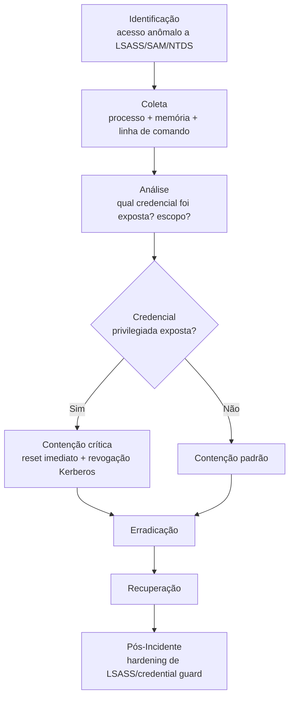

# Credential-Access

> 🟢 Full Playbook

## 1. Descrição Técnica

### Definição
Credential Access engloba técnicas usadas para roubar credenciais (senhas, hashes, tickets, tokens, chaves de API) — é uma tática ampla do MITRE ATT&CK que abrange desde dumping de memória de processo (LSASS) até extração de credenciais armazenadas em navegadores ou cofres de senha. Este playbook cobre a metodologia **genérica**; técnicas específicas de alto volume têm playbooks dedicados (`Brute-Force/`, `Password-Spraying/`, `Kerberoasting/`, `Pass-the-Hash/`).

### Objetivo do Atacante
Obter credenciais válidas para escalonamento de privilégio, movimento lateral, ou acesso persistente sem depender de malware (uso de "living off the land" com conta legítima).

### Impacto Esperado
- **Confidencialidade:** acesso não autorizado a sistemas/dados protegidos pela credencial roubada
- Risco multiplicador: credencial roubada frequentemente habilita movimento lateral e escalonamento, ampliando o escopo do incidente original

### Vetores de Entrada
- Dumping de memória LSASS (Mimikatz e ferramentas similares)
- Extração de hashes do SAM/NTDS.dit
- Roubo de credenciais armazenadas em navegador (autofill, password manager local)
- Keylogging
- Extração de credenciais de arquivos de configuração/scripts (secrets em código, "secret sprawl")
- Phishing/AiTM para captura direta

### Indicadores de Comprometimento (IOCs)
| Tipo | Exemplo | Onde encontrar |
|---|---|---|
| Acesso a LSASS por processo não usual | `procdump.exe → lsass.exe` | Sysmon Event ID 10 |
| Dump de NTDS.dit | `ntdsutil.exe` execução | Sysmon Event ID 1 |
| Ferramenta de dumping conhecida | Mimikatz, LaZagne, SharpDump (hash) | EDR/AV |
| Acesso a Credential Manager | — | Event ID 5379/5382 |

### TTPs Relacionados (MITRE ATT&CK)
| Tática | Técnica | ID |
|---|---|---|
| Credential Access | OS Credential Dumping | T1003 |
| Credential Access | OS Credential Dumping: LSASS Memory | T1003.001 |
| Credential Access | OS Credential Dumping: NTDS | T1003.003 |
| Credential Access | Credentials from Password Stores | T1555 |
| Credential Access | Unsecured Credentials | T1552 |

---

## 2. Fluxo de Investigação

### 2.1 Identificação
**Como detectar:**
- Alerta EDR de acesso a LSASS por processo não autorizado (Sysmon Event ID 10 com `TargetImage` = lsass.exe)
- Alerta de execução de ferramentas conhecidas de dumping
- Detecção de comportamento (ex.: `comsvcs.dll MiniDump` técnica de dumping LSASS sem ferramenta externa)

**Logs relevantes:** Sysmon Event ID 10 (ProcessAccess), Event ID 4663 (acesso a objeto), PowerShell logs (Event ID 4104)

**Ferramentas utilizadas:** EDR, Sysmon + Sigma para detecção de LSASS access

**Alertas comuns:** "Credential dumping tool detected", "LSASS memory access by suspicious process"

### 2.2 Coleta
**Artefatos necessários:**
- Linha de comando completa do processo que acessou LSASS/SAM/NTDS
- Memória do host (se ferramenta de dumping ainda residente)
- Lista de contas potencialmente expostas

**Evidências:**
- Arquivos: dump file gerado (se não excluído), ferramenta usada
- Memória: captura para confirmar técnica usada
- Identidade: quais contas estavam logadas/com sessão ativa no momento do dump

### 2.3 Análise
**O que procurar:**
- Método de dumping usado (determina escopo de exposição — dump de LSASS expõe credenciais de sessões ativas; dump de NTDS.dit expõe **todas** as contas do domínio)
- Privilégio da conta executora (precisa de privilégio elevado para acessar LSASS/NTDS — como o atacante chegou a esse nível?)
- Uso subsequente das credenciais roubadas (login com a conta exposta em outro host = confirmação de uso)

**Técnicas de investigação:** correlacionar timestamp do dumping com sessões de logon ativas no host (`quser`/Event ID 4624) para determinar exatamente quais credenciais estavam expostas em memória naquele momento.

**Correlação de eventos:** se NTDS.dit foi acessado, tratar como **comprometimento potencial de domínio inteiro** até prova em contrário — escopo de resposta deve escalar imediatamente (ver `Active-Directory/`).

**Hipóteses a validar:**
- [ ] Qual técnica exata de dumping foi usada?
- [ ] Quais contas estavam expostas no momento (sessões ativas)?
- [ ] As credenciais expostas já foram usadas em outro lugar (movimento lateral)?
- [ ] Se NTDS.dit foi tocado: todo o domínio deve ser considerado comprometido?

### 2.4 Contenção
- [ ] Isolar o host imediatamente
- [ ] Identificar e resetar **todas** as contas com sessão ativa no host no momento do dump
- [ ] Se NTDS.dit foi acessado: iniciar reset de **krbtgt** (duas vezes, com intervalo, conforme procedimento de AD) e avaliar reset em massa de senhas de domínio

### 2.5 Erradicação
- [ ] Remover ferramenta de dumping e qualquer persistência associada
- [ ] Confirmar como o atacante obteve privilégio para acessar LSASS/NTDS (causa raiz de escalonamento)

### 2.6 Recuperação
- [ ] Validar que todas as contas expostas foram resetadas e sessões revogadas
- [ ] Monitoramento elevado de uso das contas afetadas

### 2.7 Pós-Incidente
- [ ] Implementar Credential Guard / LSA Protection (RunAsPPL) para dificultar dumping futuro
- [ ] Restringir privilégios administrativos locais (reduzir quem pode acessar LSASS)
- [ ] Avaliar Tiering Model de Active Directory (Tier 0/1/2) para limitar exposição de credenciais privilegiadas

---

## 3. Checklist Operacional

- [ ] Processo e linha de comando do dumping identificados
- [ ] Técnica específica determinada (LSASS, SAM, NTDS, browser, etc.)
- [ ] Contas expostas identificadas com precisão
- [ ] Escopo de domínio avaliado (NTDS.dit tocado?)
- [ ] Contas resetadas e sessões revogadas
- [ ] Causa raiz de escalonamento de privilégio identificada
- [ ] Credential Guard/hardening avaliado para implementação

---

## 4. Evidências Relevantes

### Windows
| Fonte | Localização | O que procurar |
|---|---|---|
| Sysmon | Operational | Event ID 10 (ProcessAccess para lsass.exe), Event ID 1 (execução de `ntdsutil`, `vssadmin` para shadow copy de NTDS) |
| Event Viewer | Security.evtx | Event ID 4656/4663 (acesso a objeto), 4688 (criação de processo) |
| Registry | `HKLM\SYSTEM\CurrentControlSet\Control\Lsa` | Configuração de proteção LSA |

### Linux
| Fonte | Caminho | O que procurar |
|---|---|---|
| auditd | `/var/log/audit/audit.log` | Acesso a `/etc/shadow`, dumping de credenciais em memória de processo |

### Cloud
| Fonte | Serviço | O que procurar |
|---|---|---|
| CloudTrail | IAM | `GetSecretValue`, acesso anômalo a Secrets Manager/Key Vault |
| Azure Activity Logs | Key Vault | Acesso não autorizado a segredos |

---

## 5. Ferramentas Recomendadas

| Categoria | Ferramentas |
|---|---|
| DFIR | Velociraptor, KAPE |
| Memory Forensics | Volatility 3 (plugins de extração de credencial) |
| Threat Hunting | Sigma, Chainsaw |

---

## 6. Casos Reais

### Uso de Mimikatz em intrusões de Lazarus Group
Atores de diversos perfis (incluindo Lazarus Group, associado à Coreia do Norte) utilizam Mimikatz e variantes customizadas para dumping de LSASS como passo padrão após obter execução em um host Windows, viabilizando movimento lateral subsequente. **Aplicação:** a investigação prioriza identificar o processo pai que invocou a técnica de dumping (geralmente um processo já comprometido por malware/loader anterior) e mapear imediatamente quais credenciais privilegiadas estavam em memória no momento, assumindo movimento lateral iminente.

---

## Referências
- MITRE ATT&CK: [T1003](https://attack.mitre.org/techniques/T1003/), [T1003.001](https://attack.mitre.org/techniques/T1003/001/), [T1003.003](https://attack.mitre.org/techniques/T1003/003/)
- MITRE D3FEND: Credential Hardening
