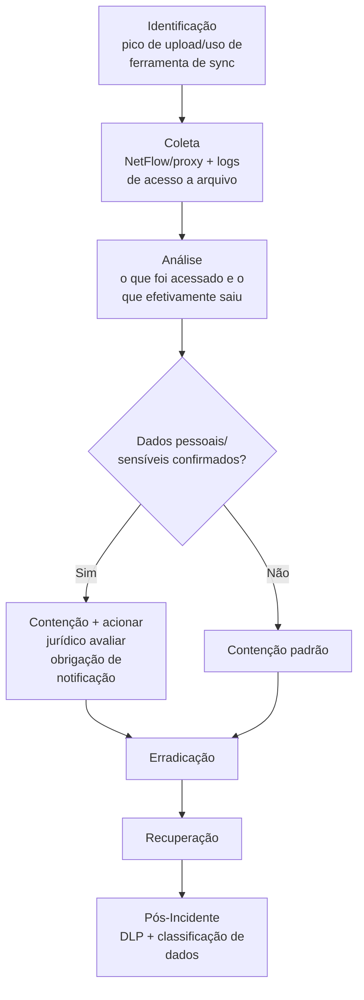

# Data-Exfiltration

> 🟢 Full Playbook

## 1. Descrição Técnica

### Definição
Data Exfiltration é a tática usada para transferir dados de dentro do ambiente da vítima para infraestrutura controlada pelo atacante, sem autorização. É o componente central da "dupla extorsão" em ransomware moderno, e o objetivo final de operações de espionagem e roubo de propriedade intelectual.

### Objetivo do Atacante
Roubo de dados sensíveis (financeiros, PII, propriedade intelectual, credenciais) para monetização direta, extorsão, ou espionagem.

### Impacto Esperado
- **Confidencialidade:** exposição de dados sensíveis
- Risco regulatório significativo (LGPD/GDPR — obrigação de notificação se dados pessoais forem exfiltrados)
- Risco reputacional e de extorsão contínua (vazamento público como alavanca)

### Vetores de Entrada
*(mecanismo de saída, após acesso já estabelecido)*
- Exfiltração via canal de C2 já estabelecido (T1041)
- Exfiltração via serviço web legítimo (Google Drive, Dropbox, Mega, Pastebin — T1567)
- Exfiltração via protocolo alternativo (FTP, DNS tunneling)
- Exfiltração física (USB — ver `USB-Forensics/`)
- Uso de ferramentas legítimas de sincronização/backup (Rclone, MEGAcmd) — altamente comum em ransomware moderno por se misturar com tráfego de TI legítimo

### Indicadores de Comprometimento (IOCs)
| Tipo | Exemplo | Onde encontrar |
|---|---|---|
| Volume de upload anômalo | pico de tráfego de saída fora de padrão | NetFlow, proxy |
| Uso de ferramenta de exfiltração conhecida | `rclone.exe`, `megacmd` (hash/linha de comando) | Sysmon Event ID 1 |
| Acesso e download em massa de arquivos | múltiplos arquivos acessados em curto período | File auditing (Event ID 4663) |
| Compressão de grande volume de dados antes do envio | criação de `.zip`/`.rar` de tamanho incomum | Sysmon Event ID 11 |

### TTPs Relacionados (MITRE ATT&CK)
| Tática | Técnica | ID |
|---|---|---|
| Exfiltration | Exfiltration Over C2 Channel | T1041 |
| Exfiltration | Exfiltration Over Web Service | T1567 |
| Exfiltration | Exfiltration Over Alternative Protocol | T1048 |
| Collection | Data Staged | T1074 |
| Collection | Archive Collected Data | T1560 |

---

## 2. Fluxo de Investigação

### 2.1 Identificação
**Como detectar:**
- DLP (Data Loss Prevention) sinalizando transferência de dados classificados
- Pico anômalo de tráfego de saída (NetFlow/proxy)
- EDR sinalizando execução de ferramenta de sincronização/exfiltração conhecida

**Logs relevantes:** NetFlow, logs de proxy, logs de DLP, Sysmon Event ID 1/3/11, Event ID 4663 (acesso a arquivo)

**Ferramentas utilizadas:** DLP, Zeek (volume de dados por conexão), EDR

**Alertas comuns:** "Large data transfer to external destination", "Known exfiltration tool execution", "DLP policy violation"

### 2.2 Coleta
**Artefatos necessários:**
- Logs completos de NetFlow/proxy do período de exfiltração suspeita
- Lista de arquivos acessados/copiados/comprimidos no período
- Linha de comando da ferramenta de exfiltração usada, se houver

**Evidências:**
- Rede: volume exato de dados transferidos, destino, protocolo usado
- Host: lista de arquivos tocados, arquivo de staging (compactado) se ainda presente

### 2.3 Análise
**O que procurar:**
- Escopo exato dos dados exfiltrados (não apenas "dados foram acessados" — determinar **quais arquivos especificamente** saíram, essencial para avaliação de impacto/notificação)
- Canal usado (C2 existente vs. serviço legítimo) — determina estratégia de bloqueio
- Se os dados contêm informação pessoal/sensível sujeita a regulação (LGPD/GDPR/setor específico)

**Técnicas de investigação:** correlacionar logs de acesso a arquivo (quem/quando/o quê) com volume de tráfego de saída para confirmar que o acesso resultou em exfiltração efetiva, não apenas visualização. Quando full PCAP está disponível, reconstrução de sessão pode confirmar exatamente quais arquivos saíram.

**Correlação de eventos:** cruzar com `C2/` (canal usado) e, se aplicável, com `Ransomware/` (exfiltração pré-criptografia é o padrão atual de dupla extorsão).

**Hipóteses a validar:**
- [ ] Quais arquivos/dados especificamente foram exfiltrados?
- [ ] Os dados exfiltrados contêm informação pessoal ou sensível regulada?
- [ ] O volume e o conteúdo são consistentes com acesso oportunista ou direcionado (atacante sabia exatamente o que buscar)?
- [ ] Existe evidência de venda/publicação dos dados (dark web, leak site)?

### 2.4 Contenção
- [ ] Bloquear o canal/destino de exfiltração identificado
- [ ] Revogar acesso da conta/host usado para a exfiltração
- [ ] Acionar jurídico imediatamente se houver suspeita de dados pessoais/sensíveis envolvidos

### 2.5 Erradicação
- [ ] Remover ferramenta de exfiltração e qualquer staging residual
- [ ] Verificar se há mecanismo de exfiltração recorrente/agendada estabelecido

### 2.6 Recuperação
- [ ] Confirmar interrupção de qualquer exfiltração em andamento
- [ ] Monitoramento elevado de tráfego de saída por período estendido

### 2.7 Pós-Incidente
- [ ] Avaliação formal de obrigação de notificação regulatória (com jurídico) — prazo legal corre a partir da confirmação do incidente, não da decisão de notificar
- [ ] Implementar/ajustar DLP para os tipos de dado expostos
- [ ] Avaliar classificação e segregação de dados sensíveis (reduzir blast radius de futura exfiltração)
- [ ] Monitorar leak sites/dark web para confirmar se dados foram publicados (relevante para resposta de comunicação)

---

## 3. Checklist Operacional

- [ ] Volume e destino da exfiltração confirmados
- [ ] Lista específica de arquivos/dados exfiltrados determinada
- [ ] Conteúdo avaliado quanto a dados pessoais/sensíveis
- [ ] Jurídico acionado para avaliação regulatória
- [ ] Canal de exfiltração bloqueado
- [ ] Monitoramento de leak sites/dark web iniciado (se aplicável)
- [ ] DLP revisado/ajustado

---

## 4. Evidências Relevantes

### Windows
| Fonte | Localização | O que procurar |
|---|---|---|
| Sysmon | Operational | Event ID 1 (ferramenta de exfiltração), 3 (conexão externa de grande volume), 11 (arquivo de staging compactado) |
| Event Viewer | Security.evtx | Event ID 4663 (acesso a arquivo, com auditoria habilitada) |

### Linux
| Fonte | Caminho | O que procurar |
|---|---|---|
| auditd | `/var/log/audit/audit.log` | Leitura em massa de arquivos, execução de ferramenta de transferência |
| Bash history | `~/.bash_history` | Comandos `scp`, `rsync`, `curl -T`, `rclone` |

### Cloud
| Fonte | Serviço | O que procurar |
|---|---|---|
| CloudTrail | S3 | `GetObject` em massa, `PutObject` para destino externo |
| Azure/GCP | Storage Audit Logs | Download em massa de blob/objeto |

---

## 5. Ferramentas Recomendadas

| Categoria | Ferramentas |
|---|---|
| DFIR | Velociraptor, KAPE |
| Network Analysis | Zeek, Wireshark, Arkime |
| DLP/Classificação | Soluções de DLP corporativo (Microsoft Purview, Symantec DLP, etc.) |

---

## 6. Casos Reais

### Exfiltração via Rclone em campanhas de Ransomware com dupla extorsão
Padrão amplamente documentado (incluindo por afiliados de LockBit, Conti e BlackCat): uso da ferramenta legítima Rclone, renomeada para se misturar com processos do sistema, para sincronizar grandes volumes de dados para serviços de armazenamento em nuvem (incluindo MEGA e armazenamento próprio do grupo) nas horas/dias **antes** da detonação do ransomware. **Aplicação:** a investigação de qualquer incidente de ransomware deve obrigatoriamente incluir busca retroativa por evidência de exfiltração no período de dwell time anterior à criptografia — a ausência de evidência clara não significa ausência de exfiltração, especialmente se os logs de NetFlow/proxy do período não foram preservados a tempo.

---

## Referências
- MITRE ATT&CK: [T1041](https://attack.mitre.org/techniques/T1041/), [T1567](https://attack.mitre.org/techniques/T1567/), [T1560](https://attack.mitre.org/techniques/T1560/)
- LGPD (Lei 13.709/2018) — obrigações de notificação à ANPD
