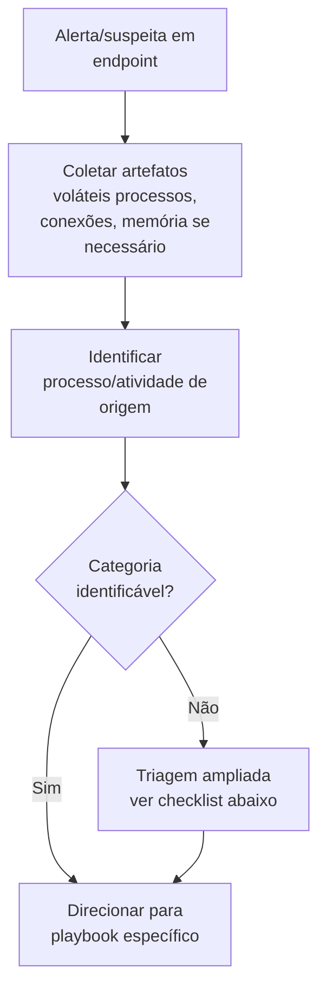

# Endpoint-Investigation

> 🟡 Quick-Reference — Metodologia

## Descrição Técnica

**Definição:** Procedimento genérico de investigação host-based (workstation/servidor) aplicável como ponto de partida para qualquer categoria de ataque que se manifeste em um endpoint — um checklist de triagem rápida antes de direcionar para o playbook específico da técnica identificada.

**Quando usar:** Como primeiro passo de qualquer investigação que começa com "algo suspeito aconteceu neste host", antes de saber qual categoria específica se aplica.

---

## Triagem Inicial de Endpoint (primeiros passos)

## Checklist de Triagem Rápida

| Pergunta | Onde verificar |
|---|---|
| Há processo desconhecido/anômalo em execução? | EDR, Task Manager/Process Hacker, `windows.pslist` |
| Há conexão de rede para destino externo incomum? | Sysmon Event ID 3, `netstat` |
| Há persistência recém-criada? | Ver checklist completo em [`Persistence/README.md`](../Persistence/README.md) |
| Há evidência de execução recente de ferramenta suspeita? | Prefetch, Shimcache, Amcache |
| Há acesso anômalo a LSASS/credenciais? | Sysmon Event ID 10 |
| Há indício de movimento lateral originado deste host? | Event ID 4624/4648 de saída |

---

## Checklist Operacional

- [ ] Artefatos voláteis coletados antes de qualquer remediação
- [ ] Processo/atividade de origem identificado
- [ ] Checklist de triagem rápida executado
- [ ] Categoria de ataque específica determinada
- [ ] Investigação direcionada ao playbook correspondente

---

## Evidências Relevantes (referência rápida)

| Fonte | O que procurar |
|---|---|
| Sysmon | Event ID 1 (processo), 3 (rede), 7 (DLL), 10 (acesso a processo), 11 (arquivo) |
| Event Viewer | Security.evtx (logon, mudança de privilégio) |
| Prefetch/Shimcache/Amcache | Evidência de execução |
| auditd (Linux) | execve, acesso a arquivo sensível |

---

## Ferramentas Recomendadas
EDR, Velociraptor, KAPE, Sysinternals Suite (Process Explorer, Autoruns)

---

## Referência Cruzada
- Metodologia completa de DFIR: [`DFIR/README.md`](../../DFIR/README.md)
- Memória: [`Memory-Forensics/README.md`](../Memory-Forensics/README.md)
- A partir daqui, direcionar para a categoria específica identificada (Malware, Persistence, Lateral-Movement, etc.)

> 📌 Esta categoria está marcada como Quick-Reference. Para expandir para Full Playbook, use `Templates/Full-Playbook-Template.md`.
