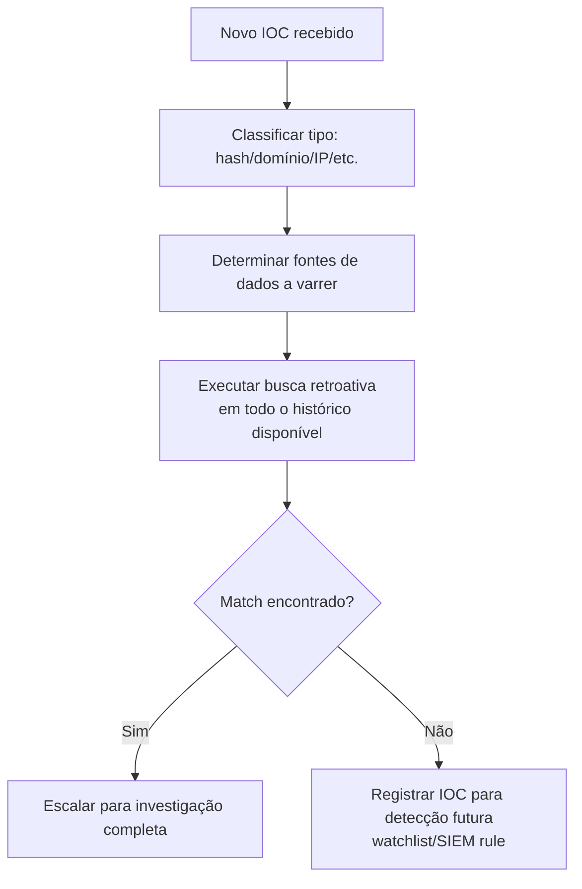

# IOC-Hunting

> 🟡 Quick-Reference — Metodologia

## Descrição Técnica

**Definição:** Busca retroativa em larga escala por um Indicador de Comprometimento (IOC) específico e já conhecido (hash, domínio, IP, etc.) em todo o ambiente — diferente de Threat Hunting hipótese-driven (que busca padrões/comportamentos sem IOC pré-definido), aqui o ponto de partida é sempre um indicador concreto.

**Quando usar:** Imediatamente após receber um novo IOC de qualquer fonte — TI feed, relatório de incidente de outra organização, descoberta durante investigação em andamento, alerta de parceiro/ISAC.

---

## Processo de IOC Sweep

## Onde Buscar por Tipo de IOC

| Tipo de IOC | Fontes a varrer |
|---|---|
| Hash de arquivo | EDR (busca histórica), VirusTotal Hunting, file integrity logs |
| Domínio/IP | DNS logs, proxy logs, NetFlow/Zeek, firewall logs |
| E-mail (remetente/assunto) | Message Trace (M365/Google Workspace), e-mail gateway |
| Chave de Registry / caminho de arquivo | EDR, Velociraptor (varredura distribuída) |
| Mutex / named pipe | EDR com capacidade de busca em memória, Velociraptor |

---

## Checklist Operacional

- [ ] IOC classificado por tipo
- [ ] Todas as fontes de dados relevantes identificadas
- [ ] Busca retroativa executada pelo **máximo período de retenção disponível** (não apenas últimos dias)
- [ ] Resultado documentado, positivo ou negativo
- [ ] Se negativo: IOC adicionado a watchlist/regra de detecção para monitoramento contínuo futuro
- [ ] Se positivo: escalado imediatamente para a categoria de ataque correspondente

---

## Boas Práticas

- **Não se limitar ao IOC isolado:** um hash malicioso geralmente faz parte de uma família — buscar também por hashes relacionados (mesmo imphash, mesma assinatura YARA) amplia a cobertura.
- **Considerar janela de retenção:** se o IOC é antigo e os logs já expiraram, documentar essa limitação explicitamente (não assumir "não encontrado" como "não ocorreu").
- **Priorizar por confiança e severidade do IOC:** nem todo IOC de todo feed de TI merece o mesmo nível de busca exaustiva — avaliar fonte e contexto antes de alocar tempo de hunting.

---

## Ferramentas Recomendadas
Velociraptor (busca distribuída em escala), SIEM, VirusTotal Hunting/Retrohunt (YARA), TI platform (MISP)

---

## Referência Cruzada
- Repositório de IOCs do ambiente: [`IOC-Collections/`](../../IOC-Collections/)
- Template de tracking: [`Templates/IOC-Tracking-Template.md`](../../Templates/IOC-Tracking-Template.md)
- Threat Hunting hipótese-driven (complementar): [`Threat-Hunting/README.md`](../Threat-Hunting/README.md)

> 📌 Esta categoria está marcada como Quick-Reference. Para expandir para Full Playbook, use `Templates/Full-Playbook-Template.md`.
