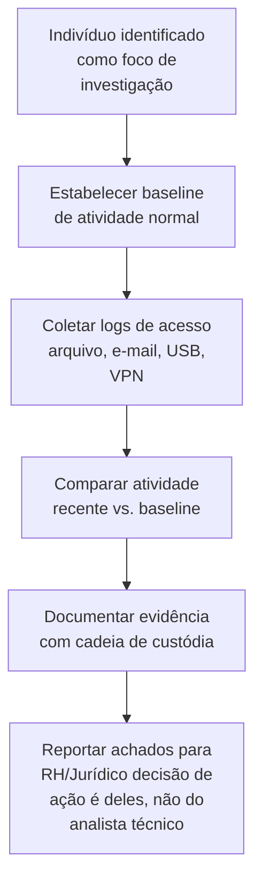

# Insider-Activity

> 🟡 Quick-Reference
>
> Esta página cobre a **investigação técnica** de atividade de insider já em andamento. Para a abordagem de caso completo (incluindo aspectos de RH/Jurídico), ver [`Insider-Threat/`](../Insider-Threat/).

## Descrição Técnica

**Definição:** Conjunto de técnicas de investigação para analisar padrões de atividade de um usuário interno especificamente suspeito — diferente de `Insider-Threat/` (que cobre o processo completo de caso), esta página foca no **como investigar tecnicamente** o comportamento de um usuário quando já há um indivíduo identificado como foco da investigação.

**Quando usar:** Quando RH/Jurídico/liderança já identificou um indivíduo específico como objeto de investigação (diferente de detecção proativa de padrão anômalo geral).

---

## Linha de Base de Atividade Normal

Antes de avaliar qualquer atividade como "anômala", estabelecer o que é normal **para aquele usuário específico**, comparando contra:

| Dimensão | Pergunta de baseline |
|---|---|
| Horário | Qual o padrão normal de horário de trabalho/acesso? |
| Volume de acesso a dados | Quantos arquivos/registros este usuário acessa tipicamente por dia? |
| Escopo de acesso | A quais sistemas/dados este usuário acessa rotineiramente, dado seu cargo? |
| Localização/dispositivo | De onde e com qual dispositivo este usuário tipicamente se conecta? |

## Sinais de Atenção (não conclusivos isoladamente)

- Acesso a dados fora do escopo da função, especialmente de forma sistemática/ampla
- Aumento de volume de download/cópia de dados nas semanas anteriores a uma mudança conhecida (aviso prévio, avaliação de desempenho negativa)
- Acesso fora de horário sem justificativa de projeto/prazo conhecido
- Uso de mídia removível ou serviços de cloud pessoal não corporativos
- Tentativa de acessar sistemas/dados fora do seu escopo de permissão (mesmo que negada — a tentativa é o sinal)

---

## Fluxo de Investigação Técnica

---

## Checklist Operacional

- [ ] Investigação formalmente autorizada por RH/Jurídico antes de início
- [ ] Baseline de atividade normal do indivíduo estabelecida
- [ ] Logs de acesso a arquivo, e-mail, USB e VPN do período coletados
- [ ] Atividade comparada contra baseline e contra a função/cargo do indivíduo
- [ ] Evidência documentada com cadeia de custódia desde o início (pode virar caso trabalhista/judicial)
- [ ] Achados reportados a RH/Jurídico — **decisão de ação disciplinar/legal não cabe à equipe técnica**

---

## Evidências Relevantes

| Fonte | O que procurar |
|---|---|
| Event ID 4663 (Windows) | Acesso a arquivo específico |
| DLP | Eventos de cópia/transferência de dado classificado |
| VPN/Proxy logs | Padrão de acesso remoto |
| E-mail (Message Trace) | Envio de dado para destinatário externo/pessoal |
| USB (Registry) | Conexão de dispositivo de armazenamento (ver `USB-Forensics/`) |

---

## Ferramentas Recomendadas
DLP, UEBA, Velociraptor (coleta forense formal quando necessário)

---

## Referência Cruzada
- Processo completo de caso de insider: [`Insider-Threat/README.md`](../Insider-Threat/README.md)
- Forense de mídia removível: [`USB-Forensics/README.md`](../USB-Forensics/README.md)
- Investigação de e-mail: [`Email-Investigation/README.md`](../Email-Investigation/README.md)

> 📌 Esta categoria está marcada como Quick-Reference. Para expandir para Full Playbook, use `Templates/Full-Playbook-Template.md`.
