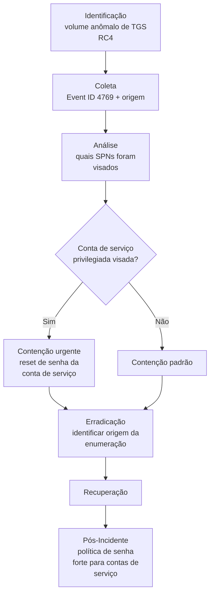

# Kerberoasting

> 🟢 Full Playbook

## 1. Descrição Técnica

### Definição
Kerberoasting é uma técnica de Credential Access que abusa do protocolo Kerberos: qualquer usuário autenticado no domínio pode solicitar um Service Ticket (TGS) para qualquer conta com um Service Principal Name (SPN) registrado. O atacante solicita esses tickets em massa, extrai a porção criptografada (criptografada com o hash da senha da conta de serviço) e realiza **cracking offline**, sem gerar alertas adicionais no domínio após a extração inicial. Contas de serviço frequentemente têm senhas antigas/fracas, tornando esta técnica altamente eficaz.

### Objetivo do Atacante
Obter credenciais de contas de serviço (frequentemente privilegiadas — contas de serviço de aplicação, banco de dados, etc.) para escalonamento de privilégio e movimento lateral.

### Impacto Esperado
- **Confidencialidade:** exposição de credencial de conta de serviço
- Risco elevado se a conta de serviço comprometida tiver privilégios administrativos (comum em ambientes legados)

### Vetores de Entrada
- Qualquer conta de domínio autenticada (não requer privilégio elevado para **solicitar** os tickets — apenas para o cracking offline subsequente)
- Ferramentas: Rubeus, Impacket (`GetUserSPNs.py`), PowerView

### Indicadores de Comprometimento (IOCs)
| Tipo | Exemplo | Onde encontrar |
|---|---|---|
| Volume anômalo de requisições TGS (Event ID 4769) com etype RC4 | múltiplas requisições de uma única origem em curto intervalo | Security.evtx do DC |
| Linha de comando de ferramenta conhecida | `Rubeus.exe kerberoast`, `GetUserSPNs.py` | Sysmon Event ID 1 |
| Hash de ticket extraído | formato `$krb5tgs$23$...` | Memória/disco do host atacante |

### TTPs Relacionados (MITRE ATT&CK)
| Tática | Técnica | ID |
|---|---|---|
| Credential Access | Steal or Forge Kerberos Tickets: Kerberoasting | T1558.003 |
| Discovery | Account Discovery: Domain Account | T1087.002 |

---

## 2. Fluxo de Investigação

### 2.1 Identificação
**Como detectar:**
- Regra de detecção para volume anômalo de Event ID 4769 com `TicketEncryptionType = 0x17` (RC4) de uma única origem (ver `Detection-Rules/Sigma/kerberoasting_excessive_tgs_requests_T1558.003.yml`)
- Threat hunting: contas com SPN que nunca solicitaram TGS antes subitamente o fazendo

**Logs relevantes:** Security.evtx do Domain Controller, Event ID 4769 (A Kerberos service ticket was requested)

**Ferramentas utilizadas:** SIEM com regra Sigma, Hayabusa/Chainsaw para parsing offline de Event Logs do DC

**Alertas comuns:** "Possible Kerberoasting activity", "Excessive TGS requests with RC4 encryption"

### 2.2 Coleta
**Artefatos necessários:**
- Logs de Security do(s) Domain Controller(s) no período suspeito
- Identidade da conta de origem da requisição (`ClientAddress`, conta autenticada)
- Lista de SPNs/contas de serviço visadas

**Evidências:**
- Logs: Event ID 4769 com detalhe de `ServiceName`, `TicketEncryptionType`, `ClientAddress`
- Host: se a origem foi identificada, coletar artefatos do host atacante (linha de comando, ferramenta usada)

### 2.3 Análise
**O que procurar:**
- Quais contas de serviço (SPNs) foram alvo — priorizar investigação das que têm privilégio elevado
- Se houve **uso subsequente** das credenciais (após tempo de cracking — pode levar horas/dias) — login da conta de serviço de local/horário anômalo
- A conta de origem da requisição: ela mesma já estava comprometida? (Kerberoasting é tipicamente um passo de **pós-exploração**, não de acesso inicial)

**Técnicas de investigação:** o uso de RC4 etype para requisições de TGS é o indicador mais forte (AES é padrão em ambientes modernos bem configurados; RC4 geralmente indica forçar downgrade ou ambiente legado/vulnerável) — mas nem todo RC4 é malicioso, validar contra baseline do ambiente.

**Correlação de eventos:** cruzar a conta de origem da requisição Kerberoasting com eventos anteriores de comprometimento (phishing, dumping de credencial) para entender a cadeia completa de ataque.

**Hipóteses a validar:**
- [ ] Quais SPNs/contas de serviço foram visados e qual o nível de privilégio de cada uma?
- [ ] A senha da conta de serviço visada é forte o suficiente para resistir a cracking offline?
- [ ] Houve uso confirmado da credencial após o tempo estimado de cracking?
- [ ] Como a conta de origem obteve acesso ao domínio inicialmente?

### 2.4 Contenção
- [ ] Resetar a senha de **todas** as contas de serviço visadas com senha forte (mínimo 25+ caracteres aleatórios, conforme prática atual recomendada)
- [ ] Desabilitar/investigar a conta de origem da requisição
- [ ] Monitorar login das contas de serviço visadas nos dias seguintes

### 2.5 Erradicação
- [ ] Identificar e remediar como a conta de origem obteve acesso ao domínio
- [ ] Avaliar migração de contas de serviço críticas para **gMSA (group Managed Service Accounts)**, que têm rotação automática de senha e não são vulneráveis a Kerberoasting da mesma forma

### 2.6 Recuperação
- [ ] Confirmar que serviços dependentes das contas de serviço resetadas continuam funcionando (testar antes de declarar concluído — quebra de conta de serviço pode causar outage)

### 2.7 Pós-Incidente
- [ ] Auditoria completa de todas as contas com SPN no domínio — identificar quais têm senha fraca/antiga
- [ ] Implementar AES como encryption type obrigatório (desabilitar RC4 onde possível)
- [ ] Migrar contas de serviço críticas para gMSA

---

## 3. Checklist Operacional

- [ ] Volume de requisições TGS RC4 confirmado e quantificado
- [ ] SPNs/contas de serviço visados identificados
- [ ] Privilégio de cada conta visada avaliado
- [ ] Origem da requisição identificada e investigada
- [ ] Senhas de contas de serviço visadas resetadas
- [ ] Uso pós-cracking monitorado
- [ ] Causa raiz do acesso da conta de origem determinada
- [ ] Avaliação de migração para gMSA realizada

---

## 4. Evidências Relevantes

### Windows
| Fonte | Localização | O que procurar |
|---|---|---|
| Security.evtx (DC) | Domain Controller | Event ID 4769 — volume, `TicketEncryptionType`, `ClientAddress`, `ServiceName` |
| Sysmon (host de origem) | Operational | Execução de Rubeus/Impacket/PowerView |
| PowerShell Logs | Event ID 4104 | Comandos PowerView (`Get-DomainUser -SPN`) |

### Linux
*Não aplicável diretamente — técnica específica de Active Directory/Kerberos. Host de origem pode ser Linux executando Impacket.*

### Cloud
*Aplicável apenas em cenários híbridos (Azure AD DS, Active Directory em IaaS).*

---

## 5. Ferramentas Recomendadas

| Categoria | Ferramentas |
|---|---|
| Detecção | Sigma, SIEM com parsing de Event ID 4769 |
| Threat Hunting | Hayabusa, Chainsaw, PowerView (uso defensivo para auditoria de SPN) |
| Identidade/AD | BloodHound (para mapear contas de serviço privilegiadas em risco) |

---

## 6. Casos Reais

### Kerberoasting como técnica padrão de pós-exploração em intrusões de Ransomware
Grupos de ransomware (incluindo afiliados de LockBit e Conti, conforme relatórios públicos da CISA) rotineiramente usam Kerberoasting como parte da fase de reconhecimento/escalonamento pós-acesso inicial, frequentemente combinado com ferramentas como Rubeus para automatizar a extração de tickets de múltiplas contas de serviço simultaneamente. **Aplicação:** a detecção de Kerberoasting deve ser tratada como **forte indicador de intrusão ativa em fase de pós-exploração** — não como evento isolado — disparando investigação imediata da origem para determinar o vetor de acesso inicial e o escopo completo do comprometimento, antes que o atacante complete o cracking offline e use a credencial para movimento lateral mais profundo.

---

## Referências
- MITRE ATT&CK: [T1558.003](https://attack.mitre.org/techniques/T1558/003/)
- MITRE D3FEND: Credential Hardening (gMSA, AES enforcement)
