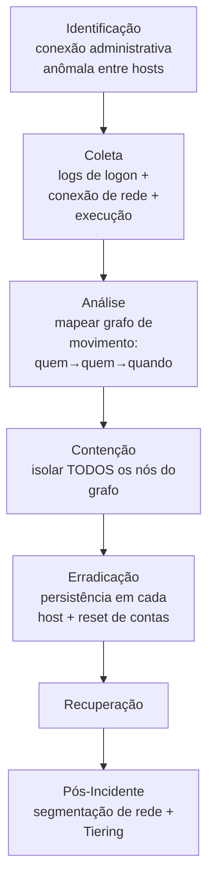

# Lateral-Movement

> 🟢 Full Playbook

## 1. Descrição Técnica

### Definição
Movimento Lateral é a tática usada por um atacante para se deslocar de um sistema inicialmente comprometido para outros sistemas dentro do ambiente, expandindo acesso e buscando ativos de maior valor (servidores críticos, Domain Controllers, dados sensíveis). Engloba técnicas como uso de serviços remotos (RDP, SSH, SMB/WinRM), PtH/PtT (cobertos em playbook dedicado), e abuso de ferramentas de administração remota legítimas ("living off the land").

### Objetivo do Atacante
Expandir o escopo de acesso a partir de um ponto de entrada inicial, geralmente buscando: sistemas com dados de maior valor, contas mais privilegiadas, ou infraestrutura crítica (Domain Controller, backup, hypervisor).

### Impacto Esperado
- **Confidencialidade/Integridade:** expansão do comprometimento para múltiplos sistemas
- Risco multiplicador direto — cada salto aumenta o escopo da resposta a incidente

### Vetores de Entrada
- Credenciais válidas (próprias ou roubadas) usadas em RDP/SSH/WinRM
- Exploração de serviço vulnerável em host interno
- Abuso de ferramentas de administração legítimas (PsExec, WMI, PowerShell Remoting)
- Compartilhamentos administrativos (`C$`, `ADMIN$`)

### Indicadores de Comprometimento (IOCs)
| Tipo | Exemplo | Onde encontrar |
|---|---|---|
| Conexão RDP/SSH entre hosts que normalmente não se comunicam | — | Event ID 4624 (Type 10), NetFlow |
| Execução remota via PsExec/WMI | `\\host\ADMIN$`, `wmic process call create` | Sysmon Event ID 1, 3, Event ID 5145 |
| Uso de PowerShell Remoting (WinRM) anômalo | Event ID 4103/4104 em host de destino | PowerShell logs |
| Criação de serviço remoto | nome de serviço aleatório/genérico | Event ID 7045 |

### TTPs Relacionados (MITRE ATT&CK)
| Tática | Técnica | ID |
|---|---|---|
| Lateral Movement | Remote Services | T1021 |
| Lateral Movement | Remote Services: RDP | T1021.001 |
| Lateral Movement | Remote Services: SMB/Admin Shares | T1021.002 |
| Lateral Movement | Remote Services: WinRM | T1021.006 |
| Execution | Windows Management Instrumentation | T1047 |
| Lateral Movement | Lateral Tool Transfer | T1570 |

---

## 2. Fluxo de Investigação

### 2.1 Identificação
**Como detectar:**
- Conexões SMB/RDP/WinRM entre hosts que não fazem parte do padrão normal de comunicação (workstation-para-workstation é frequentemente anômalo)
- EDR sinalizando execução remota via PsExec/WMI
- Picos de autenticação de uma única conta em múltiplos hosts em curto intervalo

**Logs relevantes:** Event ID 4624 (Logon Type 3/10), 4648, 5140/5145 (acesso a compartilhamento), Sysmon Event ID 1/3, Event ID 7045 (criação de serviço)

**Ferramentas utilizadas:** SIEM, Sigma, NetFlow/Zeek para padrão de comunicação host-a-host

**Alertas comuns:** "Lateral movement via SMB admin share", "PsExec execution detected", "Anomalous RDP session"

### 2.2 Coleta
**Artefatos necessários:**
- Logs de logon de **todos** os hosts potencialmente envolvidos
- NetFlow/Zeek do período para mapear todas as conexões internas relevantes
- Artefatos de execução em cada host (Prefetch, Sysmon)

**Evidências:**
- Logs: cadeia completa de Event ID 4624/4648 entre os hosts
- Rede: conexões SMB (445), RDP (3389), WinRM (5985/5986) anômalas
- Host: ferramentas usadas para execução remota em cada salto

### 2.3 Análise
**O que procurar:**
- Construir um **grafo de movimento lateral**: nó = host, aresta = conexão com timestamp e conta usada
- Identificar o "patient zero" (primeiro host comprometido) e o objetivo final aparente (DC, servidor de dados, backup)
- Ferramentas usadas em cada salto (podem variar — PsExec em um, WMI em outro, indicando adaptação do atacante)

**Técnicas de investigação:** análise de grafo é a técnica central aqui — ferramentas como Timesketch ou até uma planilha estruturada (host, hora, conta, método, destino) tornam visível o padrão que análise log-a-log isolada não revela.

**Correlação de eventos:** cruzar com `Credential-Access/` (como as credenciais usadas em cada salto foram obtidas) e `Privilege-Escalation/` (se houve escalonamento em algum nó do grafo).

**Hipóteses a validar:**
- [ ] Qual o host de origem (patient zero)?
- [ ] O atacante alcançou um Domain Controller ou sistema Tier 0?
- [ ] O movimento foi automatizado (script/ferramenta) ou manual (mais lento, mais "humano")?
- [ ] Existe um objetivo final aparente (servidor de backup, banco de dados, hypervisor)?

### 2.4 Contenção
- [ ] Isolar **todos** os hosts do grafo simultaneamente (contenção sequencial permite continuidade do movimento)
- [ ] Desabilitar todas as contas usadas nos saltos identificados
- [ ] Se o grafo se aproxima de um Domain Controller: escalar para `Active-Directory/` imediatamente

### 2.5 Erradicação
- [ ] Verificar e remover persistência estabelecida em **cada** host do grafo (não apenas no ponto de entrada)
- [ ] Resetar todas as credenciais usadas na cadeia

### 2.6 Recuperação
- [ ] Validar cada host do grafo individualmente antes de reconectar
- [ ] Monitoramento elevado de toda a cadeia por período estendido

### 2.7 Pós-Incidente
- [ ] Avaliar segmentação de rede (microsegmentação para limitar comunicação lateral desnecessária entre workstations)
- [ ] Implementar Tiering Model de Active Directory
- [ ] Restringir uso de PsExec/WMI/WinRM via política de aplicativo (AppLocker/WDAC) onde não for necessário administrativamente

---

## 3. Checklist Operacional

- [ ] Grafo completo de movimento lateral construído (host → host → conta → timestamp)
- [ ] Patient zero identificado
- [ ] Verificado alcance de sistemas Tier 0 (DC, PKI, backup)
- [ ] Todos os hosts do grafo isolados simultaneamente
- [ ] Persistência removida em cada nó
- [ ] Credenciais da cadeia resetadas
- [ ] Segmentação de rede avaliada como ação de hardening

---

## 4. Evidências Relevantes

### Windows
| Fonte | Localização | O que procurar |
|---|---|---|
| Security.evtx | Todos os hosts | Event ID 4624 (Type 3/10), 4648, 5140/5145, 7045 |
| Sysmon | Operational | Event ID 1 (execução remota), 3 (conexão), 21 (WMI) |

### Linux
| Fonte | Caminho | O que procurar |
|---|---|---|
| auth.log | `/var/log/auth.log` | SSH entre hosts internos anômalo |
| auditd | `/var/log/audit/audit.log` | Execução remota via SSH/orquestração |

### Cloud
| Fonte | Serviço | O que procurar |
|---|---|---|
| CloudTrail | EC2 Systems Manager | Uso de SSM Run Command para execução remota não autorizada |
| Azure Activity Logs | VM Run Command | Execução remota anômala entre VMs |

---

## 5. Ferramentas Recomendadas

| Categoria | Ferramentas |
|---|---|
| DFIR | Velociraptor, KAPE |
| Visualização de grafo | Timesketch, BloodHound (defensivo) |
| Network Analysis | Zeek, Wireshark, RITA |

---

## 6. Casos Reais

### Movimento lateral em campanhas de Volt Typhoon
Ator associado a operações de pré-posicionamento em infraestrutura crítica, conhecido por priorizar técnicas "living off the land" (uso de ferramentas administrativas nativas como WMI e PowerShell, evitando malware customizado) para movimento lateral, dificultando detecção por assinatura. **Aplicação:** a investigação deve assumir que ausência de alerta de malware **não significa ausência de movimento lateral** — análise comportamental de logs de autenticação e execução remota nativa é essencial quando o ator prioriza LOLBins sobre ferramentas customizadas.

---

## Referências
- MITRE ATT&CK: [T1021](https://attack.mitre.org/techniques/T1021/), [T1570](https://attack.mitre.org/techniques/T1570/), [T1047](https://attack.mitre.org/techniques/T1047/)
- CISA Advisory sobre Volt Typhoon (público)
