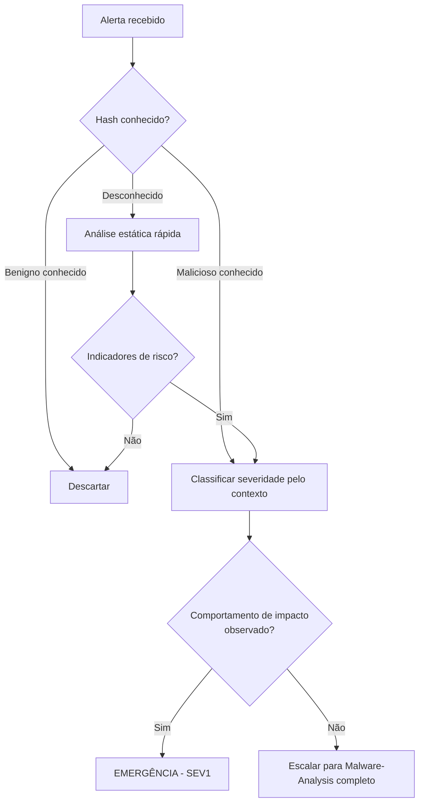

# Malware-Triage

> 🟡 Quick-Reference — Metodologia

## Descrição Técnica

**Definição:** Processo rápido de classificação inicial de uma amostra suspeita (arquivo, processo, ou alerta) para determinar prioridade de investigação, sem ainda realizar análise aprofundada — o primeiro filtro entre "ruído" e "ameaça real que exige investigação completa".

**Objetivo:** Decidir rapidamente, com informação limitada, qual o próximo passo apropriado: descartar (falso positivo), escalar para análise completa (`Malware-Analysis/`), ou tratar como emergência (ex.: ransomware).

**Quando usar:** Sempre que um alerta de malware/arquivo suspeito chega ao SOC N1 — antes de qualquer análise estática/dinâmica aprofundada.

---

## Fluxo de Triagem (resumido)

| Passo | Ação | Decisão |
|---|---|---|
| 1 | Hash lookup (VirusTotal, TI interno) | Conhecido e benigno → descartar; conhecido e malicioso → ir para 4 |
| 2 | Contexto do alerta (qual EDR/regra disparou, em qual host) | Host crítico/produção → elevar prioridade |
| 3 | Comportamento observado até o momento (se EDR já capturou) | Comportamento de impacto (criptografia, exfiltração) → tratar como emergência |
| 4 | Classificação final | Falso Positivo / Baixa Prioridade / Investigação Completa / Emergência (SEV1) |

---

## Checklist Operacional

- [ ] Hash verificado contra TI interno e VirusTotal
- [ ] Contexto do host (criticidade, dados sensíveis) avaliado
- [ ] Comportamento já observado pelo EDR revisado
- [ ] Decisão de classificação documentada (descartar/investigar/emergência)
- [ ] Se escalado: handoff para `Malware-Analysis/` com contexto completo

---

## Indicadores de Risco que Elevam Prioridade

- Amostra sem detecção em nenhum AV (0/70 no VirusTotal) — pode indicar customização/zero-day
- Comportamento de acesso a LSASS, NTDS.dit, ou Shadow Copy deletion
- Comunicação de rede para infraestrutura associada a ator conhecido (TI feed)
- Host afetado é Domain Controller, servidor de backup, ou outro ativo Tier 0

---

## Ferramentas Recomendadas
VirusTotal, Hybrid Analysis, EDR console, TI platform (MISP)

---

## Referência Cruzada
- Análise completa pós-triagem: [`Malware-Analysis/README.md`](../../Malware-Analysis/README.md)
- Playbook de Malware: [`Malware/README.md`](../Malware/README.md)

> 📌 Esta categoria está marcada como Quick-Reference. Para expandir para Full Playbook, use `Templates/Full-Playbook-Template.md`.
