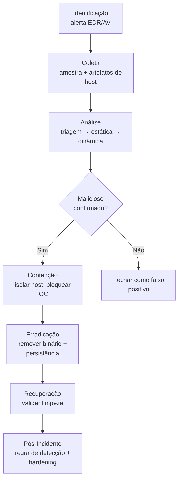

# Malware

> 🟢 Full Playbook

## 1. Descrição Técnica

### Definição
Malware (software malicioso) é qualquer código projetado para executar ações não autorizadas em um sistema — desde simples adware até trojans, worms, rootkits e ransomware. Esta categoria cobre a metodologia **genérica** de triagem e investigação de malware; para famílias com comportamento muito específico, ver os playbooks dedicados (`Ransomware/`, `C2/`, `Cryptojacking/`).

### Objetivo do Atacante
Varia por família: execução de payload secundário, estabelecimento de C2, roubo de credenciais, mineração de cripto, espionagem, ou simplesmente abrir porta para monetização posterior (malware-as-a-service, loaders como entrega para ransomware).

### Impacto Esperado
- **Confidencialidade:** roubo de dados/credenciais
- **Integridade:** modificação de sistema, instalação de backdoor
- **Disponibilidade:** consumo de recursos, instabilidade, abertura de porta para impacto maior (ransomware)

### Vetores de Entrada
- Anexo/link malicioso em e-mail (phishing)
- Download drive-by / site comprometido
- Exploração de vulnerabilidade em serviço exposto (T1190)
- Mídia removível (USB)
- Software pirateado/trojanizado
- Supply chain (dependência/atualização comprometida)

### Indicadores de Comprometimento (IOCs)
| Tipo | Exemplo | Onde encontrar |
|---|---|---|
| Hash (SHA256) do binário | `...` | EDR, Sysmon Event ID 1, VirusTotal |
| Domínio/IP de C2 | `...` | Proxy, DNS logs, Zeek |
| Mutex | `Global\\<nome>` | Análise dinâmica/memória |
| Chave de Registry de persistência | `HKCU\...\Run` | Registry, Autoruns |
| Processo filho anômalo | `winword.exe → powershell.exe` | Sysmon Event ID 1 |

### TTPs Relacionados (MITRE ATT&CK)
| Tática | Técnica | ID |
|---|---|---|
| Execution | User Execution | T1204 |
| Execution | Command and Scripting Interpreter | T1059 |
| Defense Evasion | Obfuscated Files or Information | T1027 |
| Defense Evasion | Process Injection | T1055 |
| Persistence | Boot or Logon Autostart Execution | T1547 |
| Discovery | System Information Discovery | T1082 |

---

## 2. Fluxo de Investigação

### 2.1 Identificação
**Como detectar:**
- Alerta de AV/EDR (assinatura ou comportamento)
- Regra Sigma/YARA disparada
- Sandbox de e-mail/gateway detectando anexo malicioso
- Threat hunting proativo (IOC sweep, stacking de processos incomuns)

**Logs relevantes:**
- Sysmon Event ID 1 (Process Create), 3 (Network Connection), 7 (Image Load), 11 (File Create)
- Windows Defender / EDR alert logs
- Logs de proxy/e-mail gateway (origem do payload)

**Ferramentas utilizadas:** EDR (CrowdStrike, Defender for Endpoint, SentinelOne), Sysmon + Sigma, VirusTotal

**Alertas comuns:** "Trojan detected", "Suspicious process behavior", "Known malicious hash"

### 2.2 Coleta
**Artefatos necessários:**
- Amostra do binário (extrair com hash preservado, idealmente em container protegido por senha — ex.: zip com senha `infected`)
- Linha do tempo de execução (Prefetch, Shimcache, Amcache)
- Memória do host afetado (se ainda ativo e malware pode ser fileless)

**Evidências:**
- Arquivos: binário + qualquer arquivo dropado (`%TEMP%`, `%APPDATA%`, diretórios de usuário)
- Memória: captura completa se houver suspeita de injeção de processo ou malware fileless
- Rede: PCAP/Zeek do período de execução, se disponível

### 2.3 Análise
**O que procurar:**
- Cadeia de processo: processo pai → processo malicioso → processos filhos gerados
- Comunicação de rede gerada (callback C2)
- Modificações de Registry/sistema de arquivos
- Técnicas de evasão (anti-VM, anti-debug, ofuscação)

**Técnicas de investigação:** Ver metodologia completa em [`Malware-Analysis/README.md`](../../Malware-Analysis/README.md) — triagem → estática → dinâmica → engenharia reversa conforme necessário.

**Correlação de eventos:** cruzar timestamp de execução (Prefetch/Sysmon) com logs de rede (callback) e logs de e-mail/proxy (origem do payload) para reconstruir a cadeia completa de ataque.

**Hipóteses a validar:**
- [ ] O malware estabeleceu persistência?
- [ ] Houve movimento lateral a partir deste host?
- [ ] Há exfiltração de dados associada?
- [ ] Este é um loader/dropper para payload secundário (ex.: ransomware)?

### 2.4 Contenção
- [ ] Isolar o host da rede (manter ligado se houver necessidade de captura de memória)
- [ ] Bloquear hash, domínio/IP de C2 em EDR/firewall/proxy
- [ ] Desabilitar conta de usuário se houver suspeita de credencial comprometida
- [ ] Verificar e isolar outros hosts com o mesmo IOC (hunting retroativo)

### 2.5 Erradicação
- [ ] Remover binário e artefatos dropados
- [ ] Remover persistência (Registry Run keys, Scheduled Tasks, Services, WMI subscriptions)
- [ ] Aplicar patch se o vetor foi exploração de vulnerabilidade
- [ ] Resetar credenciais potencialmente expostas

### 2.6 Recuperação
- [ ] Validar ausência de reinfecção via scan completo + monitoramento ativo por período definido
- [ ] Restaurar host a partir de imagem limpa se a remoção manual não for confiável (recomendado para rootkits/malware sofisticado)
- [ ] Reconectar à rede apenas após validação

### 2.7 Pós-Incidente
- [ ] Documentar vetor de entrada e causa raiz
- [ ] Criar/atualizar regra Sigma/YARA com IOCs extraídos
- [ ] Avaliar necessidade de campanha de conscientização (se vetor foi phishing)
- [ ] Atualizar lista de bloqueio (hash/domínio) em escala (não só no host afetado)

---

## 3. Checklist Operacional

- [ ] Amostra coletada com hash preservado
- [ ] Triagem (hash lookup) realizada
- [ ] Análise estática realizada (imports, packer, strings)
- [ ] Análise dinâmica realizada em sandbox isolado
- [ ] IOCs extraídos e registrados
- [ ] Cadeia de processo completa reconstruída
- [ ] Persistência identificada e removida
- [ ] Escopo (outros hosts afetados) determinado
- [ ] Host validado limpo antes de reconexão
- [ ] Regra de detecção criada/atualizada

---

## 4. Evidências Relevantes

### Windows
| Fonte | Caminho / Localização | O que procurar |
|---|---|---|
| Sysmon | Operational log | Event ID 1 (processo), 3 (rede), 7 (DLL load), 11 (arquivo criado) |
| Event Viewer | Security.evtx | Logon events associados ao horário de execução |
| Registry | `HKCU/HKLM\...\Run`, `Services` | Chaves de persistência |
| Prefetch | `C:\Windows\Prefetch\` | Confirmação e contagem de execução |
| Shimcache/Amcache | `SYSTEM` hive / `Amcache.hve` | Evidência de presença mesmo sem execução confirmada |
| Scheduled Tasks | `C:\Windows\System32\Tasks\` | Persistência agendada |
| WMI | WMI repository | Persistência via WMI Event Subscription |

### Linux
| Fonte | Caminho | O que procurar |
|---|---|---|
| auditd | `/var/log/audit/audit.log` | Execução de processo, syscalls |
| cron/systemd | `/etc/cron.*`, `/etc/systemd/system/` | Persistência |
| `/tmp`, `/dev/shm` | — | Binários dropados (locais graváveis comuns) |
| Bash history | `~/.bash_history` | Comandos de download/execução |

### Cloud
| Fonte | Serviço | O que procurar |
|---|---|---|
| CloudTrail | EC2/Lambda | Execução de código não autorizado, criação de instância anômala |
| Azure Activity Logs | VM/Function Apps | Deploy de código malicioso |

---

## 5. Ferramentas Recomendadas

| Categoria | Ferramentas |
|---|---|
| DFIR | Velociraptor, KAPE, Autopsy |
| Malware Analysis | REMnux, FlareVM, Ghidra, x64dbg, CAPE Sandbox |
| Network Analysis | Wireshark, Zeek, Suricata |
| Threat Hunting | Sigma, Chainsaw, Hayabusa |

---

## 6. Casos Reais

### Emotet
Originalmente trojan bancário, evoluiu para loader-as-a-service amplamente usado como vetor inicial para TrickBot, QakBot e, posteriormente, ransomware (Ryuk, Conti). **Aplicação da metodologia:** a investigação tipicamente começa pela identificação de macro maliciosa em documento do Office (T1204.002) → análise estática do documento revela URL de download do payload → análise dinâmica do DLL final confirma comportamento de loader e comunicação C2 via HTTP com tráfego característico. A contenção prioriza bloqueio de IOC de C2 em escala (Emotet historicamente operava com múltiplos "epochs"/clusters de infraestrutura simultâneos).

### QakBot (QBot)
Trojan modular usado tanto para roubo de credenciais quanto como loader para ransomware (Conti, Black Basta). **Aplicação:** investigação foca em identificar injeção em processos legítimos (`explorer.exe`, `regsvr32.exe`) e persistência via Scheduled Tasks — análise de memória é frequentemente necessária pois QakBot historicamente emprega técnicas de injeção que dificultam detecção em disco.

---

## Referências
- MITRE ATT&CK: [T1204](https://attack.mitre.org/techniques/T1204/), [T1059](https://attack.mitre.org/techniques/T1059/), [T1055](https://attack.mitre.org/techniques/T1055/)
- MITRE D3FEND: Process Spawn Analysis, File Analysis
- CISA Advisories sobre Emotet/QakBot (público)
