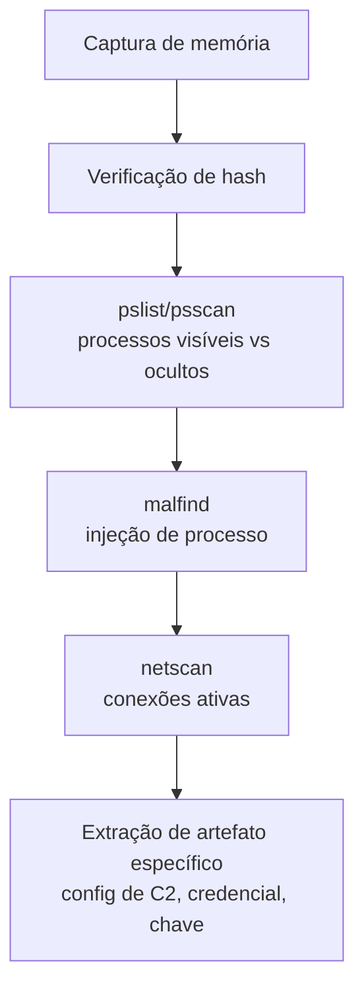

# Memory-Forensics

> 🟡 Quick-Reference — Metodologia

## Descrição Técnica

**Definição:** Disciplina de análise forense focada na captura e exame da memória RAM de um sistema — essencial para identificar malware fileless, processos injetados, chaves de criptografia em uso, conexões de rede ativas, e artefatos que nunca tocam o disco.

**Quando usar:** Sempre que houver suspeita de malware fileless, process injection, ransomware ativo (possível chave em memória), ou C2 sofisticado que evade detecção em disco.

---

## Processo de Captura

1. **Priorizar captura antes de qualquer outra ação de remediação** — memória é o artefato mais volátil; matar processos ou desligar a máquina destrói a evidência.
2. Usar ferramenta validada: Velociraptor, WinPmem (Windows), LiME (Linux), Magnet RAM Capture.
3. Verificar hash da imagem de memória imediatamente após a captura.
4. Transferir para storage forense com cadeia de custódia (ver `Templates/Evidence-Collection-Template.md`).

## Processo de Análise (Volatility 3 — referência rápida)

| Objetivo | Plugin/abordagem |
|---|---|
| Listar processos | `windows.pslist`, `windows.psscan` (detecta processos ocultos/encerrados) |
| Conexões de rede ativas | `windows.netscan` |
| DLLs carregadas por processo | `windows.dlllist` |
| Detecção de process injection | `windows.malfind` |
| Extração de hashes/credenciais | `windows.hashdump`, `windows.lsadump` |
| Histórico de comando (cmd/PowerShell) | `windows.cmdline`, `windows.consoles` |
| Extração de arquivo de processo em memória | `windows.dumpfiles` |

---

## Checklist Operacional

- [ ] Memória capturada antes de qualquer remediação
- [ ] Hash da imagem verificado
- [ ] Cadeia de custódia documentada
- [ ] Processos ocultos/discrepância pslist vs. psscan investigada
- [ ] Conexões de rede ativas correlacionadas com NetFlow/Zeek do mesmo período
- [ ] Artefatos relevantes extraídos (config de malware, credencial, chave de criptografia)

---

## Evidências/Artefatos Típicos Encontrados em Memória

| Artefato | Relevância |
|---|---|
| Processo injetado (malfind) | Indica técnica de defense evasion ativa |
| Configuração de C2 (Cobalt Strike, etc.) | Extração de toda infraestrutura configurada, incluindo failover |
| Chave de criptografia de ransomware | Possibilidade rara mas valiosa de recuperação de dados sem pagar resgate |
| Credenciais em cache (LSASS) | Confirma exatamente quais contas estavam expostas no momento |
| Histórico de comando não persistido em log | Reconstrução de ações do atacante mesmo com log clearing (T1070) |

---

## Ferramentas Recomendadas
Velociraptor, Volatility 3, WinPmem, LiME, Magnet RAM Capture

---

## Referência Cruzada
- Metodologia geral de DFIR: [`DFIR/README.md`](../../DFIR/README.md)
- Análise de malware: [`Malware-Analysis/README.md`](../../Malware-Analysis/README.md)

> 📌 Esta categoria está marcada como Quick-Reference. Para expandir para Full Playbook, use `Templates/Full-Playbook-Template.md`.
