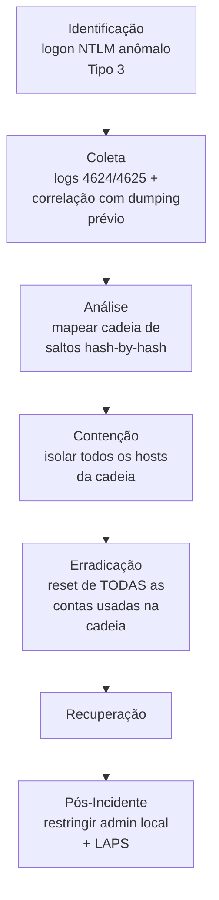

# Pass-the-Hash

> 🟢 Full Playbook

## 1. Descrição Técnica

### Definição
Pass-the-Hash (PtH) é uma técnica de movimento lateral/defense evasion na qual o atacante usa o **hash NTLM** de uma senha (obtido via dumping de credencial) diretamente para autenticar-se em outro sistema, sem nunca precisar conhecer ou crackear a senha em texto plano. Funciona porque o protocolo NTLM autentica com base no hash, não na senha original.

### Objetivo do Atacante
Movimento lateral usando credenciais já obtidas (geralmente via `Credential-Access`/dumping de LSASS), evitando a necessidade de cracking de senha.

### Impacto Esperado
- **Confidencialidade/Integridade:** acesso não autorizado a sistemas adicionais com a identidade da conta cujo hash foi roubado
- Risco multiplicador: cada salto de PtH pode expor novos hashes (incluindo de contas administrativas), acelerando comprometimento de domínio inteiro

### Vetores de Entrada
- Pré-requisito: hash NTLM já obtido via `Credential-Access` (dumping de LSASS, SAM, ou cache de credencial)
- Ferramentas: Mimikatz (`sekurlsa::pth`), Impacket (`psexec.py`, `wmiexec.py` com hash), CrackMapExec

### Indicadores de Comprometimento (IOCs)
| Tipo | Exemplo | Onde encontrar |
|---|---|---|
| Logon Type 3 (network) com NTLM em ambiente que deveria usar Kerberos | — | Event ID 4624 |
| Logon sem evento de logon interativo prévio correspondente | — | Correlação Event ID 4624/4625 |
| Uso de PsExec/WMI/serviços remotos logo após dumping de credencial | — | Sysmon Event ID 1, 3 |

### TTPs Relacionados (MITRE ATT&CK)
| Tática | Técnica | ID |
|---|---|---|
| Lateral Movement | Use Alternate Authentication Material: Pass the Hash | T1550.002 |
| Defense Evasion | Use Alternate Authentication Material | T1550 |
| Lateral Movement | Remote Services: SMB/Windows Admin Shares | T1021.002 |

---

## 2. Fluxo de Investigação

### 2.1 Identificação
**Como detectar:**
- Correlação de Event ID 4624 (Logon Type 3) com ausência de logon interativo prévio correspondente na mesma máquina (indício de uso de hash, não de senha digitada)
- EDR sinalizando uso de ferramentas conhecidas (Mimikatz `sekurlsa::pth`, CrackMapExec)
- Padrão de "lateral spray" — mesma conta autenticando em múltiplos hosts em curto intervalo

**Logs relevantes:** Event ID 4624/4625 (Security.evtx), Sysmon Event ID 1 (execução de ferramenta), Event ID 4648 (logon explícito com credencial)

**Ferramentas utilizadas:** SIEM, Sigma, BloodHound (para mapear caminhos possíveis pós-incidente)

**Alertas comuns:** "Pass-the-hash detected", "Lateral movement via NTLM", "Suspicious admin share access"

### 2.2 Coleta
**Artefatos necessários:**
- Sequência completa de logons (4624) da conta comprometida em todos os hosts no período
- Evento de dumping de credencial original (se ainda não identificado, ver `Credential-Access/`)
- Artefatos do(s) host(s) de origem e destino de cada salto

**Evidências:**
- Logs: cadeia completa de Event ID 4624 com `LogonType=3`, `AuthenticationPackageName=NTLM`
- Memória: se possível, capturar memória de hosts na cadeia antes de remediar (hash pode ainda estar em cache)

### 2.3 Análise
**O que procurar:**
- Construir a **cadeia completa de movimento lateral**: Host A (onde o hash foi roubado) → Host B → Host C..., identificando qual conta foi usada em cada salto
- Se cada salto expôs **novo** hash (ex.: chegando a um host onde admin local tem hash diferente, ou onde uma conta de domínio com privilégio maior estava em cache)
- Ponto de origem: qual foi o primeiro host comprometido (de onde o primeiro hash foi extraído)

**Técnicas de investigação:** mapear a cadeia em ordem cronológica reversa a partir do alerta inicial — cada PtH bem-sucedido é evidência de que o hash de origem era válido **naquele momento**, ajudando a delimitar a janela de exposição de cada credencial.

**Correlação de eventos:** usar BloodHound (defensivamente) para entender quais caminhos de movimento lateral eram **possíveis** dado o nível de acesso de cada conta na cadeia — ajuda a confirmar se o atacante já tinha visibilidade completa do ambiente (ex.: via reconhecimento de AD prévio) ou estava avançando por tentativa.

**Hipóteses a validar:**
- [ ] Qual foi o host/conta de origem (primeiro hash roubado)?
- [ ] Quantos hosts foram tocados na cadeia de movimento lateral?
- [ ] Alguma conta privilegiada (Domain Admin, Enterprise Admin) foi exposta na cadeia?
- [ ] O atacante chegou a um Domain Controller?

### 2.4 Contenção
- [ ] Isolar **todos** os hosts identificados na cadeia simultaneamente (isolar apenas um permite que o atacante continue pela cadeia em outros hosts)
- [ ] Desabilitar **todas** as contas usadas na cadeia, não apenas a primeira identificada

### 2.5 Erradicação
- [ ] Resetar senha de **todas** as contas envolvidas (reset invalida o hash NTLM, eliminando a validade do hash roubado)
- [ ] Se Domain Admin foi exposto: avaliar reset de krbtgt e procedimento completo de "Active Directory compromise recovery"

### 2.6 Recuperação
- [ ] Validar que todos os hosts da cadeia estão limpos antes de reconectar
- [ ] Monitoramento elevado de toda a cadeia de hosts/contas afetadas

### 2.7 Pós-Incidente
- [ ] Implementar **LAPS** (Local Administrator Password Solution) — elimina reuso de senha de admin local entre máquinas, que é o que torna PtH eficaz para propagação em massa
- [ ] Restringir contas de domínio privilegiadas de fazer logon interativo em estações de trabalho comuns (Tiering Model)
- [ ] Habilitar Credential Guard para dificultar extração de hash

---

## 3. Checklist Operacional

- [ ] Cadeia completa de movimento lateral mapeada (host a host)
- [ ] Conta/host de origem (primeiro hash roubado) identificado
- [ ] Todas as contas envolvidas identificadas
- [ ] Verificado se Domain Admin/conta Tier 0 foi exposta
- [ ] Todos os hosts da cadeia isolados simultaneamente
- [ ] Todas as senhas envolvidas resetadas
- [ ] LAPS avaliado/implementado para prevenção futura

---

## 4. Evidências Relevantes

### Windows
| Fonte | Localização | O que procurar |
|---|---|---|
| Security.evtx | Todos os hosts da cadeia | Event ID 4624 (LogonType 3, NTLM), 4625 (falhas), 4648 (logon explícito) |
| Sysmon | Operational | Event ID 1 (ferramentas de PtH), 3 (conexões SMB/WMI entre hosts) |

### Linux
*Não aplicável diretamente — NTLM é protocolo Windows. Host atacante pode ser Linux executando Impacket contra alvos Windows.*

### Cloud
*Aplicável em cenários híbridos com Active Directory em IaaS ou Azure AD DS.*

---

## 5. Ferramentas Recomendadas

| Categoria | Ferramentas |
|---|---|
| DFIR | Velociraptor, KAPE |
| Mapeamento de identidade | BloodHound (uso defensivo) |
| Threat Hunting | Sigma, Chainsaw |

---

## 6. Casos Reais

### Pass-the-Hash em campanhas de FIN7
FIN7 e outros grupos financeiramente motivados historicamente combinam dumping de credencial (Mimikatz) com Pass-the-Hash para se mover rapidamente de um ponto de entrada inicial (servidor de aplicação web comprometido, por exemplo) até hosts com acesso a sistemas de pagamento. **Aplicação:** a velocidade de propagação via PtH (movimento lateral pode ocorrer em minutos entre hosts) exige que a contenção seja simultânea em todos os hosts identificados na cadeia — conter sequencialmente um a um permite que o atacante continue avançando pelos hosts ainda não isolados.

---

## Referências
- MITRE ATT&CK: [T1550.002](https://attack.mitre.org/techniques/T1550/002/)
- MITRE D3FEND: Credential Hardening (LAPS, Credential Guard)
