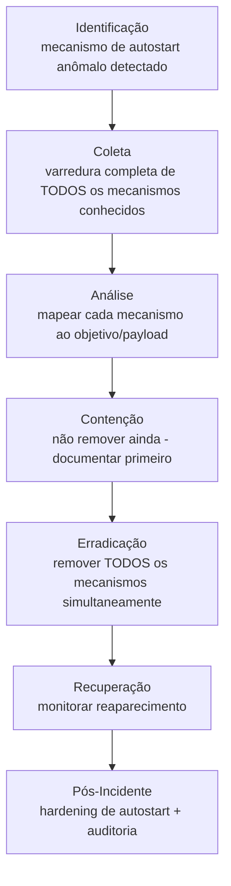

# Persistence

> 🟢 Full Playbook

## 1. Descrição Técnica

### Definição
Persistence engloba todas as técnicas usadas por um atacante para manter acesso a um sistema/ambiente mesmo após reinicializações, mudanças de credencial, ou tentativas iniciais de remediação. É uma das táticas mais importantes de identificar completamente — uma erradicação incompleta de persistência é a causa mais comum de **reinfecção** após um incidente aparentemente resolvido.

### Objetivo do Atacante
Garantir acesso de longo prazo ao ambiente, sobrevivendo a reboots, atualizações de senha, e remediações parciais.

### Impacto Esperado
- Risco de reincidência prolongada se não totalmente erradicada
- Pode ser o vetor que permite ao atacante retornar mesmo após o "incidente original" ser considerado encerrado

### Vetores de Entrada
*(mecanismos, não vetores de entrada per se — persistência é estabelecida após acesso inicial já obtido por outra técnica)*
- Registry Run Keys / Startup Folder
- Scheduled Tasks
- Serviços do Windows (criação ou modificação de serviço existente)
- WMI Event Subscriptions
- Contas de usuário/backdoor criadas
- Em Linux: cron, systemd units, `.bashrc`/`.profile`
- Em Cloud: credenciais de longa duração criadas, chaves SSH adicionadas, federação/trust configurado

### Indicadores de Comprometimento (IOCs)
| Tipo | Exemplo | Onde encontrar |
|---|---|---|
| Nova chave de Registry Run | `HKCU\...\Run\<nome>` | Registry, Autoruns |
| Scheduled Task suspeita | nome genérico/aleatório, executa script/binário externo | Event ID 4698, `C:\Windows\System32\Tasks\` |
| Novo serviço com binário incomum | `BinaryPathName` apontando para local não usual | Event ID 7045 |
| WMI Event Subscription | `__EventFilter`, `__EventConsumer` | WMI repository, Event ID 5861 |
| Conta de usuário criada fora de processo | — | Event ID 4720 |
| Chave SSH adicionada (Linux/Cloud) | `~/.ssh/authorized_keys` modificado | Auditoria de arquivo, CloudTrail (EC2 key pair) |

### TTPs Relacionados (MITRE ATT&CK)
| Tática | Técnica | ID |
|---|---|---|
| Persistence | Boot or Logon Autostart Execution | T1547 |
| Persistence | Scheduled Task/Job | T1053 |
| Persistence | Create or Modify System Process | T1543 |
| Persistence | Account Manipulation | T1098 |
| Persistence | Server Software Component | T1505 |
| Persistence | Event Triggered Execution: WMI | T1546.003 |

---

## 2. Fluxo de Investigação

> ⚠️ Persistência raramente é um único mecanismo — atacantes sofisticados estabelecem **múltiplos** mecanismos redundantes. Remover apenas o primeiro encontrado e declarar vitória é o erro mais comum em erradicação malsucedida.

### 2.1 Identificação
**Como detectar:**
- Autoruns/EDR sinalizando entrada de autostart desconhecida
- Threat hunting: comparação de baseline de Scheduled Tasks/Services contra estado atual
- Alerta de criação de conta/Service fora de janela de mudança aprovada

**Logs relevantes:** Event ID 4698 (Scheduled Task criada), 7045 (Serviço instalado), 4720 (conta criada), Sysmon Event ID 13 (RegistryEvent), 19/20/21 (WMI)

**Ferramentas utilizadas:** Sysinternals Autoruns, Velociraptor (artefatos de persistência), Sigma

**Alertas comuns:** "New autorun entry detected", "Suspicious scheduled task created", "WMI event subscription created"

### 2.2 Coleta
**Artefatos necessários:**
- **Varredura completa** de todos os mecanismos de persistência conhecidos no(s) host(s) afetado(s) — não parar no primeiro encontrado
- Configuração exata de cada mecanismo (comando executado, gatilho, frequência)

**Evidências:**
- Registry: todas as chaves Run/RunOnce, Services
- Sistema de arquivos: Startup folders, Scheduled Tasks XML
- WMI: repositório completo (`__EventFilter`/`__EventConsumer`/`__FilterToConsumerBinding`)

### 2.3 Análise
**O que procurar:**
- Cada mecanismo de persistência aponta para qual payload/comando? (pode ser o malware original, um C2 secundário, ou apenas uma conta backdoor)
- Redundância: quantos mecanismos diferentes foram estabelecidos?
- Timing: todos foram criados no mesmo momento (automação) ou em momentos diferentes (atacante retornando manualmente)?

**Técnicas de investigação:** usar checklist abrangente de mecanismos conhecidos (ver tabela "Mecanismos de Persistência — Checklist de Varredura" abaixo) — não confiar apenas no alerta que originou a investigação, que tipicamente captura só um dos mecanismos.

**Correlação de eventos:** cruzar timestamp de cada mecanismo com a timeline geral do incidente para entender em qual fase cada um foi estabelecido (acesso inicial vs. pós-escalonamento).

**Hipóteses a validar:**
- [ ] Quantos mecanismos de persistência distintos existem?
- [ ] Algum mecanismo sobrevive a reset de senha (ex.: chave SSH, conta backdoor com senha própria)?
- [ ] Existe persistência em nível de domínio/cloud (não apenas no host)?

### 2.4 Contenção
- [ ] Documentar **todos** os mecanismos antes de remover qualquer um (remoção prematura de um pode alertar o atacante sobre os demais)
- [ ] Isolar o host mantendo os mecanismos intactos para análise completa, se o tempo permitir com segurança

### 2.5 Erradicação
- [ ] Remover **todos** os mecanismos identificados **simultaneamente** (em uma única janela de manutenção coordenada)
- [ ] Resetar credenciais de qualquer conta backdoor criada
- [ ] Revogar chaves SSH/API adicionadas não autorizadamente

### 2.6 Recuperação
- [ ] Monitorar ativamente por reaparecimento de qualquer mecanismo de persistência nos dias seguintes (forte indicador de erradicação incompleta ou de atacante com acesso ainda não identificado)
- [ ] Re-executar a varredura completa de persistência após o período de monitoramento, antes de declarar encerrado

### 2.7 Pós-Incidente
- [ ] Implementar baseline de Autoruns/Scheduled Tasks/Services para detecção futura de desvio
- [ ] Restringir criação de Scheduled Tasks/Services a contas administrativas via AppLocker/WDAC
- [ ] Auditoria periódica de WMI subscriptions (mecanismo frequentemente esquecido em varreduras manuais)

---

## 3. Checklist Operacional — Varredura de Mecanismos

- [ ] Registry Run/RunOnce (HKCU e HKLM)
- [ ] Startup Folder (usuário e all-users)
- [ ] Scheduled Tasks (`C:\Windows\System32\Tasks\` completo, não só painel de controle)
- [ ] Serviços do Windows (novos ou binário de serviço existente modificado)
- [ ] WMI Event Subscriptions
- [ ] Contas de usuário/grupo criadas ou modificadas
- [ ] Chaves SSH `authorized_keys` (Linux/Cloud)
- [ ] Cron jobs e systemd units (Linux)
- [ ] Extensões de navegador instaladas
- [ ] DLL hijacking / COM hijacking
- [ ] Credenciais de longa duração / API keys criadas (Cloud)
- [ ] Federação/trust relationship configurado (Cloud/AD)

---

## 4. Evidências Relevantes

### Windows
| Fonte | Localização | O que procurar |
|---|---|---|
| Registry | `Run`, `RunOnce`, `Services` hives | Entradas não reconhecidas |
| Scheduled Tasks | `C:\Windows\System32\Tasks\` | XML completo de cada task, não apenas nome |
| WMI | WMI repository (`OBJECTS.DATA`) | `__EventFilter`/`__EventConsumer` |
| Event Viewer | Security.evtx | Event ID 4698, 4720, 7045 |

### Linux
| Fonte | Caminho | O que procurar |
|---|---|---|
| cron | `/etc/cron.*`, `/var/spool/cron/` | Jobs não reconhecidos |
| systemd | `/etc/systemd/system/` | Unit files não reconhecidos |
| SSH | `~/.ssh/authorized_keys` | Chaves não autorizadas |
| Shell startup | `~/.bashrc`, `/etc/profile.d/` | Comandos injetados |

### Cloud
| Fonte | Serviço | O que procurar |
|---|---|---|
| CloudTrail | IAM | `CreateAccessKey`, `CreateLoginProfile`, criação de usuário/role não autorizada |
| Azure AD Audit | Identity | Criação de Service Principal, App Registration não autorizada |

---

## 5. Ferramentas Recomendadas

| Categoria | Ferramentas |
|---|---|
| DFIR | Velociraptor (artefatos de persistência prontos), Sysinternals Autoruns |
| Threat Hunting | Sigma, Chainsaw, Hayabusa |

---

## 6. Casos Reais

### Persistência multi-mecanismo em intrusões de APT29
Atores de espionagem sofisticados, incluindo APT29, são conhecidos por estabelecer múltiplos mecanismos de persistência redundantes e não-óbvios (ex.: WMI subscriptions combinadas com modificação de configuração legítima de aplicação, em vez de apenas Registry Run keys óbvias), especificamente para sobreviver a remediações parciais. **Aplicação:** a investigação de qualquer comprometimento atribuído ou suspeito de ator sofisticado deve sempre incluir a varredura completa de **todos** os mecanismos da checklist acima, mesmo que o mecanismo que originou o alerta já tenha sido encontrado — assumir que existe apenas um mecanismo é o erro mais citado em retrospectivas de reinfecção pós-IR.

---

## Referências
- MITRE ATT&CK: [T1547](https://attack.mitre.org/techniques/T1547/), [T1053](https://attack.mitre.org/techniques/T1053/), [T1546.003](https://attack.mitre.org/techniques/T1546/003/)
- MITRE D3FEND: Persistence Detection
