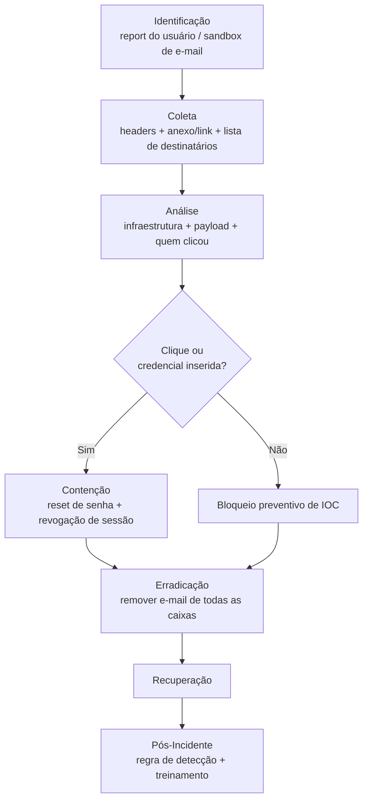

# Phishing

> 🟢 Full Playbook

## 1. Descrição Técnica

### Definição
Phishing é o envio de comunicações fraudulentas (predominantemente e-mail) em massa, fazendo-se passar por entidade confiável, com objetivo de induzir a vítima a clicar em link malicioso, abrir anexo malicioso, ou fornecer credenciais. Diferente de Spear-Phishing, phishing tradicional é tipicamente **não-direcionado** (mesma campanha enviada a grande volume de destinatários).

### Objetivo do Atacante
Acesso inicial (via credenciais ou execução de payload), distribuição de malware em larga escala, ou fraude direta (phishing de pagamento).

### Impacto Esperado
- **Confidencialidade:** credenciais roubadas, dados expostos
- **Integridade:** instalação de malware/backdoor
- Risco de escalonamento para incidente maior (ransomware, BEC) se não contido cedo

### Vetores de Entrada
- E-mail com link para página de credential harvesting
- E-mail com anexo malicioso (macro, PDF, HTML smuggling)
- QR code phishing ("quishing")
- Phishing via SMS (smishing) ou voz (vishing) como vetores adjacentes

### Indicadores de Comprometimento (IOCs)
| Tipo | Exemplo | Onde encontrar |
|---|---|---|
| Remetente | `noreply@suporte-fake[.]com` | Headers de e-mail |
| URL de phishing | `hxxp://login-verify[.]example` | E-mail gateway, proxy |
| Hash de anexo | `...` | Sandbox de e-mail |
| Domínio de typosquatting | `micros0ft-support[.]com` | DNS logs |

### TTPs Relacionados (MITRE ATT&CK)
| Tática | Técnica | ID |
|---|---|---|
| Initial Access | Phishing | T1566 |
| Initial Access | Phishing: Spearphishing Link | T1566.002 |
| Initial Access | Phishing: Spearphishing Attachment | T1566.001 |
| Credential Access | Steal Web Session Cookie (AiTM) | T1539 |

---

## 2. Fluxo de Investigação

### 2.1 Identificação
**Como detectar:**
- Usuário reporta via botão "Report Phishing"
- Sandbox/gateway de e-mail (Proofpoint, Mimecast, Defender for Office 365) bloqueia/sinaliza
- Regra de detecção de domínio recém-registrado (NRD) usado em link de e-mail

**Logs relevantes:** logs do e-mail gateway, Message Trace (M365), headers completos do e-mail reportado

**Ferramentas utilizadas:** Sandbox de e-mail, URLScan.io, VirusTotal, análise de header

**Alertas comuns:** "Phishing email blocked", "Suspicious link click", "Credential harvesting page detected"

### 2.2 Coleta
**Artefatos necessários:**
- E-mail original com headers completos (não encaminhado — headers se perdem/alteram no forward)
- Anexo (se houver), preservado com hash
- Lista completa de destinatários da campanha (Message Trace)

**Evidências:**
- Arquivos: anexo do e-mail
- Rede: logs de proxy mostrando quem acessou a URL de phishing
- Identidade: logs de autenticação dos usuários que clicaram (verificar uso de credencial após o clique)

### 2.3 Análise
**O que procurar:**
- Infraestrutura do atacante (domínio, IP, certificado — possível reuso em outras campanhas)
- Técnica de evasão usada (QR code, HTML smuggling, redirecionamento via serviço legítimo)
- Quantos usuários clicaram / quantos inseriram credenciais

**Técnicas de investigação:** análise de header de e-mail (SPF/DKIM/DMARC, `Received` chain para origem real), sandbox dinâmico do link/anexo, busca retroativa por mesma infraestrutura em outros e-mails (campanha pode ter múltiplas variantes).

**Correlação de eventos:** cruzar lista de cliques (proxy) com logs de autenticação (login bem-sucedido logo após o clique = forte indício de credencial comprometida).

**Hipóteses a validar:**
- [ ] Algum usuário inseriu credenciais na página de phishing?
- [ ] Algum anexo foi executado?
- [ ] A campanha tem variantes (outros e-mails/domínios) ainda não identificadas?

### 2.4 Contenção
- [ ] Remover o e-mail de todas as caixas (remediação via M365/Google Workspace API)
- [ ] Bloquear domínio/IP/hash em e-mail gateway, proxy e EDR
- [ ] Resetar senha + revogar sessões de qualquer usuário que inseriu credenciais
- [ ] Forçar MFA re-registration se houve indício de bypass de MFA (AiTM)

### 2.5 Erradicação
- [ ] Confirmar remoção completa do e-mail em todas as caixas afetadas
- [ ] Verificar e remover qualquer payload executado (se anexo foi aberto)
- [ ] Verificar regras de encaminhamento criadas (caso credencial tenha sido usada para login)

### 2.6 Recuperação
- [ ] Confirmar usuários afetados podem operar normalmente com credenciais novas
- [ ] Monitoramento de uso de conta nos dias seguintes

### 2.7 Pós-Incidente
- [ ] Treinamento direcionado para usuários que clicaram
- [ ] Atualização de regra de e-mail gateway/proxy com IOCs da campanha
- [ ] Avaliar necessidade de DMARC enforcement mais rígido se domínio próprio foi spoofado

---

## 3. Checklist Operacional

- [ ] E-mail original com headers coletado
- [ ] Lista de destinatários obtida (Message Trace)
- [ ] IOCs (domínio, IP, hash) extraídos
- [ ] Verificado quem clicou e quem inseriu credenciais
- [ ] E-mail removido de todas as caixas
- [ ] Senhas resetadas onde necessário
- [ ] IOCs bloqueados em escala
- [ ] Regra de detecção criada/atualizada

---

## 4. Evidências Relevantes

### Windows
| Fonte | Localização | O que procurar |
|---|---|---|
| Sysmon | Operational | Execução de anexo, processo filho de cliente de e-mail |
| Browser history | Perfil do usuário | Acesso à URL de phishing |

### Linux
| Fonte | Caminho | O que procurar |
|---|---|---|
| Mail client logs | Variável | Confirmação de abertura/clique |

### Cloud
| Fonte | Serviço | O que procurar |
|---|---|---|
| M365 Message Trace / Defender | Exchange Online | Rastreamento completo do e-mail, ação de remediação |
| Azure AD Sign-in Logs | Identity | Login após o clique (indício de credencial comprometida) |

---

## 5. Ferramentas Recomendadas

| Categoria | Ferramentas |
|---|---|
| Análise de e-mail | Microsoft Defender for Office 365, Proofpoint, MXToolbox |
| Análise de URL | URLScan.io, VirusTotal |
| Threat Hunting | Sigma, KQL (Microsoft 365 Defender) |

---

## 6. Casos Reais

### Campanhas de Phishing associadas a Emotet/QakBot
Campanhas de phishing em massa frequentemente servem como vetor inicial de distribuição de loaders como Emotet e QakBot, que por sua vez entregam ransomware. **Aplicação:** a investigação de um simples e-mail de phishing reportado deve sempre considerar a hipótese de que faz parte de uma campanha de distribuição de malware maior — verificar reuso de infraestrutura (domínio/IP) contra IOCs públicos de campanhas ativas conhecidas é um passo de triagem barato e de alto valor.

---

## Referências
- MITRE ATT&CK: [T1566](https://attack.mitre.org/techniques/T1566/)
- MITRE D3FEND: Email Analysis
