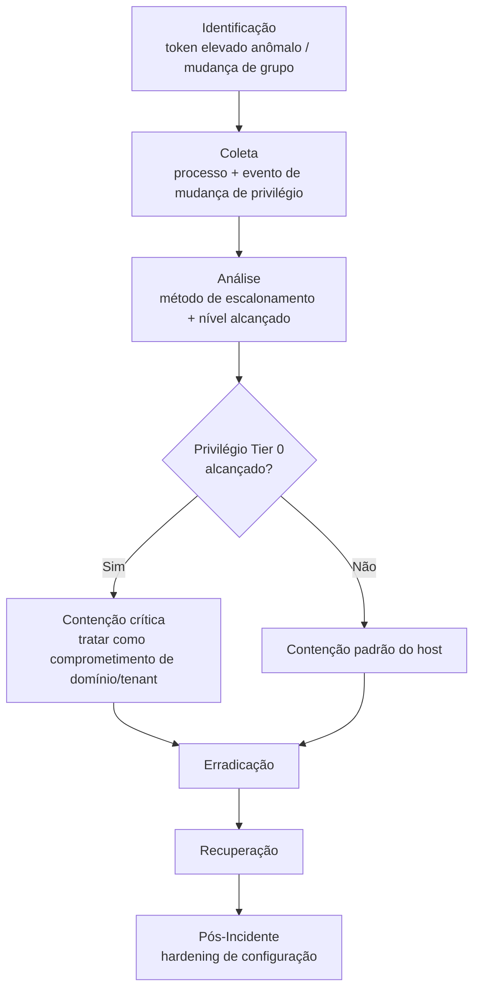

# Privilege-Escalation

> 🟢 Full Playbook

## 1. Descrição Técnica

### Definição
Privilege Escalation é a tática usada para obter permissões mais elevadas do que as inicialmente concedidas — de usuário comum para administrador local, de administrador local para Domain Admin, ou de usuário cloud com escopo limitado para um papel com privilégio amplo. É um ponto de inflexão crítico em quase toda investigação: define até onde o atacante consegue avançar.

### Objetivo do Atacante
Obter controle administrativo suficiente para desabilitar defesas, acessar dados sensíveis, criar persistência robusta, ou avançar para movimento lateral em maior escala.

### Impacto Esperado
- **Integridade/Disponibilidade:** controle total sobre o(s) sistema(s) afetado(s)
- Risco multiplicador: escalonamento bem-sucedido normalmente precede contenção/erradicação muito mais complexas

### Vetores de Entrada
- Exploração de vulnerabilidade local (kernel exploit, serviço mal configurado)
- Abuso de configuração incorreta (permissões de serviço, AlwaysInstallElevated, DLL hijacking)
- Token impersonation / abuso de privilégio existente (SeImpersonatePrivilege)
- Em AD: ACLs mal configuradas, delegação Kerberos insegura (ver `Active-Directory/`)
- Em Cloud: políticas IAM excessivamente permissivas, escalonamento via cadeia de roles

### Indicadores de Comprometimento (IOCs)
| Tipo | Exemplo | Onde encontrar |
|---|---|---|
| Criação de processo com token elevado a partir de processo não elevado | — | Sysmon Event ID 1 + Event ID 4688 com `TokenElevationType` |
| Uso de ferramenta de exploit local conhecida | PrintNightmare, JuicyPotato, etc. (hash/nome) | EDR/AV |
| Adição de conta a grupo privilegiado | `net localgroup administrators /add` | Event ID 4732/4728 |
| Mudança de política IAM (cloud) | `AttachUserPolicy`, `PutRolePolicy` | CloudTrail |

### TTPs Relacionados (MITRE ATT&CK)
| Tática | Técnica | ID |
|---|---|---|
| Privilege Escalation | Exploitation for Privilege Escalation | T1068 |
| Privilege Escalation | Valid Accounts | T1078 |
| Privilege Escalation | Abuse Elevation Control Mechanism | T1548 |
| Privilege Escalation | Access Token Manipulation | T1134 |
| Privilege Escalation | Domain Policy Modification | T1484 |

---

## 2. Fluxo de Investigação

### 2.1 Identificação
**Como detectar:**
- EDR sinalizando exploit conhecido de escalonamento local
- Mudança em grupo privilegiado fora de processo de change management aprovado
- Alerta de política IAM cloud sendo ampliada por identidade não administrativa

**Logs relevantes:** Event ID 4688 (criação de processo, com token info), 4732/4728 (adição a grupo), 4735 (mudança de grupo), CloudTrail/Azure Activity Logs para mudanças de IAM

**Ferramentas utilizadas:** EDR, Sigma, ferramentas de auditoria IAM (Prowler, ScoutSuite)

**Alertas comuns:** "Privilege escalation exploit detected", "User added to privileged group", "IAM policy modified by non-admin"

### 2.2 Coleta
**Artefatos necessários:**
- Linha de comando e binário do exploit/ferramenta usada
- Evento exato de mudança de privilégio (grupo, token, política)
- Estado de privilégio da conta **antes** do evento (para confirmar que de fato houve escalonamento, não privilégio legítimo pré-existente)

**Evidências:**
- Host: processo que executou o exploit, artefatos de exploração local
- Identidade: histórico de grupo/permissão da conta envolvida

### 2.3 Análise
**O que procurar:**
- Técnica exata de escalonamento (exploit de kernel, abuso de serviço, token impersonation, abuso de IAM)
- Nível final de privilégio alcançado — distinguir entre "admin local de um host" e "Domain Admin"/"Global Admin cloud" (impacto e resposta são radicalmente diferentes)
- Se a vulnerabilidade/configuração explorada existe em outros hosts/contas (escopo de exposição)

**Técnicas de investigação:** sempre correlacionar o momento exato do escalonamento com a atividade do atacante imediatamente antes (geralmente após acesso inicial com privilégio baixo) e depois (o que o atacante fez com o novo privilégio).

**Correlação de eventos:** cruzar com `Persistence/` — escalonamento de privilégio é frequentemente seguido imediatamente por estabelecimento de persistência mais robusta, aproveitando o novo nível de acesso.

**Hipóteses a validar:**
- [ ] Qual técnica exata foi usada?
- [ ] Que nível de privilégio foi alcançado (host local, domínio, tenant cloud)?
- [ ] A vulnerabilidade/má configuração explorada existe em outros lugares do ambiente?
- [ ] O que o atacante fez imediatamente após obter o privilégio elevado?

### 2.4 Contenção
- [ ] Revogar o privilégio elevado obtido (remover de grupo, reverter política IAM)
- [ ] Isolar o host/conta envolvida
- [ ] Se Tier 0/admin de domínio ou tenant cloud foi alcançado: escalar imediatamente para procedimento de comprometimento total (`Active-Directory/` ou `Cloud-Intrusion/`)

### 2.5 Erradicação
- [ ] Aplicar patch/correção de configuração que permitiu o escalonamento
- [ ] Verificar e corrigir a mesma vulnerabilidade/má configuração em outros hosts/contas

### 2.6 Recuperação
- [ ] Validar que o privilégio do ambiente voltou ao estado legítimo
- [ ] Monitoramento elevado de qualquer nova tentativa de escalonamento

### 2.7 Pós-Incidente
- [ ] Auditoria ampla de configurações similares (varredura de hosts vulneráveis à mesma técnica)
- [ ] Implementar princípio de menor privilégio em IAM/grupos AD
- [ ] Avaliar EDR/patch management para fechar vetor de exploit local

---

## 3. Checklist Operacional

- [ ] Técnica de escalonamento identificada com precisão
- [ ] Nível de privilégio alcançado determinado
- [ ] Privilégio elevado revogado
- [ ] Verificado se mesma vulnerabilidade existe em outros sistemas
- [ ] Ação pós-escalonamento do atacante investigada
- [ ] Patch/correção de configuração aplicado em escala

---

## 4. Evidências Relevantes

### Windows
| Fonte | Localização | O que procurar |
|---|---|---|
| Security.evtx | — | Event ID 4688 (com `TokenElevationType`), 4732/4728/4735 (grupo) |
| Sysmon | Operational | Event ID 1 (exploit local), 10 (acesso a processo privilegiado) |

### Linux
| Fonte | Caminho | O que procurar |
|---|---|---|
| auditd | `/var/log/audit/audit.log` | `execve` de exploit, mudança de SUID/SGID |
| sudoers | `/etc/sudoers`, `/etc/sudoers.d/` | Mudança não autorizada de permissão sudo |

### Cloud
| Fonte | Serviço | O que procurar |
|---|---|---|
| CloudTrail | IAM | `AttachUserPolicy`, `CreatePolicyVersion`, `AssumeRole` de cadeia anômala |
| Azure Activity Logs | RBAC | Atribuição de role privilegiada (`Owner`, `Global Admin`) |

---

## 5. Ferramentas Recomendadas

| Categoria | Ferramentas |
|---|---|
| DFIR | Velociraptor, KAPE |
| Auditoria IAM Cloud | Prowler, ScoutSuite, Pacu (uso defensivo) |
| Auditoria AD | BloodHound |

---

## 6. Casos Reais

### Escalonamento via má configuração de IAM em intrusões cloud
Padrão recorrente reportado em incidentes de comprometimento de nuvem (relatado por Mandiant e outros): atacante obtém credencial de identidade cloud com permissão aparentemente limitada, mas que possui permissão para criar/anexar política IAM (`iam:PutUserPolicy` ou equivalente) — permitindo auto-escalonamento direto para privilégio administrativo total da conta. **Aplicação:** a investigação deve sempre mapear a **cadeia de permissões** da identidade comprometida (não apenas o que ela fez, mas o que ela *podia* fazer) usando ferramentas de auditoria IAM, já que escalonamento via política mal configurada raramente gera um "exploit" claro — é abuso de permissão legítima mal desenhada.

---

## Referências
- MITRE ATT&CK: [T1068](https://attack.mitre.org/techniques/T1068/), [T1548](https://attack.mitre.org/techniques/T1548/), [T1484](https://attack.mitre.org/techniques/T1484/)
- MITRE D3FEND: Privilege Escalation Prevention
