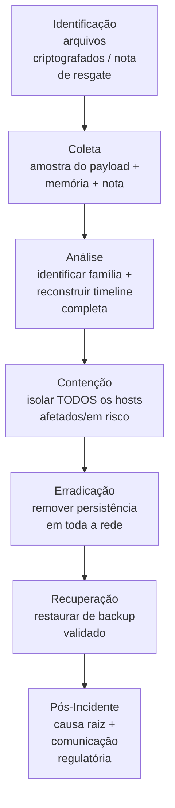

# Ransomware

> 🟢 Full Playbook

## 1. Descrição Técnica

### Definição
Ransomware é malware que criptografa (ou ameaça destruir/vazar) dados de uma vítima, exigindo pagamento de resgate para restauração ou não-divulgação. Ransomware moderno é predominantemente operado por grupos organizados (Ransomware-as-a-Service) e quase sempre envolve **dupla extorsão**: exfiltração de dados antes da criptografia, seguida da ameaça de vazamento público.

### Objetivo do Atacante
Monetização direta via resgate; secundariamente, extorsão via ameaça de vazamento de dados sensíveis.

### Impacto Esperado
- **Disponibilidade:** indisponibilidade total ou parcial de sistemas críticos
- **Confidencialidade:** exfiltração de dados pré-criptografia (dupla extorsão)
- **Integridade:** possível corrupção permanente de dados se backup falhar ou decryptor não existir
- Impacto financeiro direto (resgate, downtime) e reputacional (vazamento público, notificação regulatória)

### Vetores de Entrada
- RDP exposto com credenciais fracas/vazadas (vetor histórico mais comum)
- Phishing/Spear-Phishing com loader (Emotet/QakBot → ransomware)
- Exploração de vulnerabilidade em serviço exposto (VPN, servidor de aplicação)
- Compromisso de credenciais via infostealer prévio
- Acesso comprado de Initial Access Broker (IAB)

### Indicadores de Comprometimento (IOCs)
| Tipo | Exemplo | Onde encontrar |
|---|---|---|
| Extensão de arquivo criptografado | `.lockbit`, `.basta`, `.alphv` | Sistema de arquivos |
| Nota de resgate | `README.txt`, `RECOVER-FILES.txt` | Diretórios afetados |
| Hash do binário de criptografia | `...` | EDR, análise de amostra |
| Comando de exclusão de Shadow Copies | `vssadmin delete shadows /all` | Logs de execução de comando, Sysmon |
| IP/domínio de exfiltração (pré-criptografia) | `...` | Proxy, NetFlow |

### TTPs Relacionados (MITRE ATT&CK)
| Tática | Técnica | ID |
|---|---|---|
| Impact | Data Encrypted for Impact | T1486 |
| Impact | Inhibit System Recovery | T1490 |
| Exfiltration | Exfiltration Over Web Service | T1567 |
| Defense Evasion | Indicator Removal (log clearing) | T1070 |
| Credential Access | OS Credential Dumping | T1003 |
| Lateral Movement | Remote Services (RDP/SMB) | T1021 |

---

## 2. Fluxo de Investigação

> ⚠️ Diferente de outras categorias, em ransomware a **contenção precede a análise completa** sempre que houver criptografia ativa — o custo de esperar é a perda de mais dados.

### 2.1 Identificação
**Como detectar:**
- Usuários reportando arquivos inacessíveis / extensão alterada
- Alerta EDR de comportamento de ransomware (mass file modification)
- Nota de resgate detectada por regra de criação de arquivo
- Queda abrupta de Shadow Copies / falha de backup

**Logs relevantes:** Sysmon Event ID 11 (criação de arquivo em massa), Event ID 1 (execução de `vssadmin`/`wmic shadowcopy delete`), logs de backup (falhas/exclusões)

**Ferramentas utilizadas:** EDR, ID Ransomware (identificação de família pela nota/extensão), Sigma

**Alertas comuns:** "Ransomware behavior detected", "Mass file rename", "Shadow copy deletion"

### 2.2 Coleta
**Artefatos necessários:**
- Nota de resgate (preservar, não apagar)
- Amostra de arquivo criptografado + (se existir) versão original para comparação
- Binário do ransomware, se ainda presente
- Memória de host(s) afetado(s) — pode conter a chave de criptografia em alguns casos

**Evidências:**
- Arquivos: nota de resgate, binário, logs de backup
- Memória: prioridade alta — capturar antes de qualquer remediação
- Rede: tráfego de exfiltração pré-criptografia (geralmente horas/dias antes da detonação)

### 2.3 Análise
**O que procurar:**
- Ponto de entrada inicial (geralmente dias/semanas antes da criptografia — "dwell time" alto é típico)
- Evidência de reconhecimento interno (Discovery: `net group`, `nltest`, `AdFind`)
- Evidência de exfiltração antes da criptografia (dupla extorsão é o padrão atual)
- Escopo completo: quantos hosts foram criptografados vs. quantos foram apenas acessados

**Técnicas de investigação:** reconstrução de timeline completa desde o acesso inicial (não apenas o momento da detonação) — ransomware moderno tem fase de "pre-encryption dwell time" que pode durar dias a semanas, com reconhecimento extenso e exfiltração antes da criptografia final.

**Correlação de eventos:** cruzar logs de autenticação (movimento lateral), logs de backup (tentativas de exclusão), e tráfego de rede (exfiltração) com o timestamp da criptografia.

**Hipóteses a validar:**
- [ ] Houve exfiltração de dados antes da criptografia?
- [ ] Backups foram comprometidos/excluídos?
- [ ] Qual foi o vetor de acesso inicial e quando ocorreu?
- [ ] Existe decryptor público disponível para esta família?

### 2.4 Contenção
- [ ] Isolar TODOS os hosts afetados e hosts com indícios de comprometimento (não apenas os já criptografados)
- [ ] Isolar/proteger backups imediatamente (desconectar da rede se acessíveis)
- [ ] Desabilitar contas comprometidas usadas para movimento lateral
- [ ] Bloquear IOCs de C2/exfiltração em escala

### 2.5 Erradicação
- [ ] Identificar e remover toda persistência em todos os hosts comprometidos (não só os criptografados)
- [ ] Resetar credenciais de TODAS as contas potencialmente expostas, incluindo contas de serviço e admin
- [ ] Verificar e remover backdoors adicionais (grupos de ransomware frequentemente deixam múltiplos pontos de acesso)
- [ ] Avaliar necessidade de reset de **toda** a infraestrutura Kerberos (krbtgt) se Domain Controller foi comprometido

### 2.6 Recuperação
- [ ] Restaurar a partir de backup validado como limpo (anterior ao comprometimento, não apenas anterior à criptografia)
- [ ] Validar ausência de persistência antes de reconectar qualquer sistema restaurado
- [ ] Reconstruir (rebuild) hosts críticos a partir de imagem limpa quando houver dúvida sobre integridade
- [ ] Monitoramento intensivo pós-recuperação por período estendido (semanas)

### 2.7 Pós-Incidente
- [ ] Relatório completo de causa raiz e timeline
- [ ] Avaliação de obrigação de notificação regulatória (dados pessoais expostos)
- [ ] Revisão de exposição de RDP/serviços externos
- [ ] Implementação de segmentação de rede e backups imutáveis/offline
- [ ] Atualização de detecção para TTPs específicos do grupo identificado

---

## 3. Checklist Operacional

- [ ] Hosts isolados (mantidos ligados para captura de memória)
- [ ] Backups protegidos/isolados
- [ ] Nota de resgate e amostra preservadas
- [ ] Família de ransomware identificada
- [ ] Decryptor público verificado (No More Ransom Project)
- [ ] Timeline completa reconstruída (não só momento de detonação)
- [ ] Evidência de exfiltração avaliada
- [ ] Escopo total determinado (todos os hosts/contas comprometidos)
- [ ] Jurídico e liderança acionados
- [ ] Credenciais resetadas em escala
- [ ] Restauração validada antes de retorno à operação

---

## 4. Evidências Relevantes

### Windows
| Fonte | Caminho / Localização | O que procurar |
|---|---|---|
| Sysmon | Operational | Event ID 1 (`vssadmin`, `wmic shadowcopy delete`, `bcdedit`), Event ID 11 (renomeação em massa) |
| Event Viewer | Security.evtx | Event ID 4624/4625 (logon em massa, RDP), 4720 (criação de conta) |
| Registry | Run keys, Services | Persistência do agente de ransomware ou ferramentas de acesso remoto (AnyDesk, etc.) |
| Scheduled Tasks | `C:\Windows\System32\Tasks\` | Tarefas criadas para execução em massa |
| PowerShell Logs | Event ID 4104 | Scripts de reconhecimento/exclusão de backup |

### Linux
| Fonte | Caminho | O que procurar |
|---|---|---|
| auth.log | `/var/log/auth.log` | Acessos SSH anômalos |
| Bash history | `~/.bash_history` | Comandos de exclusão de backup, download de payload |

### Cloud
| Fonte | Serviço | O que procurar |
|---|---|---|
| CloudTrail | S3/EBS | Exclusão/criptografia de snapshots, exfiltração via S3 |
| Azure Activity Logs | Storage/Backup | Exclusão de backup vaults |

---

## 5. Ferramentas Recomendadas

| Categoria | Ferramentas |
|---|---|
| DFIR | Velociraptor, KAPE, Magnet AXIOM |
| Malware Analysis | REMnux, FlareVM, Ghidra |
| Network Analysis | Wireshark, Zeek, Arkime |
| Identificação de família | ID Ransomware, No More Ransom Project |
| Threat Hunting | Sigma, Chainsaw, Hayabusa |

---

## 6. Casos Reais

### LockBit
Um dos RaaS mais prolíficos da história, operando com afiliados independentes sob o modelo Ransomware-as-a-Service. **Aplicação:** investigação tipicamente revela acesso inicial via RDP exposto ou exploração de vulnerabilidade conhecida (ex.: Citrix Bleed), seguido de uso extensivo de `AdFind` e `SoftPerfect NetScan` para reconhecimento de Active Directory, exfiltração via ferramentas legítimas (Rclone, MEGA) antes da detonação do payload de criptografia. Conforme reportado pela CISA (AA23-075A), o IOC de maior valor investigativo costuma ser a janela de tempo entre o reconhecimento de AD e a criptografia — geralmente curta o suficiente para indicar automação por afiliado.

### BlackCat (ALPHV)
Primeiro grupo de ransomware relevante escrito em Rust, com foco em ataques híbridos Windows/Linux/ESXi. **Aplicação:** a investigação deve cobrir explicitamente hosts ESXi/Linux além de Windows, já que o grupo historicamente mirou hypervisors diretamente — análise de `/var/log/` e datastores VMware é necessária, não apenas Event Logs Windows.

---

## Referências
- MITRE ATT&CK: [T1486](https://attack.mitre.org/techniques/T1486/), [T1490](https://attack.mitre.org/techniques/T1490/)
- CISA Advisory AA23-075A (LockBit 3.0)
- No More Ransom Project: https://www.nomoreransom.org
