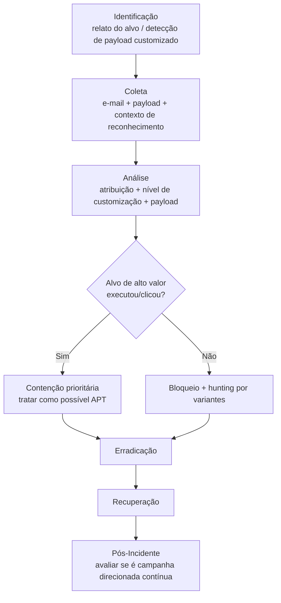

# Spear-Phishing

> 🟢 Full Playbook

## 1. Descrição Técnica

### Definição
Spear-Phishing é uma forma direcionada de phishing, voltada a um indivíduo ou pequeno grupo específico, com conteúdo customizado usando informações reais sobre o alvo (cargo, projetos, relacionamentos) para aumentar a credibilidade. É frequentemente o vetor inicial preferido de atores APT e operações de espionagem, por ter taxa de sucesso muito maior que phishing em massa.

### Objetivo do Atacante
Acesso inicial a um alvo específico de alto valor (executivo, administrador de TI, pessoa com acesso a dados sensíveis); em contexto de espionagem, frequentemente o primeiro passo de uma campanha de longo prazo.

### Impacto Esperado
- **Confidencialidade:** acesso a dados/sistemas de alto valor associados ao alvo específico
- Risco elevado de escalonamento para comprometimento profundo (o alvo geralmente tem privilégios maiores que um usuário comum)

### Vetores de Entrada
- E-mail customizado referenciando contexto real (projeto, colega, evento)
- Impersonação de contato conhecido/parceiro de negócio
- Documento "relevante ao trabalho" do alvo, contendo macro/exploit
- LinkedIn/redes sociais como reconhecimento prévio (pretexting)

### Indicadores de Comprometimento (IOCs)
| Tipo | Exemplo | Onde encontrar |
|---|---|---|
| Remetente spoofado/lookalike | `j.silva@empresa-parceira[.]co` (domínio similar) | Headers de e-mail |
| Documento com macro/exploit | `Proposta_Q3.docm` | Sandbox, EDR |
| Infraestrutura C2 customizada | `...` | Análise de payload |

### TTPs Relacionados (MITRE ATT&CK)
| Tática | Técnica | ID |
|---|---|---|
| Reconnaissance | Gather Victim Identity Information | T1589 |
| Initial Access | Spearphishing Attachment | T1566.001 |
| Initial Access | Spearphishing Link | T1566.002 |
| Initial Access | Spearphishing via Service | T1566.003 |

---

## 2. Fluxo de Investigação

### 2.1 Identificação
**Como detectar:**
- Relato direto do alvo ("esse e-mail parece estranho mas é muito específico")
- Detecção de payload customizado/não commodity (sem assinatura AV conhecida)
- TI feed associando domínio/infra a ator conhecido

**Logs relevantes:** headers completos do e-mail, Sysmon do host do alvo, logs de autenticação do alvo

**Ferramentas utilizadas:** sandbox dinâmico, análise de header, OSINT sobre a infraestrutura do remetente

**Alertas comuns:** "Targeted attack indicator", "Executive impersonation", "Lookalike domain detected"

### 2.2 Coleta
**Artefatos necessários:**
- E-mail completo (headers + corpo + anexo)
- Histórico de atividade do alvo nos dias anteriores (possível reconhecimento prévio via outros canais)
- Memória/disco do host do alvo se houve execução

**Evidências:**
- Arquivos: payload customizado (alto valor para engenharia reversa — pode revelar atribuição)
- Rede: tráfego pós-execução do host do alvo
- Identidade: logon do alvo, MFA challenges, mudanças de configuração de conta

### 2.3 Análise
**O que procurar:**
- Nível de customização (indica reconhecimento prévio — quanto mais específico, maior a sofisticação do atacante)
- Reuso de infraestrutura/TTPs com campanhas conhecidas (atribuição)
- Se o alvo tem privilégios elevados, assumir potencial acesso mais profundo que um phishing genérico

**Técnicas de investigação:** tratar com prioridade de investigação elevada desde o início — spear-phishing bem-sucedido contra alvo de alto valor deve ser investigado com o rigor de uma possível intrusão de APT até prova em contrário (ver `Attack-Categories/APT-Investigation/`).

**Correlação de eventos:** verificar se outros membros da organização com perfil similar (mesmo cargo/departamento) receberam e-mails parecidos — spear-phishing frequentemente mira múltiplos alvos relacionados na mesma campanha.

**Hipóteses a validar:**
- [ ] Esta é uma campanha isolada ou parte de operação contínua contra a organização?
- [ ] O payload é customizado/único ou commodity reaproveitado?
- [ ] Há indícios de reconhecimento prévio (OSINT, engenharia social por outro canal)?

### 2.4 Contenção
- [ ] Isolar o host do alvo imediatamente
- [ ] Resetar credenciais e revogar sessões do alvo
- [ ] Avaliar contenção silenciosa (monitoramento passivo) se houver suspeita de operação de longo prazo já em andamento — discutir com Lead Investigator antes de alertar o atacante

### 2.5 Erradicação
- [ ] Remover payload e qualquer persistência do host do alvo
- [ ] Verificar se outros sistemas a que o alvo tem acesso foram tocados

### 2.6 Recuperação
- [ ] Validar limpeza completa antes de devolver acesso ao alvo
- [ ] Considerar rotação de credenciais de sistemas sensíveis a que o alvo tinha acesso

### 2.7 Pós-Incidente
- [ ] Avaliar necessidade de engajar Threat Intel para atribuição
- [ ] Treinamento específico para perfis de alto risco (executivos, TI, financeiro)
- [ ] Considerar hunting proativo por TTPs do ator identificado em toda a organização

---

## 3. Checklist Operacional

- [ ] E-mail e payload coletados com headers completos
- [ ] Nível de customização avaliado
- [ ] Verificado se outros alvos relacionados foram visados
- [ ] Host do alvo isolado e investigado com profundidade DFIR completa
- [ ] Credenciais do alvo resetadas
- [ ] Atribuição/TI avaliada
- [ ] Hunting por TTPs do ator realizado na organização

---

## 4. Evidências Relevantes

### Windows
| Fonte | Localização | O que procurar |
|---|---|---|
| Sysmon | Operational | Execução de payload customizado, processo filho do cliente de e-mail/Office |
| Event Viewer | Security.evtx | Logon do alvo, mudanças de privilégio pós-comprometimento |

### Linux
| Fonte | Caminho | O que procurar |
|---|---|---|
| auth.log | `/var/log/auth.log` | Acesso SSH do alvo após possível comprometimento |

### Cloud
| Fonte | Serviço | O que procurar |
|---|---|---|
| Azure AD Sign-in Logs | Identity | Login do alvo de localização/dispositivo anômalo pós-clique |

---

## 5. Ferramentas Recomendadas

| Categoria | Ferramentas |
|---|---|
| DFIR | Velociraptor, KAPE |
| Malware Analysis | Ghidra, FlareVM (payloads tendem a ser mais sofisticados que phishing comum) |
| Threat Intel | MISP, VirusTotal, OSINT sobre infraestrutura |

---

## 6. Casos Reais

### APT29 (Cozy Bear)
Ator associado a operações de espionagem, historicamente conhecido por spear-phishing altamente customizado (incluindo uso de plataformas legítimas como OneDrive/Dropbox para hospedar payload, evitando detecção de domínio malicioso). **Aplicação:** a investigação deve priorizar a extração de infraestrutura associada a serviços legítimos abusados (Service vetor T1566.003), já que bloqueio de domínio tradicional é insuficiente quando o link aponta para um serviço confiável como o próprio OneDrive.

### FIN7
Grupo financeiramente motivado, historicamente usando spear-phishing com documentos Office contendo macros/exploits direcionados a funcionários de área financeira/varejo. **Aplicação:** a investigação foca na análise do payload do documento (geralmente um loader customizado) e na verificação imediata de acesso a sistemas de pagamento/PDV se o alvo tiver esse tipo de acesso.

---

## Referências
- MITRE ATT&CK: [T1566.001](https://attack.mitre.org/techniques/T1566/001/), [T1566.003](https://attack.mitre.org/techniques/T1566/003/), [T1589](https://attack.mitre.org/techniques/T1589/)
