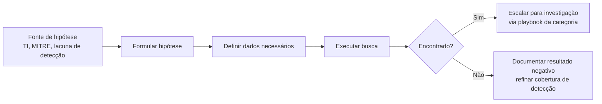

# Threat-Hunting

> 🟡 Quick-Reference — Metodologia

## Descrição Técnica

**Definição:** Busca **proativa** por ameaças no ambiente, partindo da premissa de que o atacante já pode estar presente sem ter disparado nenhum alerta automatizado — diferente de resposta a incidente (reativa), hunting é hipótese-driven e não depende de um gatilho prévio.

**Quando usar:** Continuamente, como atividade programada (não apenas após um incidente); especialmente após divulgação de TTPs de um novo ator relevante para o setor/organização.

---

## Modelo de Hunting Hipótese-Driven

### Fontes de Hipótese

| Fonte | Exemplo |
|---|---|
| Threat Intel | "Ator X usa técnica Y — buscamos evidência de Y no nosso ambiente?" |
| MITRE ATT&CK (cobertura de gap) | "Não temos detecção para T1055 — vamos caçar manualmente?" |
| Anomalia estatística | "Qual processo se comunica com mais domínios únicos por dia? (possível DGA)" |
| Incidente anterior | "O TTP do último incidente apareceu em outro lugar do ambiente?" |

---

## Técnicas de Hunting

| Técnica | Descrição |
|---|---|
| **Stacking** | Agregar um campo (ex.: nome de processo, parent-child pair) em todo o ambiente e revisar os menos frequentes — outliers raros são mais suspeitos que padrões comuns |
| **Baselining** | Estabelecer "normal" para um host/usuário/processo e buscar desvios |
| **IOC Sweep** | Busca retroativa por IOC específico (ver `IOC-Hunting/`) |
| **TTP Hunting** | Busca por padrão de comportamento (não IOC específico) associado a uma técnica MITRE |

---

## Checklist Operacional

- [ ] Hipótese formulada com fonte clara (TI, gap de detecção, etc.)
- [ ] Dados necessários identificados e disponíveis (validar antes de começar)
- [ ] Busca executada com escopo definido (período, hosts)
- [ ] Resultado documentado (positivo ou negativo)
- [ ] Se positivo: escalado para playbook da categoria correspondente
- [ ] Se negativo: avaliado se cobertura de detecção automatizada deve ser criada para essa hipótese

---

## Ferramentas Recomendadas

| Categoria | Ferramentas |
|---|---|
| Hunting em log/SIEM | KQL (Microsoft Sentinel/Defender), Splunk SPL |
| Hunting em endpoint (escala) | Velociraptor, EDR query language |
| Parsing offline de Event Logs | Hayabusa, Chainsaw |
| Visualização/correlação | Timesketch |

---

## Referência Cruzada
- Busca por IOC específico: [`IOC-Hunting/README.md`](../IOC-Hunting/README.md)
- Perfis de ator para gerar hipótese: [`Threat-Intel/README.md`](../../Threat-Intel/README.md)
- Tabela de técnicas por categoria: [`MITRE-Mappings/Master-Mapping-Table.md`](../../MITRE-Mappings/Master-Mapping-Table.md)

> 📌 Esta categoria está marcada como Quick-Reference. Para expandir para Full Playbook, use `Templates/Full-Playbook-Template.md`.
