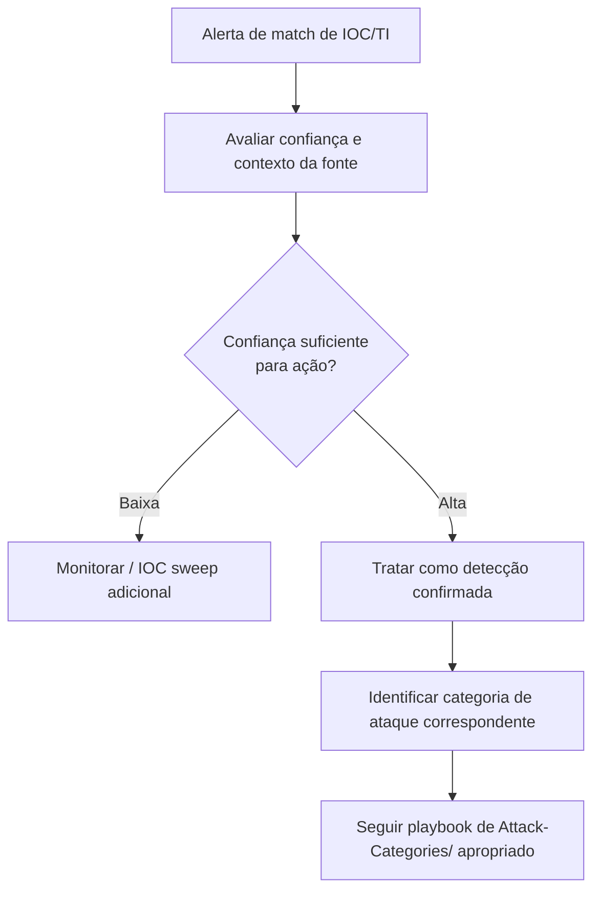

# Threat-Intel (Resposta a Alerta de Threat Intelligence)

> 🟡 Quick-Reference — Metodologia
>
> Esta página cobre a **resposta operacional** a um alerta originado por threat intelligence. Para o programa de TI em si (perfis de ator, ciclo de inteligência), ver [`Threat-Intel/`](../../Threat-Intel/) na raiz do repositório.

## Descrição Técnica

**Definição:** Procedimento de triagem e resposta quando uma detecção é originada por um indicador ou relatório de threat intelligence (feed de IOC batendo em um log, relatório de TI mencionando exposição da organização, alerta de ISAC do setor) — em vez de por uma detecção comportamental local.

**Quando usar:** Sempre que um IOC de feed externo gerar match, ou quando um relatório de TI (vendor, governamental, ISAC) mencionar TTPs/infraestrutura relevante à organização.

---

## Fluxo de Resposta

### 1. Avaliação de Confiança da Fonte
| Nível | Critério |
|---|---|
| Alta | Fonte governamental/CISA, vendor TI estabelecido, com contexto técnico detalhado |
| Média | Feed comercial/comunidade sem contexto adicional, IOC isolado sem campanha associada |
| Baixa | Fonte não verificada, IOC genérico (IP compartilhado, domínio de CDN) |

### 2. Roteamento para Categoria
Após confirmação, identificar a técnica/categoria associada ao IOC/relatório usando [`MITRE-Mappings/Master-Mapping-Table.md`](../../MITRE-Mappings/Master-Mapping-Table.md) e seguir o playbook correspondente em `Attack-Categories/`.

---

## Checklist Operacional

- [ ] Fonte e confiança do alerta de TI avaliadas
- [ ] IOC sweep adicional realizado (ver `IOC-Hunting/`) para confirmar/descartar
- [ ] Categoria de ataque correspondente identificada
- [ ] Playbook apropriado seguido a partir da confirmação
- [ ] Perfil de ator atualizado em `Threat-Intel/` (raiz) se nova informação foi obtida

---

## Armadilhas Comuns

- **Confiar cegamente em IOC sem contexto:** IPs compartilhados (CDN, cloud provider) geram falsos positivos frequentes — sempre validar contexto antes de tratar como confirmado.
- **Ignorar relatório de TI sem IOC técnico direto:** relatórios sobre mudança de TTP de um ator relevante ao setor merecem hunting proativo mesmo sem IOC específico batendo automaticamente.

---

## Ferramentas Recomendadas
MISP, TI platform comercial, VirusTotal, plataformas de ISAC do setor

---

## Referência Cruzada
- Programa de TI / perfis de ator: [`Threat-Intel/README.md`](../../Threat-Intel/) (raiz)
- Busca por IOC: [`IOC-Hunting/README.md`](../IOC-Hunting/README.md)
- Investigação de campanha sofisticada: [`APT-Investigation/README.md`](../APT-Investigation/README.md)

> 📌 Esta categoria está marcada como Quick-Reference. Para expandir para Full Playbook, use `Templates/Full-Playbook-Template.md`.
