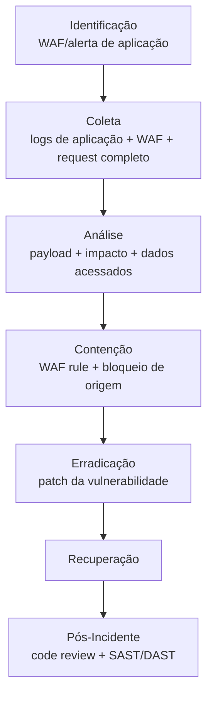

# Web-Attacks

> 🟡 Quick-Reference (8 subcategorias)

## Visão Geral

Esta categoria cobre ataques contra aplicações web — o vetor de acesso inicial mais comum contra ativos expostos à internet (T1190 - Exploit Public-Facing Application). Cada subtipo tem metodologia própria, mas compartilham um fluxo de investigação comum:

## Subcategorias

| Subcategoria | Descrição rápida | ID MITRE |
|---|---|---|
| [SQLi](SQLi/README.md) | Injeção de SQL — manipulação de query de banco de dados via input não sanitizado | T1190 |
| [XSS](XSS/README.md) | Cross-Site Scripting — injeção de script malicioso executado no navegador da vítima | T1189/T1190 |
| [SSRF](SSRF/README.md) | Server-Side Request Forgery — aplicação induzida a fazer requisição a destino controlado pelo atacante | T1190 |
| [XXE](XXE/README.md) | XML External Entity — abuso de parser XML para leitura de arquivo local/SSRF | T1190 |
| [RCE](RCE/README.md) | Remote Code Execution — execução arbitrária de código no servidor | T1190 |
| [Path-Traversal](Path-Traversal/README.md) | Acesso a arquivos fora do diretório esperado via manipulação de caminho | T1190 |
| [File-Upload](File-Upload/README.md) | Upload de arquivo malicioso (webshell) explorando validação insuficiente | T1505.003 |
| [Command-Injection](Command-Injection/README.md) | Injeção de comando de sistema operacional via input não sanitizado | T1190/T1059 |

## Evidências Comuns a Todas as Subcategorias

| Fonte | O que procurar |
|---|---|
| Logs de acesso do servidor web (access log) | Request completo, incluindo payload no body/query string |
| Logs de WAF | Regra disparada, payload bloqueado/permitido |
| Logs de aplicação | Stack trace, erro de banco de dados, exceções |
| Logs de banco de dados | Query executada (se logging habilitado) |

## Ferramentas Recomendadas

| Categoria | Ferramentas |
|---|---|
| Análise de log | grep/awk, SIEM, ELK |
| WAF | ModSecurity, Cloudflare WAF, AWS WAF |
| Validação de vulnerabilidade | Burp Suite, OWASP ZAP (uso autorizado/defensivo) |

## Referência Cruzada
- Metodologia de Cloud (quando o app está hospedado em nuvem): [`Cloud-Investigations/`](../../Cloud-Investigations/)
- Investigação de API: [`API-Attacks/`](../API-Attacks/)
- OWASP Top 10 (referência de classificação de vulnerabilidade web)
