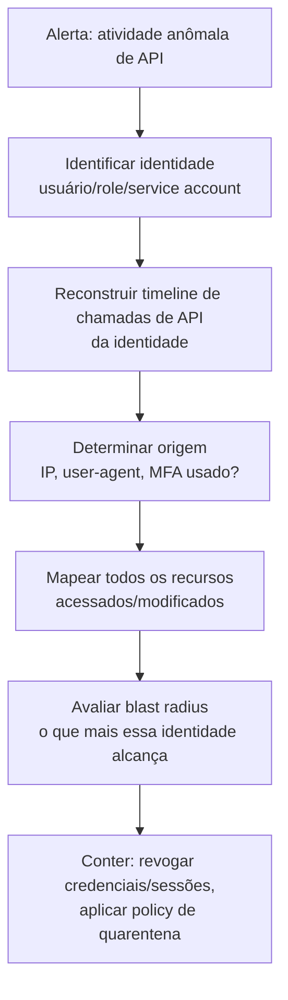

# Cloud Investigations — Metodologia Transversal

> Procedimentos de investigação em ambientes cloud, aplicáveis a Cloud-Intrusion, AWS, Azure, GCP, Kubernetes, Containers e API-Attacks.

## Diferenças-chave vs. Investigação On-Premises

| Aspecto | On-Premises | Cloud |
|---|---|---|
| Evidência primária | Disco/memória do host | Logs de API (CloudTrail/Activity Logs/Audit Logs) |
| Volatilidade de infraestrutura | Baixa (servidores fixos) | Alta (instâncias efêmeras, auto-scaling, containers) |
| Identidade como perímetro | Secundário (perímetro de rede é primário) | **Primário** — IAM é o principal vetor de ataque e investigação |
| Captura de evidência | Acesso físico/local possível | Depende de API/snapshot — pode não ser possível após terminação do recurso |
| Retenção de log | Definida internamente | Definida por configuração do provedor — pode ter custo/limite |

## Princípio Central: Identidade é o Novo Perímetro

A maioria dos incidentes cloud começa com **credenciais comprometidas** (chave de API vazada, token OAuth roubado, role mal configurada) — não com exploração de rede tradicional. A investigação deve sempre responder:

1. Qual identidade (usuário, role, service account) foi usada?
2. Como essa identidade obteve as permissões usadas no ataque (privilege escalation via IAM)?
3. O que mais essa identidade tem acesso a fazer (blast radius)?

## Processo de Investigação

## Fontes de Log por Provedor

### AWS
| Fonte | O que captura |
|---|---|
| CloudTrail | Toda chamada de API (Management + Data Events, se habilitado) |
| VPC Flow Logs | Metadados de tráfego de rede dentro da VPC |
| GuardDuty | Detecção gerenciada de ameaças (ML + TI) |
| S3 Access Logs | Acesso a objetos específicos (se habilitado por bucket) |
| IAM Access Analyzer | Identificação de acesso externo não intencional |

### Azure
| Fonte | O que captura |
|---|---|
| Azure AD Sign-in Logs | Autenticação, MFA, condições de acesso condicional |
| Azure AD Audit Logs | Mudanças de configuração, criação/modificação de objetos |
| Activity Logs | Operações em nível de assinatura/recurso (Resource Manager) |
| Microsoft Defender for Cloud | Alertas de ameaça gerenciados |
| Diagnostic Logs | Logs específicos por recurso (App Service, Key Vault, etc.) |

### GCP
| Fonte | O que captura |
|---|---|
| Admin Activity Audit Logs | Mudanças administrativas (sempre habilitado, não pode ser desativado) |
| Data Access Audit Logs | Acesso a dados (requer habilitação explícita) |
| VPC Flow Logs | Metadados de tráfego de rede |
| Security Command Center | Findings de segurança agregados |

## Armadilhas Comuns

- **Logs desabilitados por padrão:** Data Access logs (GCP) e Data Events do CloudTrail (S3 object-level) frequentemente não estão habilitados — verificar isso é o primeiro passo, antes de assumir que a evidência existe.
- **Instance Metadata Service (IMDS) abuse:** em AWS/GCP/Azure, acesso ao metadata service (ex.: `169.254.169.254`) pode vazar credenciais temporárias da instância — verificar se houve SSRF ou acesso indevido a este endpoint (relevante para Web-Attacks → Cloud-Intrusion).
- **Recursos efêmeros:** containers/instâncias auto-scaling podem ser terminados antes da coleta — automatizar snapshot/export de log assim que o alerta dispara.
- **Multi-cloud/multi-conta:** atacante pode pivotar entre contas/projetos — sempre verificar trust relationships (AWS cross-account roles, Azure AD guest access, GCP resource hierarchy).

## Ferramentas de Referência

| Ferramenta | Uso |
|---|---|
| Velociraptor (cloud plugins) | Coleta de artefatos em instâncias cloud |
| Prowler / ScoutSuite | Avaliação de postura de segurança (CSPM) — útil para identificar más configurações exploradas |
| AWS CLI / Azure CLI / gcloud | Consulta direta de logs e configuração durante investigação |
| Kubernetes: kubectl + audit logs | Investigação de cluster |
| CloudTrail Lake / Log Analytics / BigQuery | Consulta em escala sobre logs de auditoria |

## Checklist de Contenção Específico de Cloud

- [ ] Revogar credenciais/chaves de acesso comprometidas
- [ ] Invalidar sessões/tokens ativos (não basta trocar a senha)
- [ ] Revisar e remover roles/policies anômalas criadas pelo atacante
- [ ] Verificar criação de novos usuários/service accounts não autorizados
- [ ] Verificar mudanças em trust policies (cross-account, federation)
- [ ] Avaliar necessidade de rotação de **todas** as credenciais com escopo relacionado (não só a comprometida)

## Referência Cruzada
- Playbook geral: [`Attack-Categories/Cloud-Intrusion/README.md`](../Attack-Categories/Cloud-Intrusion/README.md)
- Por provedor: [`Attack-Categories/AWS/`](../Attack-Categories/AWS/), [`Attack-Categories/Azure/`](../Attack-Categories/Azure/), [`Attack-Categories/GCP/`](../Attack-Categories/GCP/)
- Containers/Kubernetes: [`Attack-Categories/Kubernetes/`](../Attack-Categories/Kubernetes/), [`Attack-Categories/Containers/`](../Attack-Categories/Containers/)
