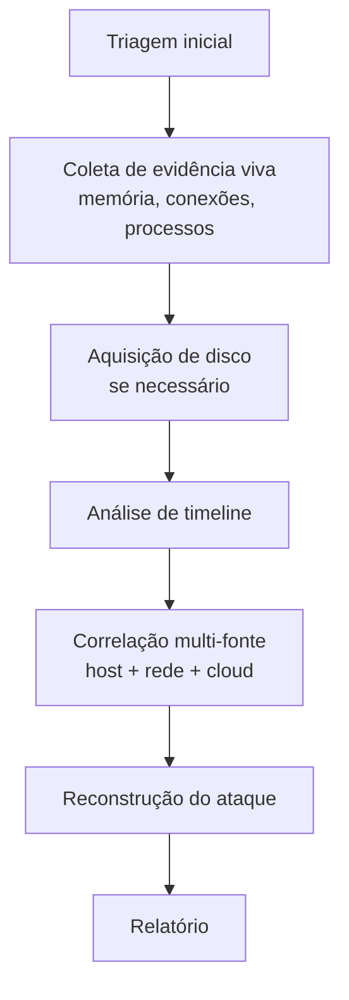

# DFIR — Metodologia Transversal de Digital Forensics & Incident Response

> Princípios e procedimentos de forense digital aplicáveis a **qualquer** categoria de ataque em `Attack-Categories/`. Este documento complementa, não substitui, o playbook específico de cada categoria.

## Princípios Fundamentais

1. **Preservação antes de análise.** Nunca analise a evidência original — sempre trabalhe em cópia forense (bit-for-bit, com hash verificado).
2. **Ordem de volatilidade.** Colete sempre do mais volátil para o menos volátil (ver `Templates/Evidence-Collection-Template.md`).
3. **Cadeia de custódia.** Toda evidência que pode virar prova formal precisa de cadeia de custódia documentada desde a coleta.
4. **Minimal footprint.** Ferramentas de coleta devem alterar o mínimo possível o sistema sob investigação (ex.: preferir agentes read-only, evitar instalar software no host comprometido).
5. **Documentar em tempo real.** Decisões e ações devem ser registradas no momento em que ocorrem, não reconstruídas depois.

## Processo Geral de Investigação Forense

## Triagem Rápida vs. Aquisição Completa

| Cenário | Abordagem recomendada |
|---|---|
| Volume alto de hosts, tempo limitado | **Triagem** (KAPE, Velociraptor) — coleta artefatos-chave sem imagem completa |
| Host crítico, necessidade de prova forte | **Aquisição completa** de disco (dd, FTK Imager) + memória |
| Ambiente cloud/efêmero | Snapshot de disco + export de logs antes que a instância seja terminada |
| Suspeita de anti-forense ativo | Priorizar memória e artefatos voláteis — atacante pode estar limpando disco |

## Artefatos Universais de Host (Windows)

| Artefato | O que revela |
|---|---|
| MFT ($MFT) | Histórico de criação/modificação/exclusão de arquivos, mesmo após exclusão |
| USN Journal | Mudanças no sistema de arquivos com timestamp preciso |
| Event Logs | Autenticação, execução de processo (com Sysmon), mudanças de configuração |
| Prefetch | Confirmação de execução de binário + primeira/última execução + contagem |
| Shimcache / Amcache | Evidência de presença/execução de arquivo, mesmo sem log de execução |
| Registry (NTUSER.DAT, SYSTEM, SOFTWARE) | Persistência, configuração, histórico de atividade do usuário |
| $Recycle.Bin | Arquivos excluídos recuperáveis |
| Jump Lists / LNK files | Histórico de arquivos/aplicações acessados |

## Artefatos Universais de Host (Linux)

| Artefato | O que revela |
|---|---|
| `/var/log/auth.log`, `/var/log/secure` | Autenticação, uso de sudo |
| `auditd` | Chamadas de sistema monitoradas (se configurado) |
| Bash/Zsh history | Comandos executados (cuidado: facilmente manipulável) |
| `/etc/cron.*`, `crontab -l` | Persistência agendada |
| systemd units (`/etc/systemd/system/`) | Persistência via serviço |
| `/proc` (se sistema ainda ativo) | Processos, conexões, memória mapeada em tempo real |
| `.bash_profile`, `.bashrc`, `/etc/profile.d/` | Persistência via shell startup |

## Memória Forense — Visão Rápida
→ Ver detalhes táticos em `Attack-Categories/Memory-Forensics/README.md`. Princípio geral: capturar com ferramenta validada (Velociraptor, WinPmem, LiME) antes de qualquer outra ação que possa sobrescrever páginas de memória relevantes.

## Análise de Timeline Multi-Fonte
A reconstrução de um incidente raramente vem de uma única fonte. Combine:
- Timeline de host (MFT + Event Logs + Prefetch)
- Timeline de rede (NetFlow/PCAP/proxy)
- Timeline de identidade (logs de autenticação, MFA, SSO)
- Timeline de cloud (CloudTrail/Activity Logs)

Use `Templates/Timeline-Template.md` como formato unificado e marque a **confiança** de cada entrada.

## Ferramentas de Referência

| Categoria | Ferramentas |
|---|---|
| Triagem/Coleta | KAPE, Velociraptor, CyLR |
| Análise de disco | Autopsy, FTK, Magnet AXIOM, X-Ways |
| Análise de memória | Volatility 3, Velociraptor (memory plugins) |
| Parsing de Event Logs | Chainsaw, Hayabusa, EvtxECmd |
| Timeline | Plaso/log2timeline, Timesketch |

## Referência Cruzada
- Análise de malware: [`Malware-Analysis/README.md`](../Malware-Analysis/README.md)
- Forense de rede: [`Network-Forensics/README.md`](../Network-Forensics/README.md)
- Investigação em nuvem: [`Cloud-Investigations/README.md`](../Cloud-Investigations/README.md)
- Templates: [`Templates/`](../Templates/)
