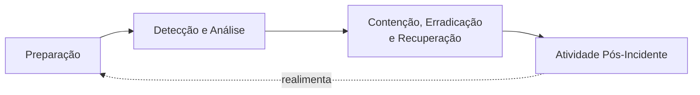

# Incident Response — Processo Macro (NIST SP 800-61 Rev. 2)

> Este documento descreve o **processo organizacional** de resposta a incidentes — papéis, severidade, comunicação e ciclo de vida. Para a metodologia técnica de investigação de um tipo específico de ataque, ver `Attack-Categories/`.

---

## Ciclo de Vida do Incidente

### 1. Preparação
- Manutenção de playbooks (este repositório), ferramentas DFIR prontas (jump kit), contatos de escalonamento atualizados.
- Acordos prévios: contatos legais, comunicação, fornecedores de DFIR externo (retainer), seguro cyber.
- Validação periódica via tabletop exercises e purple team.

### 2. Detecção e Análise
- Triagem inicial de alertas (SOC N1) → validação → classificação de severidade.
- Uso dos playbooks de `Attack-Categories/` para guiar a investigação técnica.
- Critério de "incidente confirmado" vs. "falso positivo" deve ser documentado por categoria.

### 3. Contenção, Erradicação e Recuperação
- Estratégia de contenção definida **antes** de agir (ver matriz de decisão abaixo).
- Erradicação só ocorre após escopo completo determinado — agir cedo demais pode alertar o atacante (em casos de APT/insider) ou destruir evidência.
- Recuperação inclui critério de validação explícito antes de declarar o incidente encerrado.

### 4. Atividade Pós-Incidente
- Relatório final (`Templates/IR-Report-Template.md`) obrigatório para incidentes de severidade Média ou superior.
- Lições aprendidas devem gerar ação rastreável (nova regra de detecção, hardening, treinamento).

---

## Classificação de Severidade

| Severidade | Critério | SLA de resposta inicial | Exemplo |
|---|---|---|---|
| **Crítica (SEV1)** | Impacto em produção, dados sensíveis expostos, ransomware ativo, comprometimento de domínio AD | Imediato (< 15 min) | Ransomware em produção, Domain Admin comprometido |
| **Alta (SEV2)** | Comprometimento confirmado, escopo limitado, sem impacto operacional ainda | < 1 hora | Host único com malware C2 ativo |
| **Média (SEV3)** | Atividade suspeita, sem confirmação de comprometimento | < 4 horas | Alerta de phishing clicado, sem evidência de execução |
| **Baixa (SEV4)** | Evento informativo, risco mínimo | < 24 horas | Scan de porta externo, tentativa de login isolada |

---

## Papéis e Responsabilidades

| Papel | Responsabilidade |
|---|---|
| **Incident Commander (IC)** | Decisão final, coordenação geral, comunicação com liderança |
| **Lead Investigator (DFIR)** | Conduz a investigação técnica, define hipóteses, valida escopo |
| **SOC Analyst (N1/N2)** | Triagem inicial, escalonamento, execução de checklist operacional |
| **Comms Lead** | Comunicação interna/externa, jurídico, regulatório (LGPD/GDPR) |
| **IT/Infra Owner** | Executa contenção/erradicação em sistemas (isolamento, patch, rebuild) |
| **Scribe** | Documentação em tempo real (timeline, decisões, ações) |

---

## Matriz de Decisão de Contenção

| Pergunta | Se SIM | Se NÃO |
|---|---|---|
| O atacante tem acesso ativo agora? | Conter imediatamente | Avaliar coleta adicional primeiro |
| A contenção vai alertar o atacante? | Avaliar contenção silenciosa (ex.: sinkhole, monitoramento passivo) antes de bloqueio ativo | Conter normalmente |
| Evidência crítica ainda não foi coletada? | Coletar antes de erradicar (nunca antes de conter, se houver risco ativo) | Prosseguir para erradicação |
| O escopo completo é conhecido? | Prosseguir | Investigar mais antes de declarar erradicação completa |

---

## Comunicação

- **Interna:** liderança técnica informada em SEV1/SEV2 dentro do SLA; atualizações periódicas durante o incidente (ex.: a cada 2h em SEV1).
- **Externa/Regulatória:** avaliar obrigação de notificação (LGPD — ANPD; GDPR — autoridade local; setor financeiro/saúde — reguladores específicos) com jurídico antes de qualquer comunicação externa.
- **Clientes/Parceiros:** somente após alinhamento com jurídico e liderança executiva.

> Regra geral: nenhuma comunicação externa sem aprovação do Incident Commander + jurídico.

---

## Critérios de Encerramento

Um incidente só pode ser encerrado quando:
- [ ] Causa raiz identificada e documentada
- [ ] Persistência/backdoors removidos e validados
- [ ] Nenhuma atividade maliciosa nos últimos [X dias, definir por severidade] de monitoramento ativo
- [ ] Relatório final aprovado pelo Incident Commander
- [ ] Ações de hardening/detecção atribuídas com responsável e prazo

---

## Referência Cruzada
- Metodologia técnica por tipo de ataque: [`Attack-Categories/`](../Attack-Categories/)
- Runbooks de execução rápida: [`Playbooks/`](../Playbooks/)
- Templates de documentação: [`Templates/`](../Templates/)
