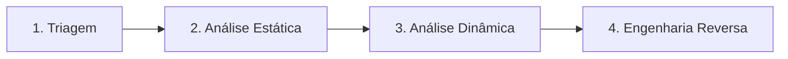

# Malware Analysis — Metodologia Transversal

> Procedimentos de análise de malware aplicáveis a qualquer categoria envolvendo payload malicioso (Malware, Ransomware, C2, Cryptojacking, Botnets, etc.).

## Princípio de Segurança

**Nunca execute uma amostra fora de um ambiente isolado (sandbox/VM sem rede de produção, snapshot revertível).** Sempre assuma que a amostra pode detectar análise (anti-VM, anti-debug) e se comportar de forma diferente ou tentar se propagar.

## Os Quatro Níveis de Análise

### 1. Triagem (Triage)
**Objetivo:** classificar rapidamente, sem aprofundar.
- Hash (MD5/SHA1/SHA256) → consultar VirusTotal, MalwareBazaar, TI interno.
- `file` / `PEiD` / `DIE` (Detect It Easy) → tipo de arquivo, packer, linguagem de compilação.
- Strings legíveis (`strings`, FLOSS para strings ofuscadas) → URLs, IPs, mutexes, mensagens de erro.
- Verificação de assinatura digital (válida? revogada? roubada?).

### 2. Análise Estática
**Objetivo:** entender a estrutura e capacidades sem executar.
- Análise de headers PE/ELF (seções, imports, exports, entry point).
- Identificação de packer/crypter (UPX, Themida, custom).
- Análise de imports (API calls) → hipóteses de comportamento (ex.: `CreateRemoteThread` + `VirtualAllocEx` → process injection).
- Extração de recursos embutidos (configs, payloads secundários, certificados).

### 3. Análise Dinâmica
**Objetivo:** observar comportamento real em execução controlada.
- Sandbox automatizado (CAPE, ANY.RUN, Joe Sandbox, Cuckoo) para triagem em volume.
- Execução manual monitorada (Process Monitor, Process Hacker, API Monitor) para casos que escapam de sandbox automatizado.
- Captura de tráfego de rede gerado (FakeNet-NG, INetSim) para identificar C2 sem expor à internet real.
- Monitoramento de: criação de processo/arquivo/registry, conexões de rede, técnicas de persistência, injeção de processo.

### 4. Engenharia Reversa
**Objetivo:** entender o funcionamento interno em profundidade (necessário para malware sofisticado, custom, ou quando se precisa de decryptor/IOC profundo).
- Disassembly (Ghidra, IDA Pro) e/ou debugging (x64dbg, WinDbg).
- Identificação de algoritmo de criptografia/ofuscação (relevante para ransomware → possibilidade de decryptor).
- Extração de configuração de C2 embutida (domínios, chaves, campanha ID).
- Identificação de família/atribuição via comparação de código (similaridade, YARA, reuso de biblioteca).

## Quando Parar em Cada Nível

| Cenário | Nível suficiente |
|---|---|
| IOC já conhecido publicamente, hash bate em TI feed | Triagem |
| Necessário confirmar comportamento básico (é realmente malicioso?) | Estática + Dinâmica em sandbox |
| Malware customizado, sem detecção AV, ransomware ativo | Dinâmica completa + Engenharia Reversa |
| Necessidade de atribuição a ator/campanha | Engenharia Reversa + comparação com TI |

## Ambiente de Análise Recomendado

| Ferramenta | Uso |
|---|---|
| FlareVM | Workstation Windows pré-configurada para análise estática/dinâmica |
| REMnux | Workstation Linux para análise de malware, scripts maliciosos, documentos |
| Ghidra / IDA Pro | Disassembly e engenharia reversa |
| x64dbg | Debugging dinâmico em Windows |
| CAPE / Cuckoo Sandbox | Análise dinâmica automatizada |
| FLOSS | Extração de strings ofuscadas |
| YARA | Criação de assinaturas e matching contra coleções de malware |

## Indicadores a Extrair (para `IOC-Tracking-Template.md`)
- Hashes (MD5/SHA1/SHA256, e imphash para variantes da mesma família)
- Domínios/IPs de C2
- Mutexes, named pipes
- Caminhos de arquivo e chaves de registro criadas
- User-Agent / padrões de tráfego de rede
- Certificados usados para assinatura (se houver)

## Documentos de Famílias Conhecidas
Casos reais aplicados estão documentados nos playbooks de categoria correspondentes — ver seção "Casos Reais" em `Attack-Categories/Malware/README.md`, `Attack-Categories/Ransomware/README.md` e `Attack-Categories/C2/README.md`.

## Referência Cruzada
- Forense de host: [`DFIR/README.md`](../DFIR/README.md)
- Forense de rede (para tráfego C2): [`Network-Forensics/README.md`](../Network-Forensics/README.md)
- Regras YARA: [`Detection-Rules/YARA/`](../Detection-Rules/YARA/)
