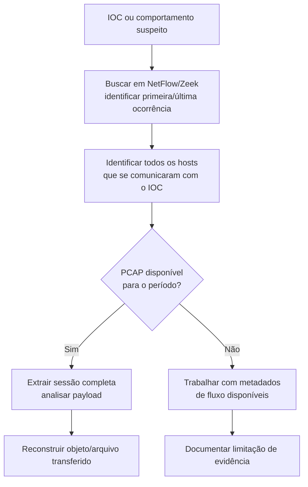

# Network Forensics — Metodologia Transversal

> Procedimentos de forense de rede aplicáveis a categorias como C2, Data-Exfiltration, Lateral-Movement, DDoS, Botnets, DNS-Abuse.

## Fontes de Dados de Rede

| Fonte | Granularidade | Retenção típica | Melhor para |
|---|---|---|---|
| PCAP completo (full packet capture) | Máxima (payload completo) | Curta (caro em storage) | Análise profunda pós-incidente, extração de payload |
| NetFlow / IPFIX | Metadados de fluxo (IP, porta, bytes, duração) | Longa | Detecção de padrão, hunting retroativo |
| Logs de Proxy/Firewall | URL, categoria, ação (allow/block) | Média-Longa | Investigação de acesso web, exfiltração via HTTP(S) |
| Logs de DNS | Query, resposta, timestamp | Longa | C2 via DNS, identificação de domínios suspeitos |
| Zeek (Bro) logs | Metadados ricos por protocolo (conn, http, dns, ssl, files) | Longa | Hunting e investigação sem custo de full PCAP |

## Processo de Investigação

## O que Procurar por Tipo de Investigação

### Command & Control (C2)
- Beaconing: conexões periódicas com intervalo regular (mesmo com jitter) para o mesmo destino.
- JA3/JA3S fingerprint do TLS handshake (identifica ferramentas de C2 mesmo com domínio/IP rotativo).
- User-Agent incomum ou desatualizado.
- Volume de dados assimétrico (muito mais upload que download, ou vice-versa, fora do padrão esperado).

### Exfiltração de Dados
- Picos de tráfego de saída fora do horário normal.
- Uso de serviços legítimos como canal (Exfiltration Over Web Service — Google Drive, Dropbox, Pastebin).
- Compressão/criptografia de dados antes do envio (entropia alta no payload).
- DNS com queries anormalmente longas/frequentes (possível exfiltração via DNS tunneling).

### Movimento Lateral
- Tráfego SMB/RDP/WinRM/SSH entre hosts que normalmente não se comunicam.
- Picos de autenticação Kerberos/NTLM entre segmentos.
- Uso de portas administrativas a partir de estações de trabalho comuns (não deveriam iniciar RDP entre si, por exemplo).

### DDoS
- Volume de tráfego anômalo de múltiplas origens para um único destino/porta.
- Padrões de protocolo (SYN flood, UDP amplification, HTTP flood) identificáveis em NetFlow.

## Reconstrução de Sessão/Arquivo

Quando PCAP está disponível:
- **Wireshark** → `File > Export Objects` para extrair arquivos transferidos via HTTP/SMB/FTP.
- **Zeek** → `extract-files` script para extração automática durante o processamento.
- **NetworkMiner** → reconstrução passiva de sessões e artefatos a partir de PCAP.

## Ferramentas de Referência

| Ferramenta | Uso |
|---|---|
| Wireshark | Análise interativa de PCAP, reconstrução de sessão |
| Zeek | Geração de logs ricos por protocolo a partir de tráfego ao vivo ou PCAP |
| Suricata | IDS/IPS, matching de assinatura em tempo real |
| Arkime (ex-Moloch) | Indexação e busca em larga escala de PCAP histórico |
| NetworkMiner | Extração passiva de artefatos e metadados |
| RITA | Detecção de beaconing a partir de logs Zeek |

## Limitações Comuns

- **TLS/criptografia:** payload de aplicação não é visível sem decriptação (TLS inspection) — trabalhar com metadados (SNI, JA3, tamanho/timing de pacote).
- **Retenção:** PCAP completo raramente é mantido por mais que dias/semanas — priorizar NetFlow/Zeek para investigações retroativas de longo prazo.
- **Cloud/SaaS:** tráfego para serviços cloud pode não passar por captura de rede tradicional — complementar com logs de API/CASB.

## Referência Cruzada
- Playbook de C2: [`Attack-Categories/C2/README.md`](../Attack-Categories/C2/README.md)
- Playbook de Exfiltração: [`Attack-Categories/Data-Exfiltration/README.md`](../Attack-Categories/Data-Exfiltration/README.md)
- Regras Suricata: [`Detection-Rules/Suricata/`](../Detection-Rules/Suricata/)
