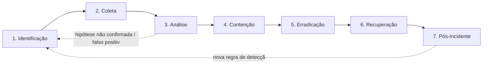

# Cyber Attack Analysis Framework

> Framework operacional de **Incident Response** e **Digital Forensics** — playbooks técnicos para triagem, investigação, contenção, erradicação e recuperação de incidentes de cibersegurança.

[]()
[]()
[]()
[]()

---

## Sobre o Projeto

Este repositório é uma base de conhecimento operacional para equipes de **SOC (N1/N2/N3)**, **Threat Hunting**, **DFIR (Digital Forensics & Incident Response)** e **Incident Response**, cobrindo **51 categorias de ataque** com metodologia padronizada de investigação.

O objetivo não é ser um material teórico, e sim um **conjunto de playbooks acionáveis**: o que olhar, em qual log, com qual ferramenta, em qual ordem, e o que fazer com o resultado — do primeiro alerta até o relatório pós-incidente.

**Para quem é este repositório:**

| Perfil | Como usar |
|---|---|
| Analista SOC N1 | `Attack-Categories/<categoria>/README.md` → seção de Identificação + Checklist Operacional |
| Analista SOC N2/N3 | Playbook completo da categoria + `Detection-Rules/` para tuning de alertas |
| Threat Hunter | `Attack-Categories/Threat-Hunting/`, `IOC-Hunting/` + `MITRE-Mappings/` para hunting hipótese-driven |
| DFIR Analyst | `DFIR/`, `Memory-Forensics/`, `Network-Forensics/`, `Cloud-Investigations/` + `Templates/` |
| Incident Commander | `Incident-Response/README.md` (processo NIST 800-61) + `Templates/IR-Report-Template.md` |

---

## Padrões e Referências

Todo o conteúdo é construído em cima de:

- **NIST SP 800-61 Rev. 2** — *Computer Security Incident Handling Guide* (estrutura macro do processo de resposta a incidentes)
- **MITRE ATT&CK®** — mapeamento de táticas e técnicas (Enterprise Matrix)
- **MITRE D3FEND™** — mapeamento de contramedidas defensivas
- **SANS DFIR** (FOR508, FOR572, FOR610, FOR578) — metodologia de forense, malware analysis e threat intel
- Práticas de SOC/DFIR observadas em ambientes corporativos de grande porte (Fortune 500)

> Os mapeamentos MITRE são uma referência viva. Técnicas e sub-técnicas são revisadas periodicamente pela MITRE — sempre valide IDs críticos contra o [ATT&CK Navigator](https://attack.mitre.org) antes de usar em produção (ex.: relatórios para diretoria, integrações SIEM).

---

## Estrutura do Repositório

```
Cyber-Attack-Analysis-Framework/
│
├── README.md                      ← este arquivo
├── Incident-Response/             ← processo macro de IR (NIST 800-61), papéis, severidade, comunicação
├── Playbooks/                     ← runbooks operacionais (ação durante o incidente, cross-categoria)
├── Attack-Categories/             ← 51 categorias de ataque, cada uma com sua metodologia completa
│   ├── Malware/
│   ├── Ransomware/
│   ├── Phishing/
│   ├── ... (ver índice completo abaixo)
│   └── Web-Attacks/
│       ├── SQLi/  XSS/  SSRF/  XXE/  RCE/  Path-Traversal/  File-Upload/  Command-Injection/
│
├── Detection-Rules/                ← regras de detecção prontas, mapeadas por categoria/técnica
│   ├── Sigma/
│   ├── YARA/
│   └── Suricata/
│
├── MITRE-Mappings/                 ← tabela mestre de mapeamento ATT&CK/D3FEND por categoria
├── IOC-Collections/                ← repositório de IOCs por incidente/campanha
├── Threat-Intel/                   ← templates de tracking de atores, campanhas e ciclo de intel
├── DFIR/                           ← metodologia transversal de forense digital (ordem de volatilidade, custódia)
├── Malware-Analysis/               ← metodologia transversal de análise de malware (estático/dinâmico)
├── Network-Forensics/              ← metodologia transversal de forense de rede (PCAP, NetFlow, Zeek)
├── Cloud-Investigations/           ← metodologia transversal de investigação em nuvem (AWS/Azure/GCP)
└── Templates/                      ← templates reutilizáveis (relatório, timeline, evidências, IOC tracking)
```

### `Playbooks/` vs `Attack-Categories/` — qual a diferença?

- **`Attack-Categories/<categoria>/`** é a **base de conhecimento técnica**: definição, TTPs, IOCs, fluxo de investigação completo (7 fases), evidências, ferramentas, casos reais. É para onde você vai para **entender e investigar**.
- **`Playbooks/`** contém **runbooks de execução rápida**: sequências de ação direta para o analista seguir durante um incidente ativo (ex.: *"Ransomware detectado em produção — próximos 30 minutos"*). Os runbooks referenciam e resumem o conteúdo de `Attack-Categories/`, mas são otimizados para serem seguidos sob pressão, não para estudo.

### `Threat-Intel/` (raiz) vs `Attack-Categories/Threat-Intel/`

- **`/Threat-Intel/`** (raiz) guarda os **artefatos do programa de threat intel**: templates de perfil de ator, tracking de campanhas, ciclo de inteligência (PIRs, coleta, análise, disseminação).
- **`/Attack-Categories/Threat-Intel/`** é o **playbook de resposta** para quando uma detecção é originada por um indicador de threat intel (ex.: feed de IOC bateu em um host) — como triá-la e investigá-la.

---

## Metodologia: as 7 Fases de Investigação

Cada playbook de categoria segue o mesmo esqueleto, alinhado ao ciclo do NIST 800-61 (Preparação → Detecção e Análise → Contenção/Erradicação/Recuperação → Atividade Pós-Incidente), detalhado em 7 fases operacionais:



| Fase | Pergunta-chave | Saída esperada |
|---|---|---|
| 1. Identificação | Como sabemos que isso é um incidente? | Alerta validado, severidade classificada |
| 2. Coleta | Quais evidências preciso preservar antes que se percam? | Artefatos coletados com cadeia de custódia |
| 3. Análise | O que de fato aconteceu, e qual o alcance? | Linha do tempo, escopo do comprometimento |
| 4. Contenção | Como paro o ataque sem destruir evidência? | Ameaça isolada, sem propagação |
| 5. Erradicação | Como removo a causa raiz? | Ambiente limpo, persistência removida |
| 6. Recuperação | Como volto à operação normal com segurança? | Sistemas validados e restaurados |
| 7. Pós-Incidente | O que aprendemos, e como prevenimos a próxima vez? | Lições aprendidas, novas detecções, hardening |

---

## Sistema de Dois Níveis

Por volume (51 categorias), o conteúdo é entregue em dois formatos:

- 🟢 **Full Playbook** — as ~16 categorias de maior prevalência/impacto recebem tratamento completo: as 7 fases detalhadas, fluxograma Mermaid próprio, tabela de evidências Windows/Linux/Cloud, ferramentas recomendadas e casos reais aplicados.
- 🟡 **Quick-Reference** — as demais categorias recebem um guia substantivo (definição, IOCs, TTPs principais, checklist operacional, evidências e ferramentas), pronto para uso imediato e que pode ser expandido para Full Playbook posteriormente.

> Status atual de cada categoria: ver índice abaixo. A lista de categorias Full Playbook está em definição/confirmação — ver seção **Roadmap**.

---

## Índice de Categorias de Ataque

| # | Categoria | Status | Táticas MITRE ATT&CK principais |
|---|---|---|---|
| 1 | [Malware](Attack-Categories/Malware/) | 🟢 Full Playbook | Execution, Defense Evasion |
| 2 | [Ransomware](Attack-Categories/Ransomware/) | 🟢 Full Playbook | Impact, Exfiltration |
| 3 | [Phishing](Attack-Categories/Phishing/) | 🟢 Full Playbook | Initial Access |
| 4 | [Spear-Phishing](Attack-Categories/Spear-Phishing/) | 🟢 Full Playbook | Initial Access |
| 5 | [BEC](Attack-Categories/BEC/) | 🟢 Full Playbook | Initial Access, Collection, Impact |
| 6 | [Credential-Access](Attack-Categories/Credential-Access/) | 🟢 Full Playbook | Credential Access |
| 7 | [Brute-Force](Attack-Categories/Brute-Force/) | 🟡 Quick-Reference | Credential Access |
| 8 | [Password-Spraying](Attack-Categories/Password-Spraying/) | 🟡 Quick-Reference | Credential Access |
| 9 | [Kerberoasting](Attack-Categories/Kerberoasting/) | 🟢 Full Playbook | Credential Access |
| 10 | [Pass-the-Hash](Attack-Categories/Pass-the-Hash/) | 🟢 Full Playbook | Lateral Movement, Defense Evasion |
| 11 | [Lateral-Movement](Attack-Categories/Lateral-Movement/) | 🟢 Full Playbook | Lateral Movement |
| 12 | [Privilege-Escalation](Attack-Categories/Privilege-Escalation/) | 🟢 Full Playbook | Privilege Escalation |
| 13 | [Persistence](Attack-Categories/Persistence/) | 🟢 Full Playbook | Persistence |
| 14 | [C2](Attack-Categories/C2/) | 🟢 Full Playbook | Command and Control |
| 15 | [Data-Exfiltration](Attack-Categories/Data-Exfiltration/) | 🟢 Full Playbook | Exfiltration |
| 16 | [Insider-Threat](Attack-Categories/Insider-Threat/) | 🟡 Quick-Reference | Collection, Exfiltration |
| 17 | [Supply-Chain](Attack-Categories/Supply-Chain/) | 🟡 Quick-Reference | Initial Access |
| 18 | [Web-Attacks](Attack-Categories/Web-Attacks/) (SQLi, XSS, SSRF, XXE, RCE, Path-Traversal, File-Upload, Command-Injection) | 🟡 Quick-Reference | Initial Access, Execution |
| 19 | [Active-Directory](Attack-Categories/Active-Directory/) | 🟢 Full Playbook | Credential Access, Lateral Movement |
| 20 | [Cloud-Intrusion](Attack-Categories/Cloud-Intrusion/) | 🟢 Full Playbook | Initial Access, Persistence |
| 21 | [AWS](Attack-Categories/AWS/) | 🟡 Quick-Reference | — |
| 22 | [Azure](Attack-Categories/Azure/) | 🟡 Quick-Reference | — |
| 23 | [GCP](Attack-Categories/GCP/) | 🟡 Quick-Reference | — |
| 24 | [Kubernetes](Attack-Categories/Kubernetes/) | 🟡 Quick-Reference | Execution, Privilege Escalation |
| 25 | [Containers](Attack-Categories/Containers/) | 🟡 Quick-Reference | Execution, Privilege Escalation |
| 26 | [API-Attacks](Attack-Categories/API-Attacks/) | 🟡 Quick-Reference | Initial Access |
| 27 | [DDoS](Attack-Categories/DDoS/) | 🟡 Quick-Reference | Impact |
| 28 | [Botnets](Attack-Categories/Botnets/) | 🟡 Quick-Reference | Command and Control |
| 29 | [Cryptojacking](Attack-Categories/Cryptojacking/) | 🟡 Quick-Reference | Impact |
| 30 | [Malware-Triage](Attack-Categories/Malware-Triage/) | 🟡 Quick-Reference | — (metodologia) |
| 31 | [Memory-Forensics](Attack-Categories/Memory-Forensics/) | 🟡 Quick-Reference | — (metodologia) |
| 32 | [Threat-Hunting](Attack-Categories/Threat-Hunting/) | 🟡 Quick-Reference | — (metodologia) |
| 33 | [IOC-Hunting](Attack-Categories/IOC-Hunting/) | 🟡 Quick-Reference | — (metodologia) |
| 34 | [Threat-Intel](Attack-Categories/Threat-Intel/) | 🟡 Quick-Reference | — (metodologia) |
| 35 | [Email-Investigation](Attack-Categories/Email-Investigation/) | 🟡 Quick-Reference | Collection |
| 36 | [Endpoint-Investigation](Attack-Categories/Endpoint-Investigation/) | 🟡 Quick-Reference | — (metodologia) |
| 37 | [Network-Investigation](Attack-Categories/Network-Investigation/) | 🟡 Quick-Reference | — (metodologia) |
| 38 | [DNS-Abuse](Attack-Categories/DNS-Abuse/) | 🟡 Quick-Reference | Command and Control |
| 39 | [VPN-Abuse](Attack-Categories/VPN-Abuse/) | 🟡 Quick-Reference | Initial Access |
| 40 | [USB-Forensics](Attack-Categories/USB-Forensics/) | 🟡 Quick-Reference | Initial Access, Exfiltration |
| 41 | [Mobile-Forensics](Attack-Categories/Mobile-Forensics/) | 🟡 Quick-Reference | — (matriz Mobile ATT&CK) |
| 42 | [Insider-Activity](Attack-Categories/Insider-Activity/) | 🟡 Quick-Reference | Collection, Exfiltration |
| 43 | [APT-Investigation](Attack-Categories/APT-Investigation/) | 🟢 Full Playbook | Multi-tática (campanha completa) |

> Tabela completa de técnicas (IDs ATT&CK) por categoria: [`MITRE-Mappings/Master-Mapping-Table.md`](MITRE-Mappings/Master-Mapping-Table.md)

---

## Detection Rules

`Detection-Rules/` reúne regras prontas em três formatos, nomeadas e versionadas por categoria/técnica ATT&CK:

- **Sigma** — regras agnósticas de SIEM, convertíveis para Splunk/Sentinel/Elastic/QRadar
- **YARA** — assinaturas para identificação de malware/famílias em disco e memória
- **Suricata** — assinaturas de rede (IDS/IPS) para tráfego malicioso conhecido

Ver convenções de nomenclatura em [`Detection-Rules/README.md`](Detection-Rules/README.md).

---

## Templates

| Template | Uso |
|---|---|
| [IR-Report-Template.md](Templates/IR-Report-Template.md) | Relatório final de incidente (executivo + técnico) |
| [Timeline-Template.md](Templates/Timeline-Template.md) | Linha do tempo forense do incidente |
| [Evidence-Collection-Template.md](Templates/Evidence-Collection-Template.md) | Registro de coleta com cadeia de custódia |
| [IOC-Tracking-Template.md](Templates/IOC-Tracking-Template.md) | Rastreamento de indicadores de comprometimento |
| [Full-Playbook-Template.md](Templates/Full-Playbook-Template.md) | Esqueleto para criar um novo playbook completo |
| [Quick-Reference-Template.md](Templates/Quick-Reference-Template.md) | Esqueleto para criar um novo guia rápido |

---

## Roadmap de Expansão

- [ ] Confirmar e finalizar a lista das 16 categorias Full Playbook
- [ ] Publicar os 16 Full Playbooks (7 fases + Mermaid + casos reais)
- [ ] Publicar os ~35 Quick-Reference restantes
- [ ] Popular `Detection-Rules/` com regras Sigma/YARA/Suricata por categoria flagship
- [ ] Popular `MITRE-Mappings/` com arquivo de mapeamento individual por categoria
- [ ] Adicionar runbooks em `Playbooks/` para as categorias de maior frequência operacional
- [ ] Adicionar seção de automação (SOAR) para resposta semi-automatizada
- [ ] Adicionar matriz Mobile ATT&CK em `Mobile-Forensics/`
- [ ] Revisão periódica de IDs MITRE ATT&CK/D3FEND contra a versão vigente

---

## Como Contribuir

1. Use sempre o template correspondente (`Templates/Full-Playbook-Template.md` ou `Quick-Reference-Template.md`) como ponto de partida.
2. Mantenha a terminologia técnica em inglês (nomes de técnicas, ferramentas, campos de log) e o texto corrido em português.
3. Toda nova técnica/categoria deve referenciar o ID MITRE ATT&CK correspondente.
4. Casos reais citados devem ser baseados em relatórios públicos (CISA, Mandiant, MSTIC, vendor threat intel) — referencie a fonte.

## Aviso Legal

Este material tem finalidade **defensiva e educacional**: apoiar equipes de segurança na detecção, investigação e resposta a incidentes. Nenhum conteúdo aqui deve ser utilizado para fins ofensivos não autorizados.

## Licença

A definir pelo mantenedor do repositório (sugestão: MIT ou CC BY-SA 4.0).
