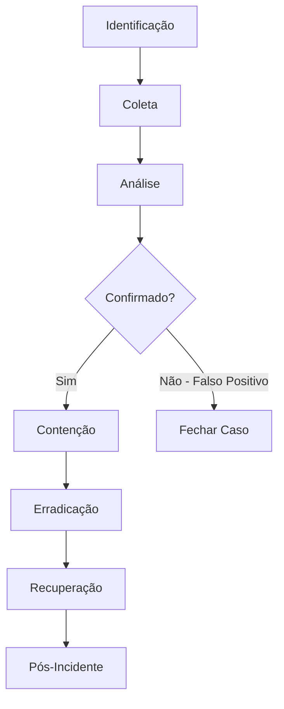

# [Nome da Categoria de Ataque]

> Template para playbooks **Full Playbook**. Copie este arquivo para `Attack-Categories/<Categoria>/README.md` e preencha cada seção. Não deixe seções em branco — se não aplicável, escreva "N/A" com justificativa.

---

## 1. Descrição Técnica

### Definição
[O que é este tipo de ataque, em 2-4 frases, sem jargão desnecessário.]

### Objetivo do Atacante
[Ex.: acesso inicial, escalonamento de privilégio, persistência, monetização, exfiltração.]

### Impacto Esperado
[Confidencialidade / Integridade / Disponibilidade — qual(is) é(são) afetado(s) e como.]

### Vetores de Entrada
- [Vetor 1]
- [Vetor 2]
- [Vetor 3]

### Indicadores de Comprometimento (IOCs)
| Tipo | Exemplo | Onde encontrar |
|---|---|---|
| Hash (SHA256) | `...` | EDR, VirusTotal |
| Domínio/IP C2 | `...` | Proxy, Firewall, DNS logs |
| Artefato de host | `...` | Sysmon, Registry |

### TTPs Relacionados (MITRE ATT&CK)
| Tática | Técnica | ID |
|---|---|---|
| [Tática] | [Técnica] | T.... |

---

## 2. Fluxo de Investigação

### 2.1 Identificação
**Como detectar:**
- [Fonte/regra de detecção 1]
- [Fonte/regra de detecção 2]

**Logs relevantes:**
- [Log 1 — caminho/fonte]
- [Log 2 — caminho/fonte]

**Ferramentas utilizadas:**
- [Ferramenta 1]

**Alertas comuns:**
- [Nome do alerta / regra Sigma associada]

### 2.2 Coleta
**Artefatos necessários:**
- [Artefato 1]

**Evidências:**
- Arquivos: [quais, onde]
- Memória: [se aplicável, ferramenta de captura]
- Rede: [PCAP, NetFlow, logs de proxy/firewall]

### 2.3 Análise
**O que procurar:**
- [Padrão 1]

**Técnicas de investigação:**
- [Técnica 1 — ex.: timeline analysis, stacking, frequency analysis]

**Correlação de eventos:**
- [Quais fontes cruzar e por quê]

**Hipóteses a validar:**
- [ ] [Hipótese 1]
- [ ] [Hipótese 2]

### 2.4 Contenção
**Ações imediatas:**
- [ ] [Ação 1]

**Bloqueios:**
- [ ] [O que bloquear — IOC, conta, segmento de rede]

**Isolamento:**
- [ ] [Host/conta/segmento a isolar]

### 2.5 Erradicação
**Remoção da ameaça:**
- [ ] [Passo 1]

**Limpeza:**
- [ ] [Passo 1]

**Correções:**
- [ ] [Patch/configuração a aplicar]

### 2.6 Recuperação
**Retorno operacional:**
- [ ] [Passo 1]

**Validação:**
- [ ] [Como confirmar que o ambiente está limpo antes de liberar]

### 2.7 Pós-Incidente
**Lições aprendidas:**
- [Pergunta guia: o que falhou na prevenção/detecção?]

**Hardening:**
- [ ] [Ação de hardening 1]

**Detecção futura:**
- [ ] [Nova regra Sigma/YARA/Suricata a criar]

---

## 3. Checklist Operacional

- [ ] Alerta validado e severidade classificada
- [ ] Evidências voláteis preservadas (memória, conexões de rede ativas)
- [ ] IOCs extraídos e registrados em `IOC-Collections/`
- [ ] Escopo do comprometimento determinado (quantos hosts/contas)
- [ ] Contenção aplicada sem destruir evidência
- [ ] Persistência identificada e removida
- [ ] Causa raiz identificada
- [ ] Ambiente validado antes do retorno à operação
- [ ] Relatório final preenchido (`Templates/IR-Report-Template.md`)
- [ ] Detecções novas/atualizadas publicadas em `Detection-Rules/`

---

## 4. Evidências Relevantes

### Windows
| Fonte | Caminho / Localização | O que procurar |
|---|---|---|
| Event Viewer | `Security.evtx`, `System.evtx` | [Event IDs relevantes] |
| Sysmon | `Microsoft-Windows-Sysmon/Operational` | [Event IDs relevantes] |
| Registry | [Hive/chave] | [Valor esperado] |
| Prefetch | `C:\Windows\Prefetch\` | Execução de binário |
| Shimcache | `SYSTEM` hive | Evidência de execução |
| Amcache | `Amcache.hve` | Metadados de execução |
| Scheduled Tasks | `C:\Windows\System32\Tasks\` | Persistência |
| Services | Registry `Services` key | Persistência |
| WMI | WMI repository / Event ID 5861 | Persistência via WMI subscription |
| PowerShell Logs | Event ID 4103/4104 | Comandos executados |

### Linux
| Fonte | Caminho | O que procurar |
|---|---|---|
| auth.log / secure | `/var/log/auth.log`, `/var/log/secure` | Autenticação, sudo |
| syslog | `/var/log/syslog` | Eventos gerais |
| auditd | `/var/log/audit/audit.log` | Chamadas de sistema monitoradas |
| cron | `/etc/cron.*`, `/var/spool/cron/` | Persistência agendada |
| systemd | `/etc/systemd/system/`, `journalctl` | Persistência via unit files |
| bash history | `~/.bash_history` | Comandos executados |

### Cloud
| Fonte | Serviço | O que procurar |
|---|---|---|
| AWS CloudTrail | IAM/EC2/S3 events | Chamadas de API anômalas |
| Azure Activity Logs | Azure AD / Resource Manager | Logins, mudanças de role |
| GCP Audit Logs | Admin Activity / Data Access | Mudanças de IAM, acesso a dados |

---

## 5. Ferramentas Recomendadas

| Categoria | Ferramentas |
|---|---|
| DFIR | Velociraptor, KAPE, Autopsy, FTK, Magnet AXIOM |
| Malware Analysis | REMnux, FlareVM, Ghidra, IDA, x64dbg |
| Network Analysis | Wireshark, Zeek, Suricata, Arkime |
| Threat Hunting | Sigma, Chainsaw, Hayabusa, Wazuh |

---

## 6. Casos Reais

### [Nome do caso/grupo/campanha]
**Como a metodologia se aplicaria:** [2-4 frases explicando a aplicação prática das fases acima a este caso, citando a fonte pública do relatório.]

---

## Referências
- MITRE ATT&CK: [link da(s) técnica(s))]
- MITRE D3FEND: [contramedida(s) relacionada(s)]
- [Outras referências públicas]
