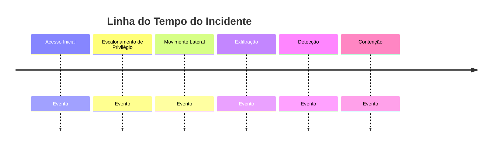

# Timeline Forense — IR-[AAAA]-[NNNN]

> Todos os horários devem ser normalizados para **UTC**. Registre o timezone original entre parênteses quando relevante (ex.: log local em horário de Brasília).

## Convenções

- **Fonte de tempo:** preferir timestamps de log de servidor/SIEM sobre timestamps de arquivo local (sujeitos a manipulação/timestomping).
- **Confiança:** classificar cada entrada como `Alta` (log de sistema/SIEM confiável), `Média` (artefato de host, ex. Prefetch) ou `Baixa` (inferência/correlação).
- **MITRE ATT&CK:** mapear cada ação do atacante à técnica correspondente quando possível.

---

## Timeline

| # | Data/Hora (UTC) | Fonte | Host/Sistema | Evento | Técnica MITRE | Confiança | Evidência (referência) |
|---|---|---|---|---|---|---|---|
| 1 | | | | | | | |
| 2 | | | | | | | |
| 3 | | | | | | | |

---

## Marcos-chave

| Marco | Data/Hora (UTC) |
|---|---|
| Acesso inicial (compromise time) | |
| Primeira atividade pós-exploração | |
| Escalonamento de privilégio | |
| Movimento lateral (primeiro salto) | |
| Estabelecimento de persistência | |
| Exfiltração (se houver) | |
| **Detecção** (dwell time = detecção − acesso inicial) | |
| Início da contenção | |
| Contenção completa | |
| Erradicação completa | |
| Retorno à operação normal | |

**Dwell time calculado:** [detecção − acesso inicial]

---

## Visualização (opcional)

---

## Notas de Análise
[Observações sobre lacunas na timeline, fontes conflitantes, ou hipóteses ainda não confirmadas.]
