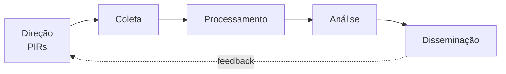

# Threat Intel — Programa de Inteligência de Ameaças

> Artefatos do programa de threat intelligence: perfis de ator, tracking de campanha e ciclo de inteligência. Para o playbook de **resposta** a uma detecção originada por TI, ver [`Attack-Categories/Threat-Intel/README.md`](../Attack-Categories/Threat-Intel/README.md).

## Ciclo de Inteligência



| Fase | Descrição |
|---|---|
| Direção | Definição de Priority Intelligence Requirements (PIRs) — o que a organização precisa saber |
| Coleta | OSINT, feeds comerciais, ISACs, dados internos (logs, IOCs de incidentes próprios) |
| Processamento | Normalização, deduplicação, enriquecimento |
| Análise | Correlação, atribuição, avaliação de relevância/risco para a organização |
| Disseminação | Relatórios, alertas, atualização de regras de detecção |

## Template: Perfil de Ator/Grupo

```markdown
# Perfil: [Nome do Ator/Grupo]

**Aliases:** [...]
**Origem/atribuição suspeita:** [País/motivação — Nation-state, Criminal, Hacktivist]
**Motivação:** [Financeira / Espionagem / Disrupção / Ideológica]
**Setores-alvo:** [...]
**Geografias-alvo:** [...]

## TTPs Conhecidos (MITRE ATT&CK)
| Tática | Técnica | ID |
|---|---|---|

## Ferramentas/Malware Associados
- [...]

## Infraestrutura Conhecida (histórico)
- [...]

## Relevância para a Organização
[Por que este ator importa para nós especificamente — setor, geografia, exposição]

## Fontes
- [Relatórios públicos referenciados]
```

## Template: Tracking de Campanha

```markdown
# Campanha: [Nome/codinome]

**Período observado:** [Data início] - [Data fim/em andamento]
**Ator associado:** [se conhecido]
**Vetor inicial:** [...]
**Setores afetados:** [...]

## IOCs da Campanha
→ Ver `IOC-Collections/Feeds-Externos/<campanha>.csv`

## Linha do Tempo de Evolução
| Data | Mudança observada |
|---|---|

## Status
[Ativa / Em declínio / Encerrada / Monitoramento]
```

## Fontes de Threat Intel Recomendadas

| Tipo | Exemplos |
|---|---|
| Governamentais | CISA Advisories, NCSC, CERT.br |
| Vendor (gratuito) | Mandiant, Microsoft MSTIC blog, Talos, Unit42 |
| Comunidade | MISP communities, ISACs do setor |
| Repositórios de IOC | MalwareBazaar, URLhaus, AlienVault OTX |

## Aplicação Prática

Quando um relatório de TI externo menciona um ator relevante:
1. Extrair IOCs e técnicas → criar/atualizar perfil de ator acima.
2. Cruzar técnicas com [`MITRE-Mappings/Master-Mapping-Table.md`](../MITRE-Mappings/Master-Mapping-Table.md) para identificar quais categorias de `Attack-Categories/` são relevantes.
3. Gerar hipóteses de hunting em [`Attack-Categories/Threat-Hunting/`](../Attack-Categories/Threat-Hunting/) baseadas nos TTPs do ator.
4. Avaliar lacunas de detecção em [`Detection-Rules/`](../Detection-Rules/) para as técnicas do ator.

## Referência Cruzada
- Resposta a alerta originado por TI: [`Attack-Categories/Threat-Intel/README.md`](../Attack-Categories/Threat-Intel/README.md)
- Investigação de APT (atores sofisticados/persistentes): [`Attack-Categories/APT-Investigation/README.md`](../Attack-Categories/APT-Investigation/README.md)
- Coleção de IOCs: [`IOC-Collections/`](../IOC-Collections/)
